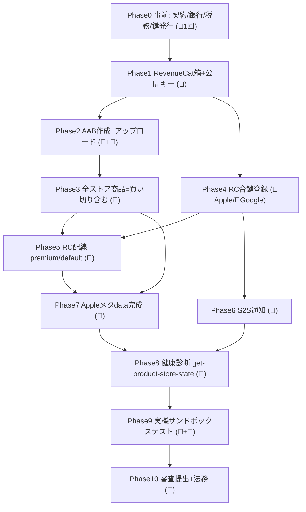

# Notion Phase 8 課金設定 — 改修前原本 (2026-06-14 取得)

> **出典**: Notion ページ ID `34b0ee330ea0813ea82eea0ee2e667b0`
> **取得日時**: 2026-06-14 (notion-fetch 経由)
> **元タイトル**: 💰 Phase 8: 課金設定（RevenueCat）
> **最終確認日 (元ページ記載)**: 2026-05-27
>
> このファイルは Phase 8 ページ改修前の原本バックアップ。
> 改修後の Notion ページとの差分確認や、 万一「元に戻したい」 ときの参照用。

---

## 元ページ全文

<callout icon="💰" color="blue_bg">
**Phase 8: 課金設定（RevenueCat × Apple / Google）— 自動化主体・後戻りゼロ版**
BonsaiLog (Sess48) の実績を手順書化。**次アプリでもそのまま流用**できるよう 🔁流用可 / 🆕アプリ別 を明示し、**API自動(Claude)を主・手作業(GUI)を補足**として記載する。**最終確認日: 2026-05-27**
</callout>

## 0. 凡例（アイコンの意味）

<callout icon="♻️" color="green_bg">
**🔁 流用できるもの（次アプリで使い回す）**: `docs/01_key` の共通鍵（Apple `.p8`×2 / Google サービスアカウント JSON / Issuer ID / Vendor 番号）、`scripts/store-automation` 一式、prebuild/postbuild/build スクリプト、全175地域リスト、RevenueCat MCP の操作手順、この手順書テンプレ。
**🆕 アプリ別に差し替えるもの**: bundle id / package 名 / 商品ID / 価格 / RevenueCat の project・app ID / プライバシーURL / 審査メモ / 表示名。
</callout>

## 1. 全体像（依存グラフ）

各 Phase は「前の Phase が終わらないと進めない」依存関係でつながっている。**この順番を守ればつまずかない**（特に Phase 2→3 の順番が肝）。

<callout icon="⭐" color="yellow_bg">
**今回の最大の学び＝Phase 2 と 3 の順番**: 「ストア商品を作る」より先に「AABを作ってアップロード」する。理由 → **Google の買い切り(一回課金)商品は、BILLING権限入りのAABをトラックにアップロード済みでないと作成できない**。AABを先に上げておけば、その後で月/年/買い切りを**一括で**作れて後戻りしない。（前回はサブスク作成→AAB→買い切り作成、と分断して詰まった）
</callout>

---

## Phase 0 — 事前準備（👤 人間 / 1回だけ / アカウント単位）

<callout icon="♻️" color="green_bg">
🔁 app-factory では一度やれば共通鍵を使い回せる。**2アプリ目以降はこの Phase をほぼスキップ可**（鍵は `docs/01_key` に保管済み）。
</callout>

- [ ] 👤 Apple: 有料App契約・銀行口座・税務(W-8BEN) → ステータス「アクティブ」まで待つ
- [ ] 👤 Google: お支払いプロファイル・銀行口座
- [ ] 👤 Apple: App Store Connect API キー(`.p8`) + In-App Purchase キー(`.p8`) + Issuer ID + Vendor番号 + App共有シークレットを発行
- [ ] 👤 Google: サービスアカウント JSON を発行（Pub/Sub 編集者権限を付与しておくと Phase 6 がスムーズ）
- [ ] 🔁 すべて `docs/01_key/` に保管（git管理外）

**🆕 アプリ別に決めること**: アプリ名 / bundle id（例 `com.dooooraku.bonsailog`）/ 製品ID命名（例 `bonsailog_pro_monthly` `_annual` `_lifetime`）/ 価格（例 月 \$3.99 / 年 \$29.99 / 買切 \$69.99）。

📛 **製品IDは作成後に変更・削除できない**。タイポ厳禁。

---

## Phase 1 — RevenueCat の箱と公開キーを最初に作る（🤖 Claude）

<callout icon="📛" color="red_bg">
**なぜ最初か**: 本番AAB(Phase2)に **RevenueCat 公開SDKキー**を埋め込む必要がある。これが無いと `prebuild-env-check` で止まる。だから一番先に作る。（前回はこれを後回しにしてビルドが即停止した）
</callout>

- [ ] 🤖 `create-project`（例: name=BonsaiLog）→ project ID 取得（🆕 例 `projed4e672d`）
- [ ] 🤖 `create-app` ×2（iOS=app_store + bundle id / Android=play_store + package名）→ app ID 取得（🆕）
- [ ] 🤖 `list-app-public-api-keys` で iOS(`appl_…`) / Android(`goog_…`) の**公開SDKキー**を取得
- [ ] 🤖 `.env` に `REVENUECAT_IOS_API_KEY` / `REVENUECAT_ANDROID_API_KEY` を設定（🔁 `.env` は git管理外）

**コマンドの意味**: `create-project`=RevenueCatに「店」を新規開設 / `create-app`=店にアプリ枠を登録 / `list-app-public-api-keys`=アプリに埋める「公開合言葉」を取り出す。

---

## Phase 2 — AAB を作ってストアにアップロード（🤖 ビルド / 👤 アップロード）

- [ ] 🤖 `pnpm build:android:aab:local` を実行（中身は ①prebuild点検 → ②`eas build --local` 本体 → ③postbuild検証 の3段）
- [ ] 👤 できた `dist/app-production.aab` を Play Console の**内部テスト or クローズドテスト**にアップロード

<callout icon="📛" color="red_bg">
**つまずき回避**:
- 署名鍵(実印)が無くても **EASが自動生成してサーバー保管**する（「Generate a new Keystore? Yes」）。手で作らなくてよい。
- ビルドが `GetEnv.NoBoolean` で落ちたら、環境変数 `CI` が空文字になっている → `env -u CI` を付けて再実行。
- **このAABアップロードが Phase 3 の Google 買い切り作成の前提**（BILLING権限入りAABが必要）。
</callout>

(注: Play Console 画像 3 枚 — phase8-billing/play-dashboard.png / play-closed-test.png / play-release-detail.png)

---

## Phase 3 — 全ストア商品を一括作成（🤖 Claude / 公式API）

<callout icon="♻️" color="green_bg">
🔁 `scripts/store-automation`（Apple ASC API + Google Android Publisher API）で自動作成。**RevenueCat MCP ではストア商品は作れない**ため各ストアの公式APIを使う。設定は `config.bonsailog.json` を 🆕 差し替えるだけ。
</callout>

- [ ] 🤖 Apple: サブスクグループ + 月/年サブスク + 買い切りIAP を作成（`apple_create_products.py`）
- [ ] 🤖 Google: サブスク(月/年 basePlan) を作成・価格・activate（`google_create_products.py --commit`）
- [ ] 🤖 Google: 買い切り(onetimeproduct) を作成（AAB上げ済なので**今度は通る**）→ `purchaseOptions:batchUpdateStates` で **DRAFT→ACTIVE** 有効化
- [ ] 価格は USD 基準（🆕 \$○○ / \$○○/ \$○○）、各国はストアが自動換算 投入する価格はユーザーに承認をとってください。

<callout icon="📛" color="orange_bg">
- 必ず `--dry-run`（`--commit`なし）で作成予定を確認 → `--commit` で本実行（製品IDは不変）。
- Google 買い切りの**読み取りAPIは404になる癖**があるが、作成は `PATCH ?allowMissing=true` の冪等upsertなので**再実行しても無害**。
- 買い切りは作成直後 `DRAFT`。`batchUpdateStates` で `ACTIVE` にしないと販売・テストに出ない。
</callout>

---

## Phase 4 — RevenueCat にストアの合鍵を登録（🤖 Apple / 👤 Google）

合鍵 = RevenueCat が「この人ちゃんと買った?」をストアに問い合わせる鍵。**これが無いと購入を検証できず、サンドボックステストで詰まる**。

- [ ] 🤖 Apple: `update-app` で ASC APIキー + アプリ内課金キー + Shared Secret + Issuer ID を投入（🔁 共通鍵流用、Issuer は Apple アカウント単位で同一）
- [ ] 👤 Google: サービスアカウント JSON を RevenueCat の Android アプリ設定で**手動アップロード**（📛 `update-app` に項目が無く MCP 不可）
- [ ] ⏳ Google 合鍵は**反映に最大36時間**かかることがある

(注: RevenueCat Android 設定 画像 — phase8-billing/rc-android-creds-rtdn.png)

<callout icon="✅" color="green_bg">
**確認**: Service Account が「**Valid credentials**」になっていれば Google 合鍵OK。Apple は `get-app` のレスポンスで `app_store_connect_api_key_configured: true` / `subscription_key_configured: true` を確認。
</callout>

---

## Phase 5 — RevenueCat 配線（🤖 Claude / 公式順序）

RevenueCat公式の推奨順序「商品 → entitlement → 紐付け → offering/package」に従う。

- [ ] 🤖 `create-product` ×6（iOS3 + Android3）。Google サブスクは `サブスクID:basePlanID` 形式（例 `bonsailog_pro:monthly`）
- [ ] 🤖 `create-entitlement`（lookup_key=**`premium`**）→ `attach-products-to-entitlement` で6商品を紐付け
- [ ] 🤖 `create-offering`（lookup_key=`default`）→ `create-packages`（`$rc_monthly` / `$rc_annual` / `$rc_lifetime`）→ `attach-products-to-package`（iOS=eligibility `all` / Android=`google_sdk_ge_6`）

<callout icon="📛" color="orange_bg">
**entitlement の識別子は `premium`**（コード `ENTITLEMENT_ID='premium'` と一致させる）。※旧ページにあった `pro` は誤り。
Android 買い切りが RevenueCat 上で `is_consumable: true` になることがある（買い切りは本来 false）。Google合鍵同期後やサンドボックスで挙動（買い切り後の復元・サブスク非表示）を要確認。
</callout>

---

## Phase 6 — S2S 通知（電話線）を引く（👤 人間 GUI）

S2S通知 = ストアで購入/解約が起きた瞬間に RevenueCat へ即連絡する仕組み。📛 ストア側の設定は API で読めないため**ダッシュボード目視**で確認する。

- [ ] 👤 Apple: RevenueCat の通知URLをコピー → App Store Connect「App Store サーバ通知」の**プロダクションサーバURL**に貼付（📛 **Version 2** を選ぶ）
- [ ] 👤 Google: RevenueCat「Connect to Google」で Topic ID 生成 → Play Console「収益化のセットアップ → リアルタイムデベロッパー通知」に貼付 →「テスト通知を送信」（⏳ Phase4 の36h反映後）

(注: ASC S2S URL 画像 — phase8-billing/asc-s2s-url.png)

<callout icon="✅" color="green_bg">
**確認**: Google は RevenueCat の「Google developer notifications」に「**Last received（最終受信）**」の日時が入れば成功。Apple は ASC にURLが保存されていればOK。
</callout>

---

## Phase 7 — Apple 商品メタデータを完成（🤖 Claude）

Apple 商品は作成直後 `MISSING_METADATA`。販売地域・価格・審査情報を入れて `READY_TO_SUBMIT` にする。

- [ ] 🤖 `set-product-store-state`（3商品）: ①販売地域(availability)を全175地域 → ②プライバシーURL → ③審査メモ → (買い切りは)価格 を設定
- [ ] 🤖 月/年は `equalize-subscription-prices`(base=US) で全175地域の価格を自動補完
- [ ] 🤖 各 async は `get-product-store-state-operation` で `succeeded` までポーリング

<callout icon="📛" color="red_bg">
**順番が命**: **availability(販売地域) を価格より先に**設定する。地域が空のまま価格補完すると失敗する（前回これで失敗）。
**審査スクショ**: `set-product-store-state` でスクショを省略すると **RevenueCat がプレースホルダー画像を自動アップロードし `READY_TO_SUBMIT` に到達**できる（実機スクショ無しでメタデータ完成）。
**📌 TODO（後で👤ユーザーが対応）**: 本番審査前に、このプレースホルダーを**実機の実際のペイウォール画面のスクショに差し替える**こと。今回は暫定のまま。
</callout>

🔁 全175地域リストは `docs/assets/phase8-billing/`（または手順書付録）から流用。🆕 価格と審査メモはアプリ別。

---

## Phase 8 — 健康診断（🤖 Claude / 配線の機械確認）

実機テストの前に、配線が正しいかを機械的に裏取りする新ステップ。

- [ ] 🤖 `get-product-store-state` を各商品に実行 → **両ストアの生データが返れば合鍵OKの確証**（合鍵が無ければ読めない）
- [ ] 🤖 Apple 3商品が `READY_TO_SUBMIT` / Google サブスク basePlan が `ACTIVE` / 買い切り `ACTIVE` を確認

<callout icon="💡" color="blue_bg">
独立確認として ASC API 直 (`inAppPurchasesV2` / `subscriptionGroups`) や Android Publisher API 直で state を見ると、RevenueCat 以外の経路でも裏取りできる（バイアス排除）。
</callout>

---

## Phase 9 — 実機サンドボックステスト（👤 実機 + 🤖 補助 / 唯一の確定検証）

<callout icon="📛" color="red_bg">
API/ダッシュボードでの確認は「配線の健康診断」に過ぎない。**100%の確証は、実機で実際に購入が通り RevenueCat に記録されること**だけ。ここは省略不可（前回 Repolog で購入バグの温床だった工程）。
</callout>

テスト項目 (iOS / Android 各):

- 月額購入
- 年額購入
- 買い切り購入
- 復元(Restore)
- 購入キャンセル
- 買い切り後にサブスク非表示(Champion)
- RevenueCat Dashboard に購入記録

- 🤖 Claude は adb ログ解析・DB裏取り・チェックリスト管理を補助。📛 Android 買い切りの `is_consumable` 挙動（復元できるか）もここで確認。

---

## Phase 10 — 審査提出 + 法務（👤 人間 / 最長の律速）

- [ ] 👤 Apple: 初回 IAP は**アプリ版と同時に審査提出** → Apple 承認待ち
- [ ] 👤 審査用スクショを実機ペイウォール画像に差し替え（Phase7 のTODO）
- [ ] 🤖+👤 プライバシーポリシー19言語に「RevenueCat 利用・匿名ID送信・EU/USサーバー保管」を明記（文章は🤖、確認は👤）
- [ ] 👤 RevenueCat の DPA（データ処理契約）を締結・署名

---

## 付録A — 📛 今回ハマった罠まとめ（4件）

| 罠                        | 原因                               | 回避策                                      |
| ------------------------- | ---------------------------------- | ------------------------------------------- |
| AABビルドが即停止         | RevenueCat公開キーが空（RC未作成） | Phase1（RC作成）を最初に                    |
| Google買い切りが作れない  | AAB未アップロード（BILLINGゲート） | Phase2（AABアップロード）を商品作成より先に |
| Apple価格補完が失敗       | 販売地域(availability)未設定       | availability→価格の順で設定                 |
| ビルドが GetEnv.NoBoolean | 環境変数 CI が空文字               | `env -u CI` で実行                          |

## 付録B — コマンド/用語集（初心者向け）

| 用語                               | 意味（役割）                                                        |
| ---------------------------------- | ------------------------------------------------------------------- |
| entitlement（権利 / 会員証）       | 「この権利を持つ人 = Pro会員」。識別子は `premium`                  |
| offering / package（商品棚 / 段）  | 購入画面に出す商品のまとまり。`default` 棚に月/年/買切の3段         |
| 合鍵（store credentials）          | RevenueCatがストアに購入を問い合わせる鍵（Apple .p8 / Google JSON） |
| S2S通知（電話線）                  | 購入/解約をストアがRevenueCatに即連絡する設定                       |
| get-product-store-state            | RevenueCatが合鍵でストアの生データを取得（成功=合鍵が本物の証拠）   |
| equalize-subscription-prices       | US価格を基準に全175地域の値段を自動で埋める                         |
| batchUpdateStates                  | 買い切りを「下書き→販売中」に切り替える                             |
| MISSING_METADATA / READY_TO_SUBMIT | Apple商品の状態。メタdata未完 → 完成（提出可）                      |

<callout icon="🔁" color="green_bg">
**次アプリでの最短手順**: 共通鍵は流用済みなので Phase 0 はスキップ。Phase 1（RC作成）→ Phase 2（AAB）→ Phase 3〜8（Claudeがほぼ自動）→ Phase 9（実機テスト）→ Phase 10（審査）。`config.<app>.json` と `.env` の 🆕 値を差し替えるだけ。
</callout>

---

## 改修後の対応関係 (= どこに何が移ったか)

| 元 Phase             | 改修後の置き場                                                                            |
| -------------------- | ----------------------------------------------------------------------------------------- |
| Phase 0 (事前準備)   | Notion 新規ページ「Phase 0: 事前準備」                                                    |
| Phase 1 (RC 箱)      | repo: `docs/how-to/release/billing-setup-automation.md` Phase 1                           |
| Phase 2 (AAB)        | Notion 新規ページ「Phase 2: AAB アップロード」 (= `/release-android` skill 経由)          |
| Phase 3 (商品作成)   | repo: billing-setup-automation.md Phase 3                                                 |
| Phase 4 (RC 合鍵)    | Apple 部分 → billing-setup-automation.md / Google JSON → Notion 純化版 Step 1             |
| Phase 5 (RC 配線)    | repo: billing-setup-automation.md Phase 5                                                 |
| Phase 6 (S2S 通知)   | Notion 純化版 Step 2-3                                                                    |
| Phase 7 (Apple メタ) | repo: billing-setup-automation.md Phase 7                                                 |
| Phase 8 (健康診断)   | repo: billing-setup-automation.md Phase 8                                                 |
| Phase 9 (実機テスト) | Notion 新規ページ「Phase 9: 実機サンドボックステスト」                                    |
| Phase 10 (審査)      | Notion 新規ページ「Phase 10: 審査・法務」                                                 |
| 付録 A (罠)          | 全 SoT に分散 (billing-setup-automation.md + iap-setup-checklist.md + Notion 純化版 Tips) |
| 付録 B (用語集)      | repo: billing-setup-automation.md 末尾の用語集                                            |
