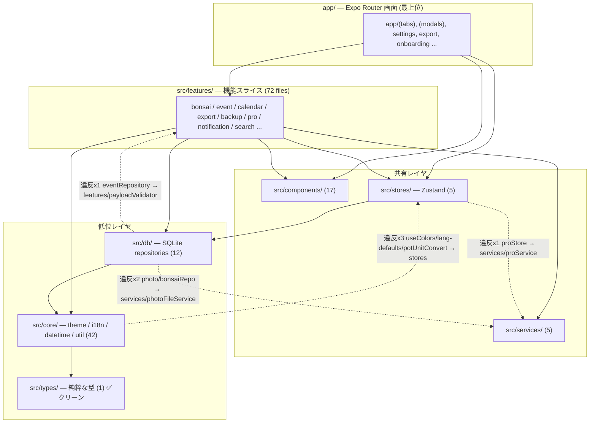

# BonsaiLog 大規模リファクタ — Phase 1: Explore 統合レポート

> 作成日: 2026-05-28
> 種別: 調査レポート(コード変更ゼロ・読み取り専用)
> 調査手法: Plan Mode + 並列サブエージェント 6本 / 2波
> 数値の根拠: すべて実コマンド出力(`find` / `wc -l` / `grep -rn` / `npx knip` / `npx expo-doctor` / `jest --coverage`)

---

## 0. かみ砕き — 今日やったことを小中学生にもわかるように

このアプリ「BonsaiLog(盆栽の記録帳アプリ)」の中身を、**設計図を引く前の「現地調査」**しました。
家のリフォームでいうと、まだ壁をいじらず、**「どの部屋が広すぎる?」「配線がぐちゃぐちゃな所は?」「使ってない物置は?」**を見て回った段階です。

調査に使った道具(コマンド)の意味:

| 道具(コマンド)         | 何をする道具?                                                    | たとえると                                     |
| ---------------------- | ---------------------------------------------------------------- | ---------------------------------------------- |
| `find app -type f`     | `app` フォルダの中のファイルを全部一覧する                       | 部屋にある物を全部書き出す                     |
| `wc -l ファイル`       | ファイルの行数を数える(`wc`=word count, `-l`=lines)              | 部屋の広さ(畳数)を測る                         |
| `grep -rn "文字" 場所` | 指定した文字を全ファイルから探す(`-r`=再帰的に, `-n`=行番号付き) | 「窓」という言葉が設計図のどこに出るか全部探す |
| `npx knip`             | 使われていないコード・部品を見つける道具                         | 一度も使ってない物置・道具を探す               |
| `npx expo-doctor`      | アプリの土台(Expo SDK)の健康診断                                 | 家の基礎にヒビがないか点検                     |
| `jest --coverage`      | テストがコードの何%を守れているか測る                            | 火災報知器が家の何%の部屋に付いてるか調べる    |

結論を一言でいうと:**「土台は健全だが、巨大な部屋(超大型ファイル)が数個あり、テスト(火災報知器)がデータ保存の心臓部にほぼ無い」**です。

---

## 1. 現状アーキテクチャ図(Mermaid)

### 1-1. レイヤ構成(依存の向き)

### 1-2. ルーティング(画面遷移)図 — Expo Router

```mermaid
graph TD
    ROOT["app/_layout.tsx (Root Stack)"]
    ROOT --> TABS["(tabs)/_layout — 4タブ"]
    ROOT --> ONB["onboarding/_layout (Stack)"]
    ROOT --> MODALS["(modals)/_layout (全modal presentation)"]
    ROOT --> PRO["pro.tsx (paywall, modal)"]
    ROOT --> EXPORT["export/_layout (Stack)"]
    ROOT --> SETTINGS["settings/_layout (Stack)"]
    ROOT --> BACKUP["backup/index — ※_layout未登録"]
    ROOT --> TAGS["tags.tsx / tag-edit.tsx — ※一部未登録"]
    ROOT --> MODALPH["modal.tsx — ⚠️ テンプレ残骸(死)"]
    ROOT --> IDX["index.tsx — 起動リダイレクト"]

    TABS --> T1["bonsai/ — list + [id]/index(詳細1592行)"]
    TABS --> T2["plan/ — index(カレンダー) + wiring"]
    TABS --> T3["record/ — index(カレンダー)"]
    TABS --> T4["look-back/ — index(CareHub) + search"]

    MODALS --> M1["work-picker → work-log-confirm (modal内push)"]
    MODALS --> M2["bonsai-new / species-picker / style-picker"]
    MODALS --> M3["bonsai-multi-select / bulk-work-picker / bulk-log-confirm"]
    MODALS --> M4["photo-viewer"]

    ONB --> O1["welcome → language → tut/[step] (tut1-5)"]
    EXPORT --> E1["index(Hub) → pdf → pdf-preview / list-preview"]
    SETTINGS --> S1["index → archived / language"]
```

**plan と record はほぼ同一画面**(`src/features/calendar/CalendarTabScreen.tsx` を `mode` prop で共有、974行)。

### 1-3. ルート定義の不整合(画面遷移系のスメル)

- `app/modal.tsx`: Expo CLI テンプレ残骸。`/modal` ルート登録されているが空、削除候補。
- `app/backup/index.tsx` / `app/tags.tsx`: 親 `_layout.tsx` に `Stack.Screen` 未登録。inline `<Stack.Screen options={...} />` で動かしているため層レベルの統制が効かない。
- `(modals)/work-picker.tsx` → `(modals)/work-log-confirm.tsx` は **modal Stack 内 push**(ADR-0030 D2 の意図的設計。iOS の戻るジェスチャに違和感が出やすい)。

---

## 2. god component 上位 10 件

ランク = 行数 + 関心の混在 + hook/props 密度の総合評価。

| #   | ファイル                                      | 行数     | hooks           | props      | 局所依存 | 主因                                                                                    |
| --- | --------------------------------------------- | -------- | --------------- | ---------- | -------- | --------------------------------------------------------------------------------------- |
| 1   | `app/(tabs)/bonsai/[id]/index.tsx`            | **1592** | ~42 (custom 10) | 0          | 27       | 3タブ(履歴/年表/基本)+写真undo timer+scroll-jump+予定作成+archive+inline form を1画面に |
| 2   | `src/features/bonsai/BonsaiBasicForm.tsx`     | **1391** | 44 (1 hook内)   | 4          | 21       | useState×15 が「フィールド/写真/タグ」3領域混在。DB書込+JSX も同居                      |
| 3   | `app/settings/index.tsx`                      | 857      | ~19             | 0          | 18       | 課金/テーマ/言語/通知/archive/export/backup/legal + `__DEV__` seed を全部               |
| 4   | `src/features/calendar/CalendarTabScreen.tsx` | 974      | ~30             | 1 (`mode`) | 23       | plan/record 2画面を1 prop で分岐 + delete dialog + kebab + bulk + grid算                |
| 5   | `app/(tabs)/look-back/search.tsx`             | 708      | ~12             | 0          | 15       | 打鍵毎に4テーブル並列 query + 履歴 + タグ filter + FTS5 highlight                       |
| 6   | `src/features/event/BulkLogConfirmScreen.tsx` | 442      | ~14 (custom 7)  | 0          | 20       | 14種別 form + 写真 + guard + IME scroll + DB + 通知 cancel                              |
| 7   | `src/features/event/WorkLogConfirmScreen.tsx` | 390      | ~15             | 0          | 17       | #6 のほぼ重複(単体版)。重複コードの温床                                                 |
| 8   | `src/features/export/ExportOptionsSheet.tsx`  | 424      | 13              | 3          | 11       | 6つの form state を抱えるミニ wizard                                                    |
| 9   | `src/features/event/EventRow.tsx`             | 609      | 5(+sub)         | 12         | 10       | compact/detailed 2モードで描画ツリー分岐                                                |
| 10  | `app/(tabs)/plan/wiring.tsx`                  | 353      | ~7              | 0          | 13       | data 取得 + wiring 期間算 + thumbnail load が同居                                       |

**抽出候補(上位3、Phase 3 以降で具体計画書化予定)**:

- **#1**: 3タブを `BonsaiHistoryTab/TimelineTab/BasicSection` に分割、写真 undo を `usePhotoCrudWithUndo`、scroll-jump を `useScrollToEvent` に。
- **#2**: `useBonsaiBasicForm` を `useBonsaiFormFields / usePendingPhotos / useBonsaiTagPicker` の3 hook に分解。`PendingPhotoList` を独立化。
- **#3**: `__DEV__` seed panel(~170行)を `DevSettingsSection` へ。`NotificationSettingsSection` 分離。

---

## 3. FSD 境界違反(下位レイヤ → 上位レイヤの逆 import)

**合計 7 件。** alias: `@/*` → リポジトリルート(tsconfig `paths`)。

| 違反エッジ          | 件数                | 例                                                                            |
| ------------------- | ------------------- | ----------------------------------------------------------------------------- |
| `core → stores`     | 3 (実体1 / 型のみ2) | `src/core/theme/useColors.ts:16` が `useSettingsStore` を import              |
| `db → services`     | 2                   | `src/db/photoRepository.ts:19` が `photoFileService` を import                |
| `db → features`     | 1                   | `src/db/eventRepository.ts:23` が `features/event/payloadValidator` を import |
| `stores → services` | 1                   | `src/stores/proStore.ts:4` が `proService` を import                          |

- **最悪オフェンダー = `src/db`**(3件)。データ層がファイル I/O(services)とバリデーション(features)を吸い込んでいる。
- **循環依存の疑い 1件**: `db/eventRepository` → `features/payloadValidator` → `db/schema`(db ↔ features の双方向結合)。
- `src/types` は **完全クリーン**(local import ゼロ)。✅

---

## 4. 死コード総量(knip + 手動裏取り)

knip は **正常完走**(JSON 出力)。設定ファイル無しで Expo Router の `app/` を自動エントリ検出。

| 区分                 | 件数 | 代表例                                                                                                                           | 偽陽性リスク                                   |
| -------------------- | ---- | -------------------------------------------------------------------------------------------------------------------------------- | ---------------------------------------------- |
| 未使用ファイル       | 48   | `scripts/ui-diff/*`(9)・`store-screenshots/*`(5)・`components/external-link.tsx`・`src/services/{legalService,reviewService}.ts` | 高(hook/plugin/platform 拡張が混入)            |
| 未使用 export        | 73   | `src/db/eventRepository.ts` だけで **16件**                                                                                      | 中(store 経由の間接呼出を knip が追えない疑い) |
| 未使用 export 型     | 26   | `backupService.ts` の Backup\* 8型                                                                                               | 中                                             |
| 未使用 dependency    | 8    | `@tamagui/*` 4種・`@tanstack/react-query`・`expo-symbols` 等                                                                     | 中(Tamagui は本当に死の可能性大)               |
| 未使用 devDependency | 9    | `sharp`・`ts-jest`・eslint系                                                                                                     | 高(config key 参照を追えない)                  |
| 重複値               | 2    | `src/core/theme/colors.ts` の色 alias                                                                                            | —                                              |

**速報値 = 約 164 件フラグ**(偽陽性込み)。**真の死コードはこれより大幅に少ない**見込み。
特に注目:

- **Tamagui 一式が死の可能性**: `tamagui.config.ts` の default export も未使用 / `@tamagui/{core,lucide-icons,portal,babel-plugin}` 4種が未参照。
- **`@tanstack/react-query` はインストール済みだが完全未使用**: 下記 §7 参照。
- **`scripts/ui-diff/*` 9ファイル**: ADR-0021 系の自動 UI 比較ツール。実運用していないなら丸ごと削除候補。

---

## 5. テストカバレッジ 低い順 20件

全体: **Statements 20.08% / Branches 18.19% / Functions 15.88% / Lines 19.59%**(閾値 global statements 20% を **+0.08% だけ上回る薄氷**)。テストは 67 suites / 955 件 全 green / 14秒。

| #   | ファイル                                         | %Stmts | 行   | リスク                    |
| --- | ------------------------------------------------ | ------ | ---- | ------------------------- |
| 1   | `src/db/db.ts`                                   | 1.28%  | ~275 | 高(DB 初期化 / migration) |
| 2   | `src/db/eventRepository.ts`                      | 1.56%  | ~870 | 高(最大 repo)             |
| 3   | `src/features/backup/backupService.ts`           | 0%     | ~835 | 高                        |
| 4   | `src/features/export/exportFlow.ts`              | 0%     | ~330 | 高                        |
| 5   | `src/db/bonsaiRepository.ts`                     | 4.03%  | ~375 | 高                        |
| 6   | `src/db/photoRepository.ts`                      | 6.49%  | ~320 | 高                        |
| 7   | `src/db/tagRepository.ts`                        | 2.43%  | ~180 | 中                        |
| 8   | `src/db/speciesRepository.ts`                    | 0%     | ~100 | 中                        |
| 9   | `src/db/bonsaiSpeciesCustomRepository.ts`        | 0%     | ~45  | 中                        |
| 10  | `src/db/bonsaiStylesCustomRepository.ts`         | 0%     | ~50  | 中                        |
| 11  | `src/services/proService.ts`                     | 32.03% | ~220 | 高(課金)                  |
| 12  | `src/stores/proStore.ts`                         | 21.87% | ~55  | 高                        |
| 13  | `src/services/photoFileService.ts`               | 5.88%  | ~45  | 中                        |
| 14  | `src/features/notification/triggerReschedule.ts` | 0%     | ~70  | 中                        |
| 15  | `src/features/notification/cancelForEvent.ts`    | 0%     | ~42  | 中                        |
| 16  | `src/features/pro/useGoToPaywall.ts`             | 14.28% | ~10  | 中                        |
| 17  | `src/core/i18n/i18n.ts`                          | 27.90% | ~90  | 中                        |
| 18  | `src/stores/settingsStore.ts`                    | 28.57% | ~35  | 中                        |
| 19  | `src/dev/seedTestData.ts`                        | 2.96%  | ~660 | 低(dev 専用)              |
| 20  | `src/services/legalService.ts`                   | 0%     | ~28  | 低                        |

**穴の集中点 = `src/db/` リポジトリ層**(アプリの心臓部がほぼ無防備)+ `backup/export` のオーケストレーション。
→ **リファクタ前に「特性化テスト(characterization test)」をこの層に張るのが最優先**(挙動を凍結してから動かす)。

> 特性化テスト = 既存実装の挙動を「ありのまま」テストに書き起こし、リファクタ後も同じ結果が出ることを保証する手法。Michael Feathers『Working Effectively with Legacy Code』由来。

---

## 6. SDK / 依存の健康状態(expo-doctor)

**17/19 pass、2 fail。**

- ❌ **Metro config**: 独自 `metro.config.js` が `expo/metro-config` を継承していない → 継承推奨。
- ❌ **パッケージ版ずれ**(SDK 55 期待値との差):
  - **メジャー違い(破壊リスク)**:
    - `@react-native-async-storage/async-storage` 期待 `2.2.0` / 実 `3.0.2`
    - `@react-native-community/datetimepicker` 期待 `8.6.0` / 実 `9.1.0`
    - `react-native-get-random-values` 期待 `~1.11.0` / 実 `2.0.0`
  - マイナー: `@shopify/flash-list` 期待 `2.0.2` / 実 `2.3.1`。
  - パッチ: 37パッケージ(expo-\* 群)が 1〜15 パッチ遅れ。`expo` 本体は `~55.0.26` 期待 / `55.0.17` 実。

> ⚠️ メジャー3件は **次回 EAS build 前**に要確認(rule 8「依存の破壊的更新が必要なら即停止報告」に直結)。

---

## 7. 追加の重要発見(状態管理 / キャッシュ)

- **Zustand store は実は 9個**: `src/stores/` 5(`onboardingStore`/`pickerStore`/`proStore`/`settingsStore`/`useSettingsBootstrap`) + 散在 4(`useToastStore` in `src/components/Toast.tsx`, `useI18nStore` in `src/core/i18n/i18n.ts`, `useNotificationOptInStore` in `src/features/notification/optInPrompt.ts`, `useSearchHistoryStore` in `src/features/search/searchHistoryStore.ts`)。
- **React Context は app 自作ゼロ**(`@react-navigation/native` の `ThemeProvider` のみ)。
- **`@tanstack/react-query` は完全未使用**: `QueryClient` も `QueryClientProvider` も `useQuery` も無し。`src/core/queries/invalidators.ts` は **呼ばれない死インフラ**。
- **DB キャッシュ戦略 = 全画面 `useFocusEffect` 毎回再 fetch**(13画面確認):
  - `app/(tabs)/bonsai/index.tsx` / `app/(tabs)/bonsai/[id]/index.tsx` / `CalendarTabScreen` / `wiring.tsx` / `search.tsx` / `settings/archived.tsx` / `export/pdf.tsx` / `tags.tsx` / `tag-edit.tsx` / `BonsaiBasicForm` / `BonsaiCreateScreen` / `bonsai-new.tsx` / `WorkLogConfirmScreen`
  - stale-while-revalidate / TTL / 楽観更新は **無し**。ローカル SQLite なので妥当だが、picker 結果の受け渡しにも `useFocusEffect` を多重利用していて読みにくい。
- **重複 state の要注意(高リスク)**:
  - **C: `useSettingsBootstrap` が lang 変更の度に `potUnit` を上書き** → ユーザーが Settings で変えた単位が言語切替で **黙って消える既知欠陥**(コード内コメントに明記)。
  - A: `selectedDateKey` が `CalendarTabScreen` local と `pickerStore` の2箇所。ラッパーを介さず直接 set される経路あり。
  - D: `proStore` の `isPro` フラットフィールドと `state` ネストの二重持ち(`spreadPlanFields` で同期するが、`__DEV__` 系で踏み外しやすい)。

---

## 8. 総括(現状の健康診断)

| 観点               | 評価        | 一言                               |
| ------------------ | ----------- | ---------------------------------- |
| 土台(SDK / 依存)   | 🟡 概ね健全 | メジャー3件のずれだけ要対応        |
| レイヤ規律         | 🟢 良好     | 違反わずか 7件、types 完全クリーン |
| 巨大コンポーネント | 🔴 課題     | 1592 / 1391 / 974 行の三巨頭       |
| テスト安全網       | 🔴 薄氷     | 20.08%、DB 層がほぼ 0%             |
| 死コード           | 🟡 中       | Tamagui / react-query が怪しい     |

**リファクタ戦略の方向性(Phase 2 以降で個別計画書化)**:

1. **まず安全網**: god component に手を入れる前に、`src/db/` リポジトリと `backup/export` に特性化テストを張る(挙動凍結)。
2. **次に死コード掃除**: Tamagui・react-query・ui-diff scripts など低リスクな削除から(1コミット1関心)。
3. **その後 god component 分割**: #1〜#3 を hook 抽出 / サブコンポーネント化(振る舞い不変を厳守)。
4. **境界違反 7件の是正**: `db→services/features` の逆流を依存性逆転で解消。

---

## 9. 人間の判断が必要な点(Phase 2 起動前)

- (a) 死コード削除で **Tamagui を本当に撤去**してよいか(`tamagui.config.ts` / `@tamagui/*` 4種 / `@tamagui/babel-plugin`)。復活予定があれば残す。
- (b) expo-doctor のメジャー版ずれ3件を **このリファクタ群で扱うか / 別 Issue に切るか**。
- (c) リファクタ順序は「**安全網テスト先**」(私の推奨)で合意か。
- (d) `useSettingsBootstrap` の `potUnit` 黙消し既知欠陥は **このリファクタの範囲内で fix するか / 別 Issue か**。
