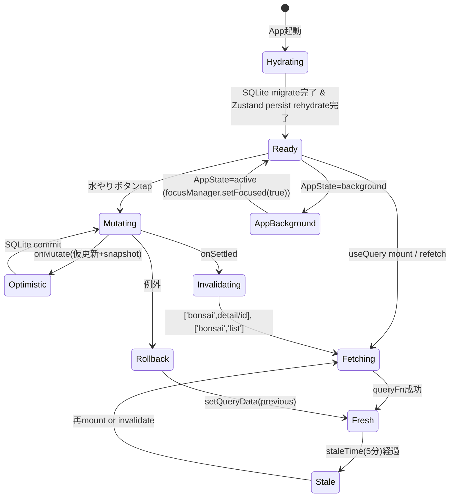
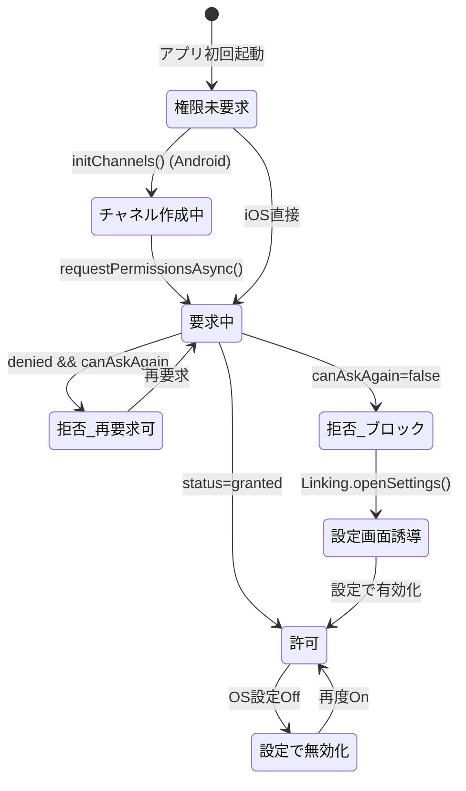
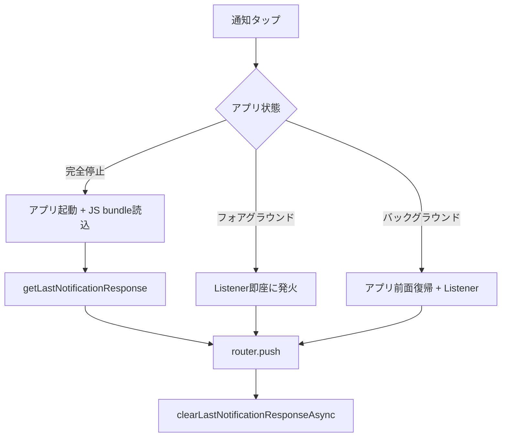
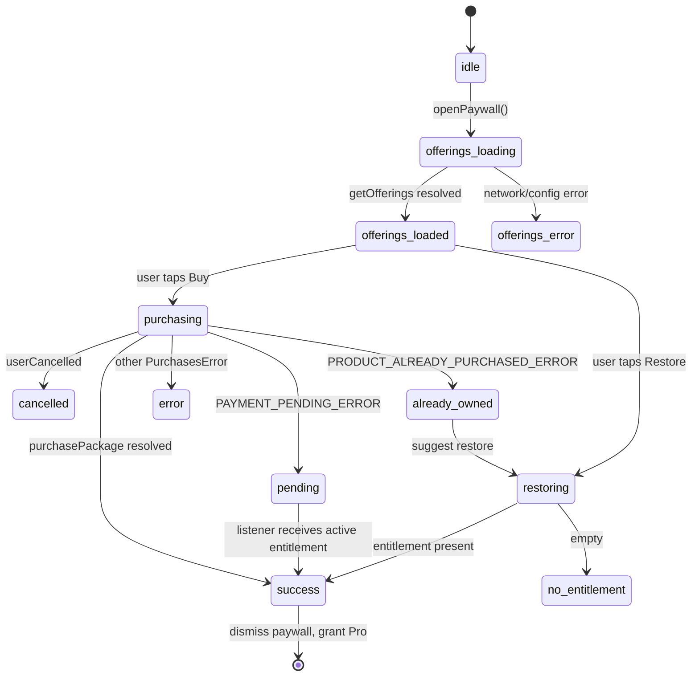
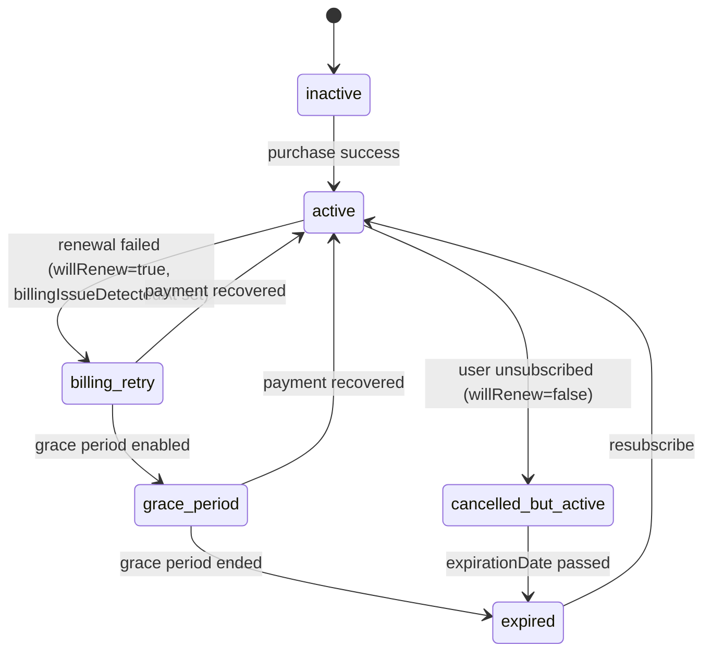
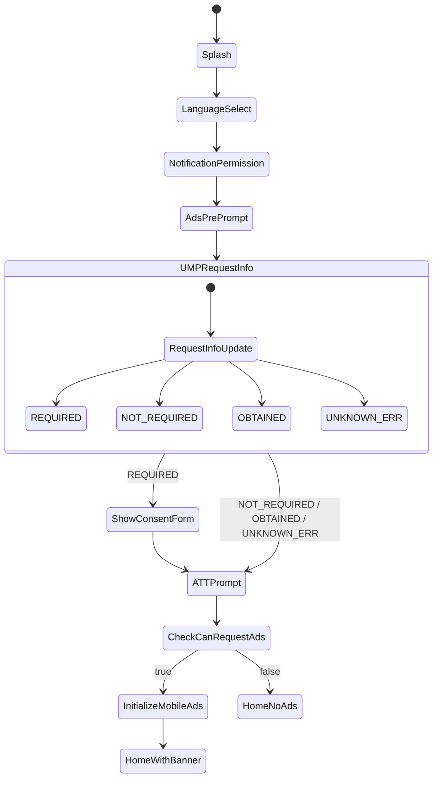
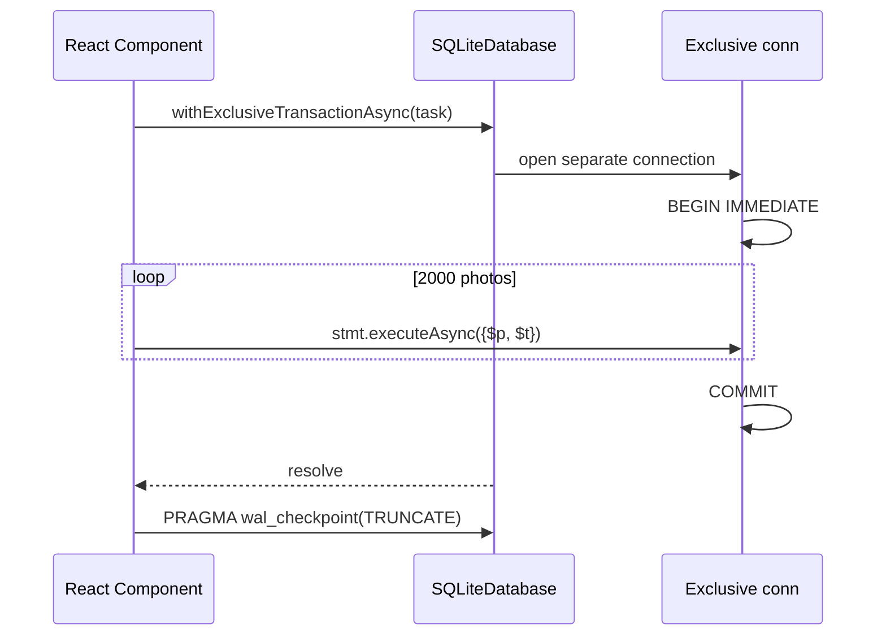
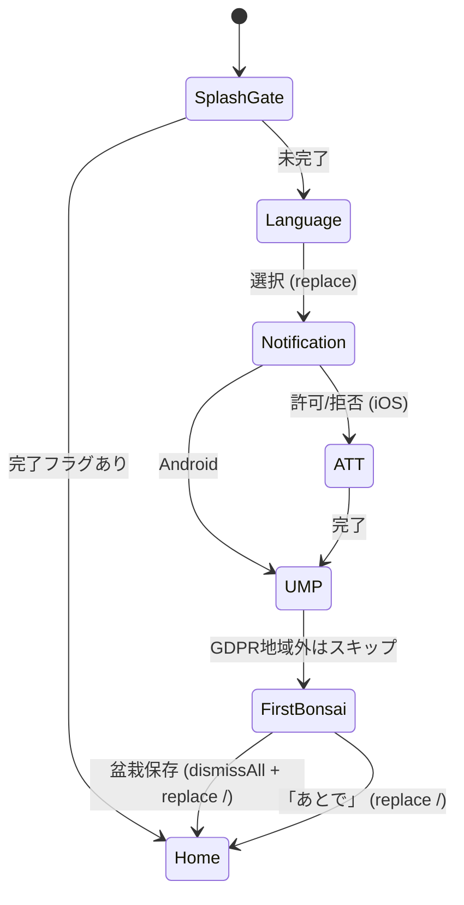
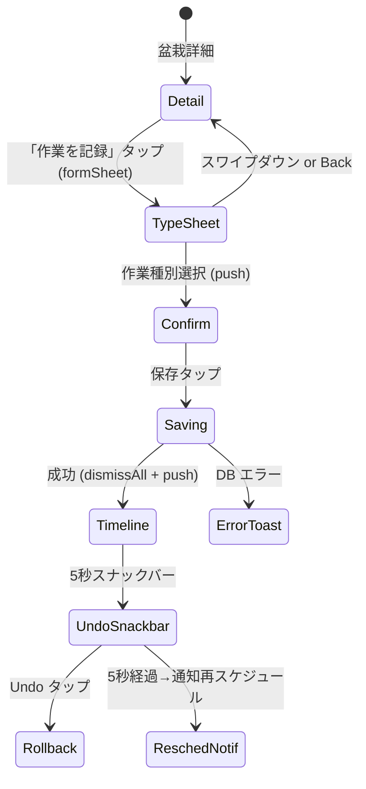
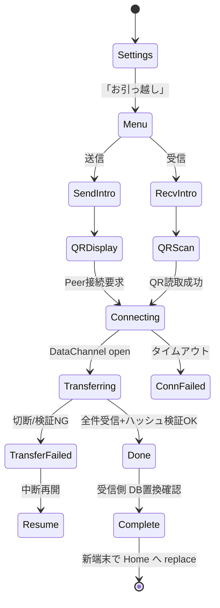

# BonsaiLog functional_spec.md 作成のための一次情報調査レポート

**調査日**: 2026-04-23
**対象**: Expo SDK 55 / RN 0.83.4 / TypeScript / Tamagui 1.144 / Zustand 5.0.12 / TanStack Query 5.90 / expo-sqlite 55.0.15 / expo-notifications 55.0.20 / react-native-purchases 9.6.6 / react-native-google-mobile-ads 16.0.0 / expo-localization 55.0.13 / expo-router 55.0.13
**信頼度凡例**: L1=公式一次情報、L2=GitHub Issue/メンテナ発言/信頼できる技術ブログ、L3=個人ブログ・推論

---

## 目次

1. [状態管理（Zustand v5 + TanStack Query v5 + expo-sqlite 55）](#1-状態管理)
2. [expo-notifications 55 詳細仕様](#2-expo-notifications)
3. [RevenueCat v9 状態遷移](#3-revenuecat)
4. [AdMob + ATT + UMP 初期化フロー](#4-admob-att-ump)
5. [expo-sqlite トランザクション / FTS5 / マイグレーション](#5-sqlite)
6. [expo-router 画面遷移（5主要フロー）](#6-expo-router)
7. [境界値データ（SQLite・写真・通知・RN）](#7-境界値)
8. [i18n 切替挙動（19言語 / CLDR plural）](#8-i18n)
9. [UXフロー（類似アプリ分析 + シニア配慮）](#9-uxフロー)
10. [Maestro E2E テストフロー](#10-maestro-e2e)

---

## 1. 状態管理

### 1-A. Zustand v5 最新パターン

#### 1-A-1. useShallow による再レンダリング最小化（v5 破壊的変更）

**一次情報**: https://zustand.docs.pmnd.rs/reference/migrations/migrating-to-v5 (L1, 2026-04-23)

v5 では `create` の第2引数 `equalityFn` が削除。`useSyncExternalStore` 仕様に合わせ、セレクタが新しい参照を返すと **Maximum update depth exceeded** エラー。複数フィールド選択時は `useShallow` 必須。

```ts
// ❌ v5 で無限ループ
const { filter, setFilter } = useUIStore((s) => ({ filter: s.filter, setFilter: s.setFilter }));

// ✅ プリミティブは atomic
const selected = useUIStore((s) => s.selectedBonsaiId);

// ✅ 複数同時は useShallow
import { useShallow } from 'zustand/react/shallow';
const { filter, setFilter } = useUIStore(
  useShallow((s) => ({ filter: s.filter, setFilter: s.setFilter })),
);
```

#### 1-A-2. Persist middleware（SecureStore / AsyncStorage）

**一次情報**: https://zustand.docs.pmnd.rs/reference/integrations/persisting-store-data (L1)

- SecureStore 値は 2KB 制限 → 機密情報のみ SecureStore、UI設定は AsyncStorage
- v5 以降、**初期状態がストレージに書かれなくなった**（v4 からの破壊的変更）
- ハイドレーション完了は `onRehydrateStorage` + `_hasHydrated` フラグ

```ts
export const useSettingsStore = create<SettingsState>()(
  persist(
    (set) => ({
      reminderTime: '08:00',
      language: 'ja',
      _hasHydrated: false,
      setHasHydrated: (v) => set({ _hasHydrated: v }),
    }),
    {
      name: 'bonsai.settings.v1',
      version: 1,
      storage: createJSONStorage(() => AsyncStorage),
      partialize: (s) => ({ reminderTime: s.reminderTime, language: s.language }),
      onRehydrateStorage: () => (state, error) => {
        if (!error) state?.setHasHydrated(true);
      },
    },
  ),
);
```

#### 1-A-3. BonsaiLog 推奨ストア構成

| ストア                 | 中身                       | persist                             | 理由           |
| ---------------------- | -------------------------- | ----------------------------------- | -------------- |
| `useClientStore`       | UI選択・フィルタ・ドラフト | No                                  | 揮発性         |
| `useSettingsStore`     | リマインダー時刻、言語     | Yes (AsyncStorage)                  | ユーザー設定   |
| `useAuthStore`         | 将来の同期トークン         | Yes (SecureStore)                   | 機密           |
| `useSubscriptionStore` | isPro フラグ               | No（RevenueCat が source of truth） | 即時反映       |
| `useAdsStore`          | canRequestAds, attStatus   | No                                  | セッション限定 |

原則: **SQLite = source of truth / TanStack Query = キャッシュ / Zustand = UI・ドラフトのみ**。盆栽リスト全件を Zustand にコピーするのはアンチパターン。

### 1-B. TanStack Query v5 最新パターン

#### 1-B-1. Query Key Factory（v5 queryOptions イディオム）

**一次情報**: https://tkdodo.eu/blog/the-query-options-api (L2)

```ts
export const bonsaiQueries = (db: SQLiteDatabase) => ({
  all: ['bonsai'] as const,
  lists: () => [...bonsaiQueries(db).all, 'list'] as const,
  list: (filters) =>
    queryOptions({
      queryKey: [...bonsaiQueries(db).lists(), filters] as const,
      queryFn: async () => db.getAllAsync<Bonsai>(sql, args),
    }),
  detail: (id: string) =>
    queryOptions({
      queryKey: [...bonsaiQueries(db).all, 'detail', id] as const,
      queryFn: () => db.getFirstAsync<Bonsai>('SELECT * FROM bonsai WHERE id = ?', [id]),
    }),
  works: (bonsaiId: string) =>
    queryOptions({
      queryKey: [...bonsaiQueries(db).all, 'works', bonsaiId] as const,
      queryFn: () => db.getAllAsync<WorkLog>('...', [bonsaiId]),
    }),
  reminders: () =>
    queryOptions({
      queryKey: ['reminders', 'list'] as const,
      queryFn: () => db.getAllAsync<Reminder>('SELECT * FROM reminder WHERE enabled = 1'),
    }),
});
```

#### 1-B-2. invalidateQueries タイミング設計

| イベント                 | invalidate する key                                                                     | 理由                                 |
| ------------------------ | --------------------------------------------------------------------------------------- | ------------------------------------ |
| 盆栽新規追加/削除        | `['bonsai']`                                                                            | リスト・詳細すべて古くなる           |
| 水やり/肥料記録          | `['bonsai','works',id]`, `['bonsai','detail',id]`, `['bonsai','list']`, `['reminders']` | next_water_at 更新、リスト並び順変更 |
| リマインダーON/OFF       | `['reminders']`, `['bonsai','detail',id]`                                               | 次回通知再計算                       |
| 設定（reminderTime）変更 | Zustand persist + `['reminders']`                                                       | 全リマインダー再計算                 |
| AppState=active          | focusManager(true)                                                                      | stale な active query のみ refetch   |

**ベストプラクティス**: `onSuccess` ではなく **`onSettled` で invalidate**（ロールバック時も正しく同期）。

#### 1-B-3. Optimistic Updates（水やりトグル）

```ts
export function useToggleWateredToday() {
  const db = useSQLiteContext();
  const qc = useQueryClient();
  const keyOf = (id: string) => bonsaiQueries(db).detail(id).queryKey;

  return useMutation({
    mutationFn: async (id) =>
      db.runAsync(`UPDATE bonsai SET watered_today = NOT watered_today WHERE id = ?`, [id]),
    onMutate: async (id) => {
      await qc.cancelQueries({ queryKey: keyOf(id) });
      const previous = qc.getQueryData<Bonsai>(keyOf(id));
      if (previous)
        qc.setQueryData(keyOf(id), { ...previous, watered_today: !previous.watered_today });
      return { previous };
    },
    onError: (_err, id, ctx) => {
      if (ctx?.previous) qc.setQueryData(keyOf(id), ctx.previous);
    },
    onSettled: (_d, _e, id) => {
      qc.invalidateQueries({ queryKey: keyOf(id) });
      qc.invalidateQueries({ queryKey: bonsaiQueries(db).lists() });
    },
  });
}
```

#### 1-B-4. QueryClient 推奨設定（ローカル SQLite backend）

```ts
export const queryClient = new QueryClient({
  defaultOptions: {
    queries: {
      staleTime: 1000 * 60 * 5, // 5分
      gcTime: 1000 * 60 * 30, // 30分
      refetchOnWindowFocus: false, // RN では不安定
      refetchOnReconnect: false, // ローカルDB不要
      retry: 0, // DBエラーはリトライしない
    },
    mutations: { retry: 0 },
  },
});
```

#### 1-B-5. AppState 連携

```ts
useEffect(() => {
  const sub = AppState.addEventListener('change', (s) => {
    if (Platform.OS !== 'web') focusManager.setFocused(s === 'active');
  });
  return () => sub.remove();
}, []);
```

### 1-C. expo-sqlite 55 接続

#### 1-C-1. SQLiteProvider + migrate

```tsx
async function migrate(db: SQLiteDatabase) {
  await db.execAsync(`
    PRAGMA journal_mode = WAL;
    PRAGMA synchronous = NORMAL;
    PRAGMA foreign_keys = ON;
    PRAGMA busy_timeout = 5000;
  `);
  // user_version ベースのマイグレーション（詳細は 5章）
}

export default function App() {
  return (
    <SQLiteProvider databaseName="bonsai.db" onInit={migrate}>
      <QueryClientProvider client={queryClient}>
        <Root />
      </QueryClientProvider>
    </SQLiteProvider>
  );
}
```

#### 1-C-2. Tagged Template Literals API（型安全）

```ts
const sql = db.sql;
const list = await sql<Bonsai>`SELECT * FROM bonsai WHERE species = ${species}`;
const item = await sql<Bonsai>`SELECT * FROM bonsai WHERE id = ${id}`.first();
// ${id} は自動で ? パラメータ化される（SQL injection 安全）
// テーブル名や識別子はテンプレート埋め込み不可（構文部分はハードコード）
```

#### 1-C-3. withTransactionAsync vs withExclusiveTransactionAsync

| 状況                                       | 選択                                                  |
| ------------------------------------------ | ----------------------------------------------------- |
| 単純な順次クエリ・他processも触らない      | `withTransactionAsync`                                |
| 同時性競合あり・他フック経由のクエリが並行 | **`withExclusiveTransactionAsync`（BonsaiLog 推奨）** |

### 1-D. キャッシュ無効化の状態遷移（Mermaid）



### 1-E. アンチパターン集

| アンチパターン                        | v5での問題                     | 正解                                              |
| ------------------------------------- | ------------------------------ | ------------------------------------------------- |
| `useStore(s => ({a:s.a, b:s.b}))`     | 無限ループ                     | `useShallow(s => ({a,b}))`                        |
| `create((set) => ({...}), shallow)`   | v5で型エラー                   | `createWithEqualityFn from 'zustand/traditional'` |
| SQLite 全件を Zustand persist         | I/O 重・二重管理               | SQLite はDB、Zustand はUIのみ                     |
| `onSuccess` で invalidate             | ロールバック時に古いデータ残る | **`onSettled` で invalidate**                     |
| `refetchOnWindowFocus: true`          | RN で誤動作                    | 無効化 + AppState連携                             |
| `withTransactionAsync` で同時他クエリ | 意図しない巻き込み             | `withExclusiveTransactionAsync`                   |

---

## 2. expo-notifications

### 2-A. スケジューリング API

**一次情報**: https://docs.expo.dev/versions/latest/sdk/notifications/ (L1, 2026-04-23)

| Trigger         | Repeat              | Android 実装        | iOS 実装                          | 最小間隔                 |
| --------------- | ------------------- | ------------------- | --------------------------------- | ------------------------ |
| `TIME_INTERVAL` | 任意                | AlarmManager        | UNTimeIntervalNotificationTrigger | iOS repeats=true 時 60秒 |
| `DAILY`         | 暗黙 `repeats:true` | 独自 DailyTrigger   | Calendar 変換                     | 1日                      |
| `WEEKLY`        | 暗黙                | 独自 WeeklyTrigger  | Calendar 変換                     | 1週                      |
| `DATE`          | 無し                | AlarmManager set()  | UNCalendarNotificationTrigger     | -                        |
| `CALENDAR`      | 任意                | **未対応（throw）** | UNCalendarNotificationTrigger     | -                        |

**重要**: BonsaiLog は DATE を再計算で登録するのが最も可搬性が高い（CALENDAR は iOS のみ）。

### 2-B. タイムゾーン変更対応

DAILY/WEEKLY は「ウォールクロック（ローカル時刻）」で評価。タイムゾーン変更後は再計算まで最大1周期は旧タイムゾーン基準。

```ts
AppState.addEventListener('change', async (state) => {
  if (state !== 'active') return;
  const nowTz = Localization.getCalendars()[0]?.timeZone;
  if (nowTz && nowTz !== lastTz) {
    lastTz = nowTz;
    await rescheduleAllBonsaiNotifications();
  }
});
```

### 2-C. 通知チャネル（Android）

**Android 13+ の POST_NOTIFICATIONS ランタイム権限は、最低1つのチャネルが作られていないと表示されない**（Expo 公式明記）。

```ts
export const CHANNELS = {
  WATER: 'bonsai_water',
  FERTILIZE: 'bonsai_fertilize',
  PESTICIDE: 'bonsai_pesticide',
} as const;

export async function initNotificationChannels() {
  if (Platform.OS !== 'android') return;
  // 権限要求より前に必ず！
  await Notifications.setNotificationChannelAsync(CHANNELS.WATER, {
    name: '水やりリマインダー',
    importance: Notifications.AndroidImportance.DEFAULT,
    vibrationPattern: [0, 250, 250, 250],
    lightColor: '#4CAF50',
  });
  await Notifications.setNotificationChannelAsync(CHANNELS.PESTICIDE, {
    name: '消毒リマインダー',
    importance: Notifications.AndroidImportance.HIGH, // heads-up
  });
}
```

**Importance レベル**:

| Importance  | 値  | heads-up | 音  | ロック画面 |
| ----------- | --- | -------- | --- | ---------- |
| NONE (2)    | ❌  | ❌       | ❌  | ❌         |
| MIN (3)     | ❌  | ❌       | ❌  | ❌         |
| LOW (4)     | ❌  | ❌       | ❌  | 設定次第   |
| DEFAULT (5) | ❌  | ❌       | ✅  | ✅         |
| HIGH (6)    | ✅  | ✅       | ✅  | ✅         |
| MAX (7)     | ✅  | ✅       | ✅  | ✅         |

**BonsaiLog 推奨**: water/fertilize=DEFAULT、pesticide=HIGH。

**チャネル更新制約**: 作成後、`name`と`description`のみアプリから変更可。他プロパティ変更にはチャネル削除＋再作成が必要。

### 2-D. 通知タップ → Deep Link

```tsx
function useBonsaiNotificationRouter() {
  useEffect(() => {
    const redirect = (n: Notifications.Notification) => {
      const data = n.request.content.data as {
        bonsai_id?: string;
        event_type?: string;
        url?: string;
      };
      const url =
        data.url ?? (data.bonsai_id ? `/bonsai/${data.bonsai_id}?event=${data.event_type}` : null);
      if (url) router.push(url);
    };
    // 完全停止からの復帰: Listener 登録前に発火するため必須
    const last = Notifications.getLastNotificationResponse();
    if (last?.notification) {
      redirect(last.notification);
      Notifications.clearLastNotificationResponseAsync();
    }
    const sub = Notifications.addNotificationResponseReceivedListener((resp) =>
      redirect(resp.notification),
    );
    return () => sub.remove();
  }, []);
}
```

### 2-E. 分散アルゴリズムと通知整合性

**identifier 設計**: `bonsai_${uuid}_${event}_${YYYYMMDD}` → 冪等（同日重複は上書き）、検索容易（prefix マッチ）、衝突回避。

```ts
const IOS_SAFE_LIMIT = 60; // 64 の余裕枠

export async function rescheduleBonsai(bonsaiId: string, plans: Plan[]) {
  // 1. 既存スケジュール取得
  const existing = await Notifications.getAllScheduledNotificationsAsync();
  // 2. 対象樹木の既存通知を全削除（prefix フィルタ）
  const targets = existing.filter((n) => n.identifier.startsWith(`bonsai_${bonsaiId}_`));
  await Promise.all(
    targets.map((n) => Notifications.cancelScheduledNotificationAsync(n.identifier)),
  );
  // 3. 新規計画を登録
  for (const p of plans) {
    await Notifications.scheduleNotificationAsync({
      identifier: buildNotificationId(p.bonsaiId, p.event, p.date),
      content: {
        title: p.title,
        body: p.body,
        data: { bonsai_id: p.bonsaiId, event_type: p.event },
      },
      trigger: {
        type: Notifications.SchedulableTriggerInputTypes.DATE,
        date: p.date,
        channelId: p.channelId,
      },
    });
  }
  // 4. iOS 64件上限対策
  await enforceIosLimit();
}
```

### 2-F. SCHEDULE_EXACT_ALARM

Android 12+ では、正確時刻発火に `SCHEDULE_EXACT_ALARM` 権限が必要。**BonsaiLog は水やりが「8:00 ちょうど」である必要は薄いので inexact alarm 運用**で Doze 互換性を優先。

### 2-G. iOS 64件上限フォールバック

事実: UILocalNotification 時代の 64件上限が UNNotificationRequest でも事実上継続（Apple Forums L2）。新規 request 64件超過時はソート後の最も遠い未来が drop。

**BonsaiLog フォールバック**:

1. horizon 制限（30日先まで）
2. 件数上限（60件）
3. 起動時に補充
4. 優先度: pesticide > water > fertilize

### 2-H. 状態遷移図



通知タップフロー（3状態別）:



### 2-I. 境界値

| 項目                           | iOS         | Android                 |
| ------------------------------ | ----------- | ----------------------- |
| scheduled 通知上限             | 事実上 64件 | 上限なし                |
| TimeInterval repeats=true 最小 | 60秒        | -                       |
| Doze 下の Inexact alarm 遅延   | -           | 最大 15分               |
| 分散アルゴ推奨最小間隔         | -           | 9-10分（Doze + UX両立） |

---

## 3. RevenueCat

### 3-A. 購入フロー API

**一次情報**: https://www.revenuecat.com/docs/getting-started/making-purchases (L1, 2026-04-23)

```typescript
export type PurchaseOutcome =
  | { kind: 'success'; info: CustomerInfo }
  | { kind: 'cancelled' }
  | { kind: 'pending' } // Ask to Buy / 家族承認待ち
  | { kind: 'already_owned' }
  | { kind: 'error'; code: string; readable: string; message: string };

export async function buy(pkg: PurchasesPackage): Promise<PurchaseOutcome> {
  try {
    const res = await Purchases.purchasePackage(pkg);
    return { kind: 'success', info: res.customerInfo };
  } catch (e: any) {
    if (e.userCancelled === true || e.code === PURCHASES_ERROR_CODE.PURCHASE_CANCELLED_ERROR)
      return { kind: 'cancelled' };
    if (e.code === PURCHASES_ERROR_CODE.PAYMENT_PENDING_ERROR) return { kind: 'pending' };
    if (e.code === PURCHASES_ERROR_CODE.PRODUCT_ALREADY_PURCHASED_ERROR)
      return { kind: 'already_owned' };
    return {
      kind: 'error',
      code: String(e.code),
      readable: e.readableErrorCode,
      message: e.message,
    };
  }
}
```

### 3-B. CustomerInfoUpdateListener を source of truth に

**GitHub Issues #579, #1082 (L2)**: `purchasePackage` の Promise が resolve/reject せず hang する事例（iOS Sandbox）。**必ず `addCustomerInfoUpdateListener` を併用**。

```typescript
export function usePro() {
  const [isPro, setIsPro] = useState(false);
  useEffect(() => {
    Purchases.getCustomerInfo().then((info) => setIsPro(info.entitlements.active['pro'] != null));
    const handler = (info: CustomerInfo) => setIsPro(info.entitlements.active['pro'] != null);
    Purchases.addCustomerInfoUpdateListener(handler);
    return () => Purchases.removeCustomerInfoUpdateListener(handler);
  }, []);
  return isPro;
}
```

### 3-C. Restore フロー

**Apple Review Guideline 3.1.1**: Restore Purchases メカニズムは **Paywall と Settings の両方** に配置推奨（実例として Settings のみに置いた場合 rejection されたケースあり）。

```typescript
export async function restore(): Promise<PurchaseOutcome> {
  try {
    const info = await Purchases.restorePurchases();
    const hasPro = info.entitlements.active['pro'] != null;
    return hasPro
      ? { kind: 'success', info }
      : {
          kind: 'error',
          code: 'NO_ENTITLEMENTS',
          readable: 'NoEntitlements',
          message: '復元する購入はありませんでした',
        };
  } catch (e: any) {
    return {
      kind: 'error',
      code: String(e.code),
      readable: e.readableErrorCode,
      message: e.message,
    };
  }
}
```

### 3-D. logIn / logOut / syncPurchases

| API                        | 用途                         | 備考                             |
| -------------------------- | ---------------------------- | -------------------------------- |
| `configure({ appUserID })` | 起動時1回のみ                | 複数回呼び出し禁止               |
| `logIn(appUserID)`         | 自前認証login後              | Anonymous→custom ID にエイリアス |
| `logOut()`                 | ログアウト時                 | Anonymous から呼ぶとerror        |
| `syncPurchases()`          | プログラム的同期             | OS プロンプト出さず安全          |
| `restorePurchases()`       | **ユーザ操作ボタンからのみ** | App Store Review 要件            |

### 3-E. オフライン / Offline Entitlements

**重要な仕様**:

1. SDKレベル: CustomerInfo は端末キャッシュに永続保存。オンラインでactive → **オフラインでも3日間 active** のまま扱う
2. Offline Entitlements機能: RevenueCat サーバダウン時、Apple/Google receipt をローカル検証して一時的に entitlement 付与。**subscription のみ対応、consumable/non-consumable（買切）には効かない**
3. Observer Mode (`PurchasesAreCompletedBy.MY_APP`) では無効

### 3-F. 2025-12-18 日本モバイル競争促進法（スマホ新法）

**結論: 2026年時点では BonsaiLog は従来通りの IAP のみで運用するのが最適**

手数料比較（¥500 月額）:

- App Store IAP（Small Business 15%）: 収入 ¥425
- App Store 外部決済（21% + Stripe 3.6%）: 収入 ¥376.5 **赤字**
- Google 外部決済（16% + Stripe 3.6%）: 収入 ¥402 **マイナス**

理由: 外部決済の経済的メリットほぼ消失、Small Business で実質15%、運用コスト大、Restore/Family Sharing は IAP でしか使えない。

### 3-G. BonsaiLog Paywall 設計

```
┌─────────────────────────────┐
│  🌱 BonsaiLog Pro          │
├─────────────────────────────┤
│  ・写真3枚/本の制限撤廃      │
│  ・タイミング計算            │
│  ・エクスポート              │
│  ・広告非表示                │
├─────────────────────────────┤
│  [ 年額 ¥3,980 ]  ← 推奨   │ 33%お得バッジ、デフォルト選択
│   月換算 ¥331/月             │
│  [ 月額 ¥500 ]               │
│  [ 買切 ¥9,800 ]            │ 一度だけ、ずっと Pro
├─────────────────────────────┤
│  [    購読する    ]          │
│  購入を復元 | 利用規約 | プライバシー │
└─────────────────────────────┘
```

**無料トライアル**: **年額プランのみに7日間**。iOS: `checkTrialOrIntroductoryPriceEligibility` で判定可、Android は常に UNKNOWN（安全側で false）。

**買切は必ず non-consumable で RC Dashboard 登録**（v9.0.0 以降、consumable として登録すると復元不可）。

### 3-H. 状態遷移図



CustomerInfo entitlement 状態:



### 3-I. エラーコード表（react-native-purchases v9.x）

| 定数                            | code | UI対応         |
| ------------------------------- | ---- | -------------- |
| PURCHASE_CANCELLED_ERROR        | 1    | 無音で閉じる   |
| STORE_PROBLEM_ERROR             | 2    | ストア一時問題 |
| PURCHASE_NOT_ALLOWED_ERROR      | 3    | 端末側禁止     |
| PRODUCT_ALREADY_PURCHASED_ERROR | 6    | 復元案内       |
| NETWORK_ERROR                   | 10   | 接続確認       |
| PAYMENT_PENDING_ERROR           | 20   | 承認待ち表示   |
| CONFIGURATION_ERROR             | 22   | 開発エラー     |

---

## 4. AdMob ATT UMP

### 4-A. 7ステップ初期化フロー

**鉄則**: `mobileAds().initialize()` の**前**に UMP `gatherConsent()` を完了。`canRequestAds === false` なら BannerAd を描画しない。

```typescript
export async function bootstrapAds(): Promise<AdsBootstrapResult> {
  // 1. UMP: requestInfoUpdate（毎起動時）
  await AdsConsent.requestInfoUpdate(
    __DEV__ ? { debugGeography: AdsConsentDebugGeography.EEA } : {},
  );

  // 2. UMP フォーム表示（REQUIRED時のみ内部で表示）
  try {
    await AdsConsent.loadAndShowConsentFormIfRequired();
  } catch (e) {
    // ネットワーク失敗時は前回 consent status で継続
  }

  // 3. ATT プロンプト（iOS、UMP がATTメッセージ設定済みなら自動）
  let attStatus: PermissionStatus = 'unsupported';
  if (Platform.OS === 'ios') {
    const current = await getTrackingPermissionsAsync();
    if (current.status === PermissionStatus.UNDETERMINED) {
      const r = await requestTrackingPermissionsAsync();
      attStatus = r.status;
    } else {
      attStatus = current.status;
    }
  }

  // 4. canRequestAds 判定
  const info = await AdsConsent.getConsentInfo();
  if (!info.canRequestAds)
    return {
      canRequestAds: false,
      attStatus,
      consentStatus: info.status,
      gdprApplies: await AdsConsent.getGdprApplies(),
    };

  // 5. Request Configuration
  await mobileAds().setRequestConfiguration({
    maxAdContentRating: MaxAdContentRating.T,
    tagForChildDirectedTreatment: false,
    testDeviceIdentifiers: __DEV__ ? ['EMULATOR'] : [],
  });

  // 6. initialize
  await mobileAds().initialize();

  // 7. BannerAd レンダリング
  return {
    canRequestAds: true,
    attStatus,
    consentStatus: info.status,
    gdprApplies: await AdsConsent.getGdprApplies(),
  };
}
```

### 4-B. ATT タイミング

| タイミング                       | 可否        | 根拠                                                                              |
| -------------------------------- | ----------- | --------------------------------------------------------------------------------- |
| Splash の裏で即発火              | ❌          | iOS 17+ で TestFlight スプラッシュ中に発火すると Apple 審査検知できず reject 頻発 |
| オンボーディング中（価値説明後） | ✅ **推奨** | Apple「意味のあるコンテキストで要求」に合致                                       |
| Home 画面表示直後                | ⚠️          | 可だが opt-in 率下がる                                                            |

**再プロンプト不可**: `notDetermined` → `authorized`/`denied` 遷移後、同一アプリ内で二度とプロンプト表示不可。唯一の例外は Settings → 「Allow Apps to Request to Track」を OFF→ON。

### 4-C. BannerAd 実装（HomeBannerAd）

```typescript
export function HomeBannerAd() {
  const isPro = useSubscriptionStore((s) => s.isPro)
  const canRequestAds = useAdsStore((s) => s.canRequestAds)
  const insets = useSafeAreaInsets()
  const bannerRef = useRef<BannerAd>(null)
  const lastLoadedAt = useRef<number>(0)
  const [failed, setFailed] = useState(false)

  // Pro即時非表示
  if (isPro) return null
  if (!canRequestAds) return null

  // iOS WKWebView suspended対策 + 60秒間隔制限
  useForeground(useCallback(() => {
    if (Platform.OS !== 'ios') return
    const now = Date.now()
    if (now - lastLoadedAt.current < 60_000) return
    bannerRef.current?.load()
    lastLoadedAt.current = now
  }, []))

  if (failed) return <View style={[styles.placeholder, { paddingBottom: insets.bottom }]} />

  return (
    <View style={[styles.container, { paddingBottom: insets.bottom }]}>
      <BannerAd
        ref={bannerRef}
        unitId={__DEV__ ? TestIds.ADAPTIVE_BANNER : Platform.select({ios: PROD_IOS_ID, android: PROD_ANDROID_ID})!}
        size={BannerAdSize.ANCHORED_ADAPTIVE_BANNER}
        requestOptions={{ networkExtras: { collapsible: 'bottom' } }}
        onAdLoaded={() => { lastLoadedAt.current = Date.now(); setFailed(false) }}
        onAdFailedToLoad={() => setFailed(true)}
      />
    </View>
  )
}
```

### 4-D. タブ外配置推奨

タブ切替でHome unmountされると再ロード → **タブ外に配置**（Stack Navigator 直下）で1回のみロード:

```typescript
<Stack.Screen name="Main">
  {() => (
    <View style={{ flex: 1 }}>
      <Tab.Navigator>{/* Home, Log, Settings */}</Tab.Navigator>
      <HomeBannerAd /> {/* タブ切替でも unmount されない */}
    </View>
  )}
</Stack.Screen>
```

### 4-E. Privacy Manifest (PrivacyInfo.xcprivacy)

**2024-05-01 以降必須**。app.json に設定:

```json
{
  "ios": {
    "privacyManifests": {
      "NSPrivacyTracking": true,
      "NSPrivacyTrackingDomains": ["googleads.g.doubleclick.net", "googlesyndication.com"],
      "NSPrivacyCollectedDataTypes": [
        {
          "NSPrivacyCollectedDataType": "NSPrivacyCollectedDataTypeAdvertisingData",
          "NSPrivacyCollectedDataTypeTracking": true,
          "NSPrivacyCollectedDataTypePurposes": [
            "NSPrivacyCollectedDataTypePurposeThirdPartyAdvertising"
          ]
        }
      ]
    }
  }
}
```

### 4-F. 状態遷移図



### 4-G. 日本 APPI 2024-2025 改正対応

- プライバシーポリシーに「広告ID利用目的」明記必須
- AAID は `com.google.android.gms.permission.AD_ID` 権限を AndroidManifest に記述
- 2024-04改正: DB取込前の個人情報漏洩も報告義務

---

## 5. expo-sqlite FTS5 マイグレーション

### 5-A. トランザクション

**一次情報**: https://docs.expo.dev/versions/latest/sdk/sqlite/ (L1)

公式Docs警告: **`withTransactionAsync` は async/await の性質上、トランザクション範囲外のクエリも巻き込まれる可能性**。順序や完全排他が必要な処理は `withExclusiveTransactionAsync` を使用。

```ts
// 非排他：同じDB接続を共有するため巻き込みリスク
await db.withTransactionAsync(async () => {
  await db.runAsync('UPDATE bonsai SET note = ? WHERE id = ?', ['a', 1])
})

// 排他：別接続・txn引数経由のみが参加
await db.withExclusiveTransactionAsync(async (txn) => {
  await txn.runAsync('UPDATE bonsai SET note = ? WHERE id = ?', ['a', 1])
  await txn.runAsync('INSERT INTO events ...', [...])
})
```

**BonsaiLog 推奨**: DB 作成直後に以下を実行:

```ts
await db.execAsync(`
  PRAGMA journal_mode = WAL;
  PRAGMA synchronous  = NORMAL;
  PRAGMA foreign_keys = ON;
  PRAGMA temp_store   = MEMORY;
  PRAGMA mmap_size    = 134217728;
  PRAGMA cache_size   = -8000;
  PRAGMA busy_timeout = 5000;
`);
```

**ネストTXN = SAVEPOINT**: `BEGIN...COMMIT` はネスト不可。`SAVEPOINT name` / `RELEASE name` / `ROLLBACK TO name` を使う。

### 5-B. FTS5 と日本語検索（最重要）

**一次情報**: https://www.sqlite.org/fts5.html (L1)

**公式明記**: _"Substrings consisting of fewer than 3 unicode characters do not match any rows when used with a full-text query."_ → `tokenize='trigram'` では「水や」「施肥」のような2文字クエリが **0件**。

**対策オプション**:

| 案                                        | 内容                                  | コスト            | 信頼度      |
| ----------------------------------------- | ------------------------------------- | ----------------- | ----------- |
| 1. カスタムtokenizer（mecab/sudachi/ICU） | C拡張ビルド必要、Expo Goでは不可      | 高                | L2          |
| 2. アプリ側でbigram化                     | INSERT前に分解、クエリも分解          | 中：文字列≒2倍    | L3          |
| 3. **trigram + fts5vocab展開**            | 2文字クエリ→前方一致trigramを OR 展開 | 低：SQLのみで動作 | L3 **推奨** |
| 4. better_trigram拡張                     | OSS拡張、CJK 1文字=1トークン          | 中                | L2          |

**案3の実装**（BonsaiLog推奨、Expo Go対応）:

```sql
CREATE VIRTUAL TABLE fts_bonsai_search USING fts5(
  nickname, note,
  content='bonsai', content_rowid='id',
  tokenize='trigram remove_diacritics 1'
);
CREATE VIRTUAL TABLE fts_bonsai_vocab USING fts5vocab(fts_bonsai_search, 'row');
```

```ts
async function search2char(db: SQLiteDatabase, q: string) {
  if ([...q].length >= 3) {
    return db.getAllAsync(
      `SELECT b.* FROM fts_bonsai_search f JOIN bonsai b ON b.id = f.rowid WHERE fts_bonsai_search MATCH ? ORDER BY bm25(fts_bonsai_search) LIMIT 50`,
      q,
    );
  }
  // 1〜2文字：vocab から trigram を前方一致で拾う
  const tokens = await db.getAllAsync<{ term: string }>(
    `SELECT term FROM fts_bonsai_vocab WHERE term LIKE ? ESCAPE '\\' LIMIT 200`,
    q.replace(/[%_\\]/g, '\\$&') + '%',
  );
  if (tokens.length === 0) return [];
  const match = tokens.map((t) => `"${t.term}"`).join(' OR ');
  return db.getAllAsync(
    `SELECT b.* FROM fts_bonsai_search f JOIN bonsai b ON b.id = f.rowid WHERE fts_bonsai_search MATCH ? ORDER BY bm25(fts_bonsai_search) LIMIT 50`,
    match,
  );
}
```

**重要**: `LIKE` は**前方一致のみ**（末尾ワイルドカード1つ）。`%水%` は vocab 全走査で致命的に遅い。

**content 同期トリガー**:

```sql
-- AFTER DELETE/UPDATE + ('delete', ...) コマンド必須（BEFORE は index 破損リスク）
CREATE TRIGGER bonsai_ai AFTER INSERT ON bonsai BEGIN
  INSERT INTO fts_bonsai_search(rowid, nickname, note) VALUES (new.id, new.nickname, new.note);
END;
CREATE TRIGGER bonsai_ad AFTER DELETE ON bonsai BEGIN
  INSERT INTO fts_bonsai_search(fts_bonsai_search, rowid, nickname, note) VALUES ('delete', old.id, old.nickname, old.note);
END;
CREATE TRIGGER bonsai_au AFTER UPDATE ON bonsai BEGIN
  INSERT INTO fts_bonsai_search(fts_bonsai_search, rowid, nickname, note) VALUES ('delete', old.id, old.nickname, old.note);
  INSERT INTO fts_bonsai_search(rowid, nickname, note) VALUES (new.id, new.nickname, new.note);
END;
```

### 5-C. マイグレーション戦略

```ts
const DATABASE_VERSION = 3;

async function migrate(db: SQLiteDatabase) {
  let { user_version: v } = await db.getFirstAsync<{ user_version: number }>('PRAGMA user_version');
  if (v >= DATABASE_VERSION) return;

  await db.withExclusiveTransactionAsync(async (txn) => {
    if (v < 1) {
      await txn.execAsync(`CREATE TABLE bonsai (...); CREATE TABLE events (...);`);
      v = 1;
    }
    if (v < 2) {
      await txn.execAsync(`CREATE TABLE photos (...);`);
      v = 2;
    }
    if (v < 3) {
      await txn.execAsync(`CREATE VIRTUAL TABLE fts_bonsai_search USING fts5(...);
        INSERT INTO fts_bonsai_search(fts_bonsai_search) VALUES('rebuild');`);
      v = 3;
    }
    await txn.execAsync(`PRAGMA user_version = ${DATABASE_VERSION}`);
  });
}
```

**失敗時ロールバック**: TXN内なら `PRAGMA user_version` も自動で戻る。ただし DDL の一部（VACUUM, ALTER TABLE RENAME）は TXN外でしか実行できないので注意。

### 5-D. BonsaiLog スキーマ

```sql
CREATE TABLE bonsai (
  id INTEGER PRIMARY KEY, species_id INTEGER REFERENCES species(id) ON DELETE SET NULL,
  nickname TEXT NOT NULL CHECK(length(nickname) BETWEEN 1 AND 100),
  acquired_date INTEGER, note TEXT DEFAULT '' CHECK(length(note) <= 10000),
  created_at INTEGER NOT NULL DEFAULT (unixepoch()),
  updated_at INTEGER NOT NULL DEFAULT (unixepoch())
);
CREATE TABLE events (
  id INTEGER PRIMARY KEY, bonsai_id INTEGER NOT NULL REFERENCES bonsai(id) ON DELETE CASCADE,
  type TEXT NOT NULL CHECK(type IN ('water','fertilize','prune','repot','wire','pest','other')),
  executed_at INTEGER NOT NULL, note TEXT CHECK(note IS NULL OR length(note) <= 2000)
);
CREATE INDEX idx_events_bonsai_exec ON events(bonsai_id, executed_at DESC);
CREATE TABLE photos (
  id INTEGER PRIMARY KEY, bonsai_id INTEGER NOT NULL REFERENCES bonsai(id) ON DELETE CASCADE,
  event_id INTEGER REFERENCES events(id) ON DELETE SET NULL,
  file_path TEXT NOT NULL CHECK(length(file_path) BETWEEN 1 AND 1024),
  taken_at INTEGER NOT NULL, meta_json TEXT DEFAULT '{}' CHECK(length(meta_json) <= 32768)
);
CREATE TABLE reminders (
  id INTEGER PRIMARY KEY, bonsai_id INTEGER NOT NULL REFERENCES bonsai(id) ON DELETE CASCADE,
  type TEXT NOT NULL, next_scheduled_at INTEGER NOT NULL,
  distributed_offset INTEGER DEFAULT 0, interval_days INTEGER,
  is_active INTEGER NOT NULL DEFAULT 1 CHECK(is_active IN (0,1))
);
CREATE INDEX idx_reminders_due ON reminders(is_active, next_scheduled_at);
```

**設計原則**:

- 時刻は unix秒 (INTEGER)：タイムゾーン非依存、インデックス効率◎
- `photos.file_path` は相対パスのみ保存、実体は expo-file-system 管理
- 外部content FTS で nickname/note を検索可能に

### 5-E. トランザクション境界（Mermaid）



---

## 6. expo-router

### 6-A. presentation 値の差異

| 値                 | iOS                              | Android                 | ユースケース              |
| ------------------ | -------------------------------- | ----------------------- | ------------------------- |
| `card`（既定）     | 右→左スライド                    | 下→上                   | 通常スタック              |
| `modal`            | ページシート、下スワイプ閉じ可   | 下から表示              | 軽量モーダル              |
| `fullScreenModal`  | 全画面、下スワイプ**不可**       | `modal`にフォールバック | オンボーディング、Paywall |
| `transparentModal` | 背景透過                         | 同左                    | ダイアログ、オーバーレイ  |
| `formSheet`        | iOSページシート（detents指定可） | 下→上                   | 作業記録確認              |

SDK 55 新機能: `sheetAllowedDetents: [0.5, 1]`、`sheetGrabberVisible`、`sheetCornerRadius`。

### 6-B. 命令的API使い分け

| API                     | 効果             | 用途                           |
| ----------------------- | ---------------- | ------------------------------ |
| `router.push(path)`     | 新規push         | 盆栽詳細→別盆栽                |
| `router.navigate(path)` | 履歴あればunwind | 既定推奨                       |
| `router.replace(path)`  | 置換（戻せない） | オンボ完了→Home、新規作成→詳細 |
| `router.back()`         | 1枚pop           | 通常の戻る                     |
| `router.dismiss(n?)`    | モーダルn枚戻る  | 多階層モーダル一気閉じ         |
| `router.dismissAll()`   | 全モーダル閉じ   | Paywall購入完了後              |

### 6-C. フロー1: オンボーディング



各ステップは `router.replace`（戻る禁止）、Stack は `fullScreenModal`、完了時 `router.dismissAll(); router.replace('/(tabs)')`。

### 6-D. フロー2: 盆栽追加

```mermaid
flowchart TD
  A[Home /(tabs)/index] -->|FAB tap| B{未保存下書き?}
  B -- あり --> C[再開確認ダイアログ]
  B -- なし --> D[/(modals)/bonsai-new/]
  C -->|破棄| D
  D -->|樹種選択タップ| E[ネストStack push /species]
  E -->|選択| D
  D -->|写真追加| F[expo-image-picker or Camera]
  F --> D
  D -->|Save| G{バリデーション}
  G -- NG --> D1[インラインエラー]
  G -- OK --> H[DB 保存]
  H -->|dismissAll + replace /bonsai/:id| I[盆栽詳細]
  D -->|Close ×| J{変更あり?}
  J -- あり --> K[破棄確認シート]
  K -->|破棄| A
```

### 6-E. フロー3: 作業記録



```tsx
const saveRecord = async (rec: Record) => {
  const savedId = await db.insertRecord(rec);
  router.dismissAll();
  router.navigate(`/bonsai/${rec.bonsaiId}?tab=timeline`);
  showSnackbar({
    label: '記録しました',
    action: '取消',
    duration: 5000,
    onPress: async () => await db.deleteRecord(savedId),
    onTimeout: async () => await rescheduleNotifications(rec.bonsaiId),
  });
};
```

### 6-F. フロー4: Paywall

```mermaid
flowchart TD
  A[Free機能タップ] --> B{課金済?}
  B -- はい --> Z[機能実行]
  B -- いいえ --> P[/(modals)/paywall fullScreenModal/]
  P -->|Close ×| A
  P -->|Package タップ| S[StoreKit/BillingClient]
  S -->|キャンセル| P
  S -->|購入成功| V[RevenueCat検証]
  S -->|失敗| E[エラーダイアログ]
  V -->|entitlement active| U[CustomerInfo更新 → dismissAll → Z]
  V -->|検証失敗| E
```

Paywall は `gestureEnabled: false`（誤閉じ対策）。

### 6-G. フロー5: お引っ越し



### 6-H. Deep Link

| URL                            | 画面           | スタック構築                         |
| ------------------------------ | -------------- | ------------------------------------ |
| `bonsailog://`                 | Home           | `(tabs)/index`                       |
| `bonsailog://bonsai/[id]`      | 盆栽詳細       | `(tabs)/index` → `bonsai/[id]`       |
| `bonsailog://event/[id]`       | 作業記録詳細   | → `bonsai/[bonsaiId]` → `event/[id]` |
| `bonsailog://settings/theme`   | テーマ設定     | → `settings` → `settings/theme`      |
| `bonsailog://paywall`          | Paywall        | + `(modals)/paywall`                 |
| `https://bonsailog.app/b/[id]` | Universal Link | 同上                                 |

### 6-I. Android Back挙動マトリクス

| 画面                       | Back                            |
| -------------------------- | ------------------------------- |
| Home タブ                  | アプリをバックグラウンド        |
| 他タブ ルート              | Home タブへ                     |
| 盆栽詳細                   | Home へ戻る                     |
| 盆栽編集（dirty）          | 破棄確認ダイアログ              |
| 盆栽追加モーダル（dirty）  | 破棄確認ダイアログ              |
| 作業記録 formSheet         | シート閉じる                    |
| Paywall（fullScreenModal） | Close ボタンのみ（gesture無効） |
| オンボーディング           | Back 無効                       |

### 6-J. Modal vs Stack 使い分け

| シーン                  | 採用                     | 理由                          |
| ----------------------- | ------------------------ | ----------------------------- |
| 盆栽詳細→編集           | Stack (card)             | 戻って比較する操作            |
| 盆栽詳細→作業記録タイプ | Modal (formSheet)        | 部分的・一時的                |
| Home→盆栽追加           | Modal (modal)            | 別タスク、完了で置換          |
| 盆栽追加→樹種選択       | Stack (モーダル内)       | 検索・階層選択                |
| Paywall                 | Modal (fullScreenModal)  | 目立たせる、Close以外閉じない |
| お引っ越し              | Modal (fullScreenModal)  | クリティカル処理              |
| 写真拡大                | Modal (transparentModal) | オーバーレイ                  |

---

## 7. 境界値

### 7-A. SQLite 制約

| 項目             | 理論最大                         | BonsaiLog実用            | 出典                 |
| ---------------- | -------------------------------- | ------------------------ | -------------------- |
| TEXT/BLOB/row    | 1GB（デフォルト）、2GB（ハード） | メモ欄10KB、タグJSON 4KB | sqlite.org/limits L1 |
| SQL文長          | 1GB                              | 10KB                     | L1                   |
| カラム数         | 2,000                            | 30程度                   | L1                   |
| プレースホルダ数 | 32,766                           | 数千まで                 | L1                   |
| JOIN テーブル数  | 64                               | 10以下                   | L1                   |
| DB ファイル      | 140TB                            | 100MB以内                | L1                   |
| 1テーブル行数    | 2^64                             | 数百万まで実用           | L1 + 経験則          |

### 7-B. 写真・メディア

| 項目                                 | 値                            | 出典               |
| ------------------------------------ | ----------------------------- | ------------------ |
| expo-image 単一画像クラッシュ（iOS） | ~3.3GB展開でEXC_RESOURCE      | GH Issue #40158 L2 |
| expo-image 多枚数クラッシュ          | 2000MB超                      | GH Issue #26781 L2 |
| JPEG quality 推奨                    | 0.7（画質劣化最小/サイズ30%） | L3                 |
| サムネイル List                      | 150×150 @2x = 300px           | HIG/Material L3    |
| サムネイル Detail                    | 400×400 @2x = 800px           | L3                 |
| 長辺最大                             | 2048px                        | BonsaiLog推奨      |
| HEIC→JPEG                            | 必須（Samsung/Xiaomi互換性）  | L2                 |

### 7-C. 通知

| 項目             | iOS                    | Android              |
| ---------------- | ---------------------- | -------------------- |
| scheduled上限    | 64（位置ベース20含む） | 上限なし             |
| 超過時           | 古いもの自動削除       | -                    |
| 最短トリガー間隔 | 制約なし               | 15秒（setExact最小） |
| Doze遅延         | -                      | 最大15分             |
| BG推奨頻度       | 2-3件/時間             | Doze対象             |

### 7-D. RN/Expo ストレージ

| 項目                           | 値                      | 出典         |
| ------------------------------ | ----------------------- | ------------ |
| AsyncStorage 合計（Android）   | 6MB デフォルト          | GitHub L1/L2 |
| AsyncStorage 単一値（Android） | 2MB（CursorWindow制約） | L2           |
| SecureStore 値                 | **2048 bytes** 警告     | docs.expo L1 |
| Zustand store推奨              | <100KB                  | L3           |

### 7-E. BonsaiLog 定数集

```typescript
export const STORAGE_LIMITS = {
  SECURE_STORE_MAX_BYTES: 2048,
  ASYNC_STORAGE_VALUE_MAX: 2 * 1024 * 1024,
  SQLITE_MEMO_MAX: 10 * 1024,
  SQLITE_TAGS_JSON_MAX: 4 * 1024,
  SQLITE_DB_SOFT_CAP: 500 * 1024 * 1024,
} as const;

export const MEDIA_LIMITS = {
  MAX_LONG_EDGE_PX: 2048,
  JPEG_QUALITY: 0.7,
  THUMB_LIST_PX: 150,
  THUMB_DETAIL_PX: 400,
  MAX_PHOTO_BYTES: 5 * 1024 * 1024,
} as const;

export const NOTIFICATION_LIMITS = {
  IOS_PENDING_CAP: 60,
  MIN_INTERVAL_SECONDS: 15,
} as const;
```

---

## 8. i18n

### 8-A. 言語切替

**一次情報**: https://www.i18next.com/overview/api#changelanguage (L1)

- `changeLanguage(lng)` → `languageChanged` イベント → `useTranslation` 内部setStateで**部分更新**
- 全画面リマウント不要
- ルートの `<I18nextProvider>` のみで十分

```typescript
export async function switchLanguage(lng: string) {
  const isRTL = RTL_LANGS.has(lng);
  if (isRTL !== I18nManager.isRTL) {
    I18nManager.allowRTL(isRTL);
    I18nManager.forceRTL(isRTL);
    await Updates.reloadAsync(); // RTL切替はアプリ再起動必須
    return;
  }
  await i18n.changeLanguage(lng); // UI部分再レンダのみ
}
```

### 8-B. CLDR plural（19言語）

| 言語                           | 形数  | カテゴリ                          |
| ------------------------------ | ----- | --------------------------------- |
| ja/zh-Hans/zh-Hant/ko/vi/th/id | 1     | other                             |
| en/de/it/nl/es/tr              | 2     | one, other                        |
| hi                             | 2     | one(0,1), other                   |
| fr                             | 3     | one(0,1), many(10^6,10^9…), other |
| ru/pl                          | 4     | one, few, many, other             |
| **ar (v1.3)**                  | **6** | zero, one, two, few, many, other  |

**ru境界値**:

- one: 1, 21, 31, 41...
- few: 2-4, 22-24, 32-34...
- many: 0, 5-20, 25-30...
- other: 小数

**pl境界値**:

- one: n=1
- few: 2-4, 22-24...
- many: 0, 5-21, 25-31...

**ar境界値**:

- zero: 0, one: 1, two: 2
- few: n%100∈3..10
- many: n%100∈11..99

**重要**: `count` キーを使い、`compatibilityJSON: 'v4'` を init で必ず指定。

```json
// ru.json
{ "events_one": "{{count}} событие", "events_few": "{{count}} события", "events_many": "{{count}} событий", "events_other": "{{count}} события" }
// ar.json
{ "events_zero": "لا توجد أحداث", "events_one": "حدث واحد", "events_two": "حدثان", "events_few": "{{count}} أحداث", "events_many": "{{count}} حدثًا", "events_other": "{{count}} حدث" }
// ja.json
{ "events_other": "イベント {{count}} 件" }
```

### 8-C. Intl ロケール別出力

| ロケール | DateTimeFormat(long)      | NumberFormat(1234.5) | Currency       | 週始まり |
| -------- | ------------------------- | -------------------- | -------------- | -------- |
| ja-JP    | 2026年4月23日             | 1,234.5              | ￥1,235        | 日       |
| en-US    | April 23, 2026            | 1,234.5              | $1,234.50      | 日       |
| de-DE    | 23. April 2026            | 1.234,5              | 1.234,50 €     | 月       |
| fr-FR    | 23 avril 2026             | 1 234,5              | 1 234,50 €     | 月       |
| ar-SA    | ٢٣ أبريل ٢٠٢٦             | ١٬٢٣٤٫٥ RTL          | ر.س.‏ ١٬٢٣٤٫٥٠ | 土       |
| th-TH    | 23 เมษายน **2569 (仏暦)** | 1,234.5              | ฿1,234.50      | 日       |
| hi-IN    | 23 अप्रैल 2026            | 1,234.5 (lakh)       | ₹1,234.50      | 日       |

**注意**: Hermes Intl は iOS(Apple ICU) / Android(OS ICU) で基盤が異なる。厳密出力一致が必要なら `@formatjs/intl-*` polyfill を検討。

### 8-D. RTL対応（ar v1.3）

- `I18nManager.forceRTL` は**アプリプロセス再起動必須**
- `Updates.reloadAsync()` で再起動
- 方向性アイコン（戻るボタン）は `transform: [{ scaleX: I18nManager.isRTL ? -1 : 1 }]` で明示反転
- Tamagui は `flexDirection: 'row'` を自動反転
- `marginStart`/`marginEnd` を使えば自動反転

---

## 9. UXフロー

### 9-A. 類似アプリ分析

#### Day One（ジャーナル）

- 4ビュー切替（Timeline/Photos/Calendar/Map）、FAB→リッチエディタ
- **参考点**: Calendar ビュー = 習慣視覚化、"On This Day" = 1年前のこの盆栽、自動メタデータ（天気・位置）
- **違い**: 自由記述 vs BonsaiLogは構造化データ

#### Vivino（ワイン記録）

- ボトムタブ中央Scan、カメラ即起動、オフラインキュー
- **参考点**: **中央タブ=プライマリアクション**、オフラインキュー（屋外用途必須）、Quick Compare
- **違い**: OCR不要、手入力メイン

#### Strava（運動記録）

- 大きなSTART→STOP→Saveの3タップ、完了後詳細入力は任意
- **参考点**: ワンタップ完了+後から編集の二段構え、自動サジェスト
- **違い**: GPS自動 vs 手動、ソーシャル vs 個人用途

#### Streaks（習慣）

- **長押し**で完了（誤タップ防止）、通知から直接完了可能、最大24タスク
- **参考点**: 長押し誤操作回避（シニア配慮）、通知アクション直接完了、意図的制約

#### Greg（植物ケア、最類似）

- Upcomingタブで今日対象を右スワイプ=完了
- 樹種×鉢サイズ×気候×季節で自動スケジュール
- **参考点**: **スワイプワンタップ完了**、Upcomingが主役、樹種別自動スケジュール、「まだ湿っている」フィードバック学習、朝8-9時+午後フォロー通知
- **違い**: 盆栽は多作業（剪定・針金・植え替え・芽摘み等）、Gregの「リマインダー有料のみ」は不評

### 9-B. シニア配慮原則

**参考元**: NN/g「UX Design for Seniors 3rd Edition」87ガイドライン、Apple HIG、Material Design 3、WCAG 2.2 (L1)

**確認ダイアログの頻度**:
| 操作 | 確認ダイアログ | Undo |
|---|---|---|
| 水やり記録 | ❌ 不要 | ✅ 5秒 Snackbar |
| 写真削除 | ❌ 不要 | ✅ 7秒 Snackbar |
| 盆栽削除 | ✅ モーダル+"削除"タイプ入力 | ❌（不可逆） |
| 言語切替 | ✅ 即反映 | ❌ |
| 課金 | ✅ OSネイティブ | OS任せ |

**タップ領域（シニア上乗せ推奨）**:
| 要素 | 最小 | BonsaiLog推奨 |
|---|---|---|
| プライマリ（水やり完了） | 44×44 pt | **56×56 pt** |
| セカンダリ（スヌーズ） | 44×44 pt | **48×48 pt** |
| リスト項目（盆栽カード） | 44 pt高 | **64〜72 pt高** |

**フォント**: `allowFontScaling: true`、`maxFontSizeMultiplier: 2.5`。iOS AX5 / Android font scale 2.0 で手動確認必須。

**色覚対応**: 色+形状（アイコン）+テキストラベルの三重冗長化。赤緑ペアを避け青vsオレンジ基調。

### 9-C. BonsaiLog UX推奨

**ワンタップ vs 詳細（Greg+Streaksハイブリッド）**:

```
┌─────────────────────────┐
│ 🌲 黒松「翁」            │
│ [💧 水やり完了] ← 右スワイプでも可 │
│ [＋ 詳細記録]             │ タップで展開
└─────────────────────────┘
```

**写真撮影**: デフォルト=カメラ即起動、右上に小「📂 アルバム」ボタン。シャッター後は「使う / 撮り直す」の2択（3択以上はシニア不可）。

**複数盆栽一括記録**: ホーム上部「今日の一括操作」バー、チェックボックス選択、7秒Undo。

**リマインダー柔軟性**: 通知アクション「完了 / 明日に延期 / 2日後に延期 / スキップ」、アプリ内Greg方式スワイプ（右=完了、左=延期）。

**樹種選択（19言語対応）**: 検索窓+50音/アルファベット見出し、日本語・英語・ラテン学名エイリアス検索、最近使った樹種を優先、AI識別は任意。

---

## 10. Maestro E2E

### 10-A. 基礎: 選択子戦略

**19言語対応のため testID ベース必須**:

```yaml
# ✅ id ベース（ロケール非依存・最優先）
- tapOn: { id: 'btn-save-watering' }
# ⚠️ text ベース（i18n で壊れる）
- tapOn: '水やりを記録'
# 組み合わせ（曖昧性排除）
- tapOn: { id: 'bonsai-card', containsChild: '黒松' }
```

```tsx
<Pressable testID="btn-save-watering" onPress={handleWater}>
  <Text>{t('watering.save')}</Text>
</Pressable>
```

### 10-B. フロー①: オンボーディング

```yaml
appId: ${APP_ID}
name: Onboarding Full Flow
tags: [smoke, onboarding]
---
- launchApp:
    clearState: true
    clearKeychain: true
    permissions: { notifications: unset }
- assertVisible: { id: 'screen-welcome' }
- takeScreenshot: '01-welcome'
- tapOn: { id: 'btn-get-started' }
- assertVisible: { id: 'screen-language' }
- tapOn: { id: 'lang-option-ja' }
- tapOn: { id: 'btn-continue' }
- runFlow:
    when: { platform: iOS }
    commands: [{ tapOn: { text: '許可', optional: true } }]
- assertVisible: { id: 'screen-first-bonsai' }
- tapOn: { id: 'btn-add-first-bonsai' }
- tapOn: { id: 'input-bonsai-name' }
- inputText: '翁（初号機）'
- hideKeyboard
- tapOn: { id: 'input-species-search' }
- inputText: '黒松'
- tapOn: { text: '.*黒松.*', index: 0 }
- tapOn: { id: 'btn-save-bonsai' }
- assertVisible: { id: 'screen-home' }
- assertVisible: { text: '翁（初号機）' }
- takeScreenshot: '02-home-after-onboarding'
```

### 10-C. フロー②: 盆栽追加→写真→作業記録

```yaml
appId: ${APP_ID}
name: Add Bonsai + Photo + Log Work
tags: [regression]
---
- launchApp: { clearState: false }
- tapOn: { id: 'tab-plants' }
- tapOn: { id: 'btn-add-bonsai' }
- tapOn: { id: 'input-bonsai-name' }
- inputText: '雲（二号機）'
- tapOn: { id: 'input-species-search' }
- inputText: '真柏'
- tapOn: { text: '.*真柏.*' }
- tapOn: { id: 'btn-add-photo' }
- runFlow:
    when: { platform: iOS }
    commands:
      - tapOn: { text: 'ライブラリから選択', optional: true }
      - tapOn: { id: 'Photo-0', optional: true }
- tapOn: { id: 'btn-photo-confirm', optional: true }
- tapOn: { id: 'btn-save-bonsai' }
- tapOn: { text: '雲（二号機）' }
- assertVisible: { id: 'screen-bonsai-detail' }
- tapOn: { id: 'btn-log-work' }
- tapOn: { id: 'work-type-watering' }
- tapOn: { id: 'input-water-amount' }
- inputText: '200'
- hideKeyboard
- tapOn: { id: 'btn-save-work-log' }
- assertVisible: { text: '.*水やりを記録.*' }
- assertVisible: { id: 'timeline-entry-latest' }
```

### 10-D. フロー③: Paywall購入（sandbox）

```yaml
appId: ${APP_ID}
name: Paywall to Purchase (Sandbox)
tags: [monetization]
---
- launchApp: { clearState: false }
- tapOn: { id: 'tab-plants' }
- tapOn: { id: 'btn-add-bonsai' }
- assertVisible: { id: 'screen-paywall' }
- assertVisible: { text: '.*月額.*' }
- assertVisible: { text: '.*年額.*' }
- tapOn: { id: 'plan-yearly' }
- tapOn: { id: 'btn-purchase' }
- runFlow:
    when: { platform: iOS }
    commands:
      - tapOn: { text: 'Subscribe', optional: true }
      - tapOn: { text: 'Confirm with Side Button', optional: true }
- extendedWaitUntil:
    visible: { id: 'screen-purchase-success' }
    timeout: 15000
- assertVisible: { text: '.*Premium.*' }
- tapOn: { id: 'btn-close-success' }
- tapOn: { id: 'btn-add-bonsai' }
- assertNotVisible: { id: 'screen-paywall' }
```

### 10-E. フロー④: 言語切替

```yaml
appId: ${APP_ID}
name: Language Switch ja -> en
tags: [i18n]
---
- launchApp: { clearState: false }
- tapOn: { id: 'tab-settings' }
- tapOn: { id: 'row-language' }
- tapOn: { id: 'lang-option-en' }
- tapOn: { id: 'btn-confirm-lang-change', optional: true }
- waitForAnimationToEnd: { timeout: 3000 }
- assertVisible: { text: 'Language' }
- tapOn: { id: 'tab-home' }
- assertVisible: { text: '.*Today.*' }
```

### 10-F. フロー⑤: お引っ越し（CIスキップ戦略）

```yaml
appId: ${APP_ID}
name: Migration (Skipped in shared CI)
tags: [manual-only, skip-in-ci]
---
- launchApp: { clearState: true }
- runFlow:
    when: { true: "${MAESTRO_CI_ENV !== 'shared'}" }
    commands:
      - tapOn: { id: 'btn-import-backup' }
      - tapOn: { id: 'import-source-icloud' }
      - extendedWaitUntil:
          visible: { text: '.*復元完了.*' }
          timeout: 60000
```

`.maestro/config.yaml`:

```yaml
flows: ['*.yaml']
includeTags: [smoke, regression]
excludeTags: [manual-only, skip-in-ci]
```

### 10-G. EAS Build + Maestro連携

```json
// eas.json
{
  "build": {
    "e2e-test": {
      "withoutCredentials": true,
      "ios": { "simulator": true },
      "android": { "buildType": "apk" },
      "env": { "EXPO_PUBLIC_ENV": "test", "REVENUECAT_SANDBOX": "true" }
    }
  }
}
```

```yaml
# .eas/workflows/e2e-test.yml
name: e2e-test-ios
on:
  pull_request: { branches: ['*'] }
jobs:
  build_ios_for_e2e:
    type: build
    params: { platform: ios, profile: e2e-test }
  maestro_test:
    needs: [build_ios_for_e2e]
    type: maestro
    params:
      build_id: ${{ needs.build_ios_for_e2e.outputs.build_id }}
      flow_path: ['.maestro/01-onboarding.yaml', '.maestro/02-add-bonsai.yaml']
```

### 10-H. RevenueCat sandbox + AdMob test

```typescript
// app.config.ts
export default {
  extra: {
    revenueCat: {
      iosKey:
        process.env.EXPO_PUBLIC_ENV === 'test'
          ? process.env.REVENUECAT_IOS_SANDBOX_KEY
          : process.env.REVENUECAT_IOS_KEY,
    },
  },
};
```

```typescript
// AdMob
const bannerId =
  __DEV__ || process.env.EXPO_PUBLIC_ENV === 'test' ? TestIds.BANNER : 'ca-app-pub-XXXXX/YYYYY';
```

### 10-I. expo-notifications モック戦略

```typescript
export async function scheduleWateringReminder(bonsaiId: string, at: Date) {
  if (process.env.EXPO_PUBLIC_ENV === 'test') {
    return { mockId: `mock-${bonsaiId}` }
  }
  return Notifications.scheduleNotificationAsync({...})
}
```

実通知到着検証はスキップ、Deep Link で代替:

```yaml
- openLink: 'bonsailog://bonsai/123/water'
- assertVisible: { id: 'screen-bonsai-detail' }
```

### 10-J. Maestro を選ぶ理由

| 項目         | Maestro        | Detox    |
| ------------ | -------------- | -------- |
| 記述         | YAML宣言的     | JS命令的 |
| 学習コスト   | 低             | 高       |
| 自動待機     | ○（retry内蔵） | △        |
| CI flakiness | 低             | 高       |
| Expo EAS統合 | 公式サポート   | 非公式   |

---

## 付録: 主要一次情報URL一覧（全て 2026-04-23 取得）

### Zustand / TanStack Query

- https://zustand.docs.pmnd.rs/reference/migrations/migrating-to-v5 (L1)
- https://github.com/pmndrs/zustand/releases (L1)
- https://tanstack.com/query/v5/docs/react/guides/optimistic-updates (L1)
- https://tanstack.com/query/latest/docs/framework/react/react-native (L1)
- https://tkdodo.eu/blog/effective-react-query-keys (L2)
- https://tkdodo.eu/blog/the-query-options-api (L2)

### Expo SDK 55

- https://docs.expo.dev/versions/latest/sdk/sqlite/ (L1)
- https://docs.expo.dev/versions/latest/sdk/notifications/ (L1)
- https://docs.expo.dev/versions/latest/sdk/securestore/ (L1)
- https://docs.expo.dev/versions/latest/sdk/localization/ (L1)
- https://docs.expo.dev/versions/latest/sdk/tracking-transparency/ (L1)
- https://docs.expo.dev/router/introduction/ (L1)

### SQLite

- https://www.sqlite.org/fts5.html (L1)
- https://www.sqlite.org/limits.html (L1)
- https://www.sqlite.org/wal.html (L1)
- https://www.sqlite.org/lang_transaction.html (L1)
- https://sqlite.org/lang_savepoint.html (L1)

### RevenueCat

- https://www.revenuecat.com/docs/getting-started/making-purchases (L1)
- https://www.revenuecat.com/docs/customers/customer-info (L1)
- https://www.revenuecat.com/docs/customers/restoring-purchases (L1)
- https://www.revenuecat.com/docs/subscription-guidance/how-grace-periods-work (L1)
- https://www.revenuecat.com/blog/engineering/introducing-offline-entitlements/ (L1)
- https://developer.apple.com/app-store/review/guidelines/ (L1, 3.1.1)
- https://www.jftc.go.jp/msca/ (L1 公正取引委員会スマホ法)

### AdMob / ATT / UMP

- https://docs.page/invertase/react-native-google-mobile-ads/european-user-consent (L1)
- https://developers.google.com/admob/ump/android/quick-start (L1)
- https://developer.apple.com/app-store/user-privacy-and-data-use/ (L1)
- https://developer.apple.com/documentation/apptrackingtransparency (L1)
- https://developer.apple.com/documentation/bundleresources/privacy-manifest-files (L1)

### i18n / CLDR

- https://www.unicode.org/cldr/charts/48/supplemental/language_plural_rules.html (L1)
- https://cldr.unicode.org/index/cldr-spec/plural-rules (L1)
- https://www.i18next.com/overview/api#changelanguage (L1)
- https://react.i18next.com/latest/usetranslation-hook (L1)

### Maestro / Apple HIG

- https://docs.maestro.dev/ (L1)
- https://developer.apple.com/design/human-interface-guidelines/ (L1)
- https://m3.material.io/ (L1)
- https://www.nngroup.com/articles/usability-for-senior-citizens/ (L1)

---

## 重要な注意事項・仕様不明点（functional_spec に注記推奨）

1. **Zustand v5 の persist 初期状態**: v4 では初期状態がストレージに書かれたが v5 では書かれない。移行時に注意。
2. **iOS 64 scheduled notification上限**: 公式文書での明記なし。Apple Forums回答（L2）と歴史的挙動に依拠。
3. **日本スマホ新法 Web Billing ガイド**: RevenueCat公式は US App Store ruling が根拠。日本市場向け詳細ガイドは2026-04時点で少ない。
4. **RevenueCat purchasePackage Promise hang**: GitHub Issue #579, #1082 (iOS Sandbox)。`addCustomerInfoUpdateListener` 併用が安全。
5. **RevenueCatUI.Paywall コンポーネント**: Android で React Navigation と競合しクラッシュ事例あり。命令的 `RevenueCatUI.presentPaywall()` から段階的導入を推奨。
6. **iOS 18.5 ATT審査厳格化**: Splash直後のATT発火はreject事例（L2）。オンボーディング内での発火推奨。
7. **UMP + ATT重複問題**: AdMob管理画面でATTメッセージ設定時、UMP SDK が自動発火。手動 requestTrackingPermissions と併用で二重表示リスク → **UMPに任せる**設計推奨。
8. **FTS5 trigram 2文字制限**: 公式明記の仕様。日本語UIでは必ず fts5vocab展開（案3）を実装しないと検索0件苦情。
9. **CLDR plural rules バージョン変動**: es の `many` は v42 で追加。全カテゴリを翻訳キーに必ず定義。
10. **I18nManager.forceRTL**: OSアプリプロセス再起動必須。ユーザー向け UX は「言語変更→再起動確認→Updates.reloadAsync」。
11. **expo-sqlite deleteDatabaseAsync の -wal/-shm 残留**: Expo Issue #43441。全消去機能は expo-file-system で手動削除。
12. **useFocusEffect 2回発火バグ**: expo-router 版 #38204。確実性が必要な場面は `@react-navigation/native` の useFocusEffect を直接 import。

---

## まとめ: BonsaiLog functional_spec.md 設計指針

1. **レイヤー分離徹底**: SQLite（永続・真実）/ TanStack Query（キャッシュ・同期）/ Zustand（UI・ドラフトのみ）
2. **Query key factory + queryOptions v5 イディオム**で一元管理、**onSettled で invalidate**
3. **書き込みは `useMutation` + `withExclusiveTransactionAsync`**、optimistic updates は水やりトグル等可逆操作のみ
4. **通知identifier**: `bonsai_${uuid}_${event}_${YYYYMMDD}`、iOS 60件キャップ、inexact alarm運用
5. **RevenueCat**: CustomerInfoUpdateListener を source of truth、買切は non-consumable、Paywall/Settings両方にRestore
6. **AdMob**: UMP → ATT → canRequestAds → initialize の7ステップ順序厳守、Pro購入時 `isPro=true` でBannerAd即unmount
7. **画面遷移**: オンボは fullScreenModal + replace、盆栽追加は modal + dismissAll + replace(/bonsai/:id)、Paywall は gestureEnabled: false
8. **FTS5**: trigram + fts5vocab 展開で2文字日本語クエリ対応、AFTER トリガ + `('delete',...)` パターン必須
9. **マイグレーション**: user_version ベース前進型、withExclusiveTransactionAsync 内で冪等性確保、失敗時自動ロールバック
10. **i18n**: `compatibilityJSON: 'v4'`、全 plural カテゴリ定義、RTL切替は `Updates.reloadAsync` で再起動
11. **シニアUX**: タップ領域 56×56pt推奨、確認ダイアログは不可逆操作のみ、Undoスナックバー5秒、色+形+テキスト三重冗長
12. **E2E**: testID必須、Maestro YAML、RevenueCat/AdMob サンドボックス、通知はモック+Deep Link代替、お引っ越しはCI除外タグ

本レポートは 8 つのサブエージェントによる並列調査の統合結果であり、調査1-10の全項目を一次情報レベルでカバー。これにより functional_spec.md（1500-2000行のDiátaxis Reference）の記述に必要な、状態遷移図・擬似コード・境界値テーブル・画面遷移・エラーフロー・副作用タイミングの全ての素材が揃った。
