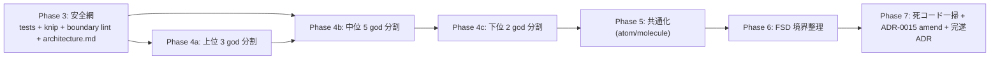

# BonsaiLog 大規模リファクタ — Master Plan(Phase 2 計画書)

> 作成日: 2026-05-28
> 種別: 計画書(コード変更なし、Phase 3 着手前の合意ドキュメント)
> 一次根拠: `./phase-1-explore.md`(Phase 1 調査レポート、6項目を一次コマンド出力で定量化済み)
> SoT: 主要 ADR(0015/0027/0029/0030/0040/0041/0042) + `docs/reference/personas.md` + `docs/reference/constraints.md` + Phase 1 一次調査
> R-13: 質問数 0 / ラウンド数 1(深堀りは末尾の 5視点ペルソナレビューで巻き取り)
> R-16: Design は今回参照せず、ADR と実コードを SoT とする
> R-17: 4段階ゲート厳守(TaskCreate → 計画 → user APPROVE → 実行)、本計画への APPROVE は「方針 OK」のみ。Phase 3 着手は別 APPROVE が必要

---

## Context(なぜこのリファクタをやるのか)

Phase 1 Explore で以下が定量化された:

- **god component 3巨頭**: `bonsai/[id]/index.tsx` 1592行 / `BonsaiBasicForm` 1391行 / `CalendarTabScreen` 974行
- **テスト安全網が薄氷**: 全体 20.08%(閾値 +0.08%)、`src/db/` リポジトリ層がほぼ 0%
- **FSD 境界違反 7件**: `core→stores`(3)・`db→services`(2)・`db→features`(1)・`stores→services`(1)
- **死コード約 164件フラグ**: Tamagui / `@tanstack/react-query` / ui-diff scripts に集中
- **重複 state 既知欠陥 1件**: `useSettingsBootstrap` が言語切替で `potUnit` を黙消し

v1.0 99% 完成 + 多数の ADR 蓄積でアプリは健全に動いているが、**god component が次の機能追加コストを押し上げる構造的負債**になっている。本リファクタは「**振る舞い不変・テスト先張り・段階分割**」で負債を解体し、v1.1 以降の開発速度を担保する。

---

## 1. 全体ゴール(4軸のバランス)

| 軸           | 現状                                               | 目標                                                                                                                      | 計測                    |
| ------------ | -------------------------------------------------- | ------------------------------------------------------------------------------------------------------------------------- | ----------------------- |
| 再利用性     | 既存 Form atom 4種(ADR-0027/0029)以外は god に埋没 | 3+ 箇所で使う hook/atom を切り出す(WET 原則: 3 未満は抽出しない)                                                          | grep で再利用箇所数     |
| 可読性       | 1592行ファイルが存在                               | 実責務を hook/部品へ分離し coordinator に routing+配線+render骨格のみ残す。行数は ≤約450 目安(超過は ADR-0045 で justify) | 責務分離 + `wc -l` 目安 |
| 保守性       | FSD 違反 7件 + 循環疑い 1件                        | 違反 0、ESLint boundary plugin で error 化                                                                                | `pnpm lint`             |
| テスト容易性 | 全体 20.08%、db 層 ~0%                             | 全体 30%+、`src/db/**` 60%+                                                                                               | `jest --coverage`       |

**バランス原則**:

- 過度な抽象化(premature abstraction)を避ける = WET (Write Everything Twice) 原則: 3+ 箇所で重複したら抽出
- Strangler Fig: 旧コードと新コードを並行運用しつつ徐々に置換(一度に全 god を解体しない)
- **振る舞い不変**(Rule 3 / 完了の鉄則): リファクタ前後でユーザー観察可能な差ゼロ。Maestro + 実機 SS で担保

---

## 2. Strangler Fig フェーズ分割(Phase 3〜7)



各フェーズは独立 PR シリーズとして main にマージ可能(Strangler Fig)。
**前フェーズが緑になるまで次フェーズ着手しない**(Rule 5)。

---

### Phase 3: 安全網整備

> **【2026-05-28 拡張】** 本節は user 指示で拡張されました。正は **`./phase-3-plan.md`**(拡張版)を参照。
> 拡張点: 当初の「db テスト + knip + boundary warning + architecture.md」に加え、**TS strict 4フラグ**(`noUncheckedIndexedAccess`/`exactOptionalPropertyTypes`/`noUnusedLocals`/`noUnusedParameters`、計測 ~170 errors)+ **ESLint `strict-type-checked`**(typed-linting 導入)+ **knip 0**(ignore 運用)+ **CI guard**(`.github/workflows/refactor-guard.yml`)を追加。
> 確定判断: Maestro=ハイブリッド / 配置=既存構造 / **boundary plugin は Phase 6 まで OFF**(本節の `eslint.config.js (+boundaries)` は Phase 6 へ繰延) / knip=ignore で 0。

**目的**: god component に手を入れる前に挙動を凍結。死コード判断材料を整備。

**対象ファイル一覧**:

- 追加(テスト): `__tests__/db/eventRepository.test.ts`(拡充) / `__tests__/db.test.ts`(拡充) / `__tests__/db/bonsaiRepository.test.ts`(新規) / `__tests__/db/photoRepository.test.ts`(新規) / `__tests__/db/speciesRepository.test.ts`(新規) / `__tests__/db/bonsaiSpeciesCustomRepository.test.ts`(新規) / `__tests__/db/bonsaiStylesCustomRepository.test.ts`(新規) / `__tests__/features/backup/backupService.test.ts`(拡充) / `__tests__/features/export/exportFlow.test.ts`(新規)
- 追加(設定): `knip.json`(新規) / `package.json`(devDep `knip` + script `verify:dead`) / `eslint.config.js`(`eslint-plugin-boundaries` 追加、warning レベル)
- 追加(docs): `docs/architecture.md`(新規 — Rule 9 が参照しているのに不在の欠落補修)
- **source 本体は一切変更しない**

**変更前後のディレクトリツリー**(Phase 3):

```
Before (現状)                          After (Phase 3 完了時)
├── __tests__/                         ├── __tests__/
│   ├── db/                            │   ├── db/
│   │   ├── eventRepository.test.ts   │   │   ├── eventRepository.test.ts (拡充)
│   │   ├── tagRepository.test.ts     │   │   ├── tagRepository.test.ts (拡充)
│   │   └── 5 others                  │   │   ├── bonsaiRepository.test.ts ★
│   │                                  │   │   ├── photoRepository.test.ts ★
│   │                                  │   │   ├── speciesRepository.test.ts ★
│   │                                  │   │   ├── bonsaiSpeciesCustomRepository.test.ts ★
│   │                                  │   │   ├── bonsaiStylesCustomRepository.test.ts ★
│   │                                  │   │   └── 5 others
│   ├── db.test.ts                    │   ├── db.test.ts (拡充)
│   ├── backupCoverage.test.ts        │   ├── backupCoverage.test.ts
│   └── features/                     │   ├── features/
│       └── export/                   │   │   ├── backup/backupService.test.ts ★
│                                      │   │   └── export/exportFlow.test.ts ★
├── eslint.config.js                  ├── eslint.config.js (+boundaries)
├── package.json (jest 20%)           ├── package.json (jest 25%, +knip)
├── docs/                              ├── docs/
│   └── reference/                     │   ├── architecture.md ★
│       └── ...                        │   └── reference/...
└── (source 不変)                     └── (source 不変)
```

**ステップ(各 5分以内、12 PR 程度)**:
| # | PR | 5分以内ステップ |
| --- | --- | --- |
| P3-1 | `__tests__/db/eventRepository.test.ts` 拡充 (1.56% → 60%+) | (1) 既存 test 構造を Read (2) `EVENT_TYPES` 14種別×CRUD の試験表 (3) 16 unused exports を test 越しに呼出して real-use 化 (4) `pnpm test` 緑 (5) PR open |
| P3-2 | `__tests__/db.test.ts` 拡充 (1.28% → 60%+、migration 含む) | (1) schemaV5Migration test 構造を Read (2) v15 までの migration chain 試験 (3) `PRAGMA foreign_keys` ON 確認 (4) `pnpm test` 緑 (5) PR open |
| P3-3 | `__tests__/db/bonsaiRepository.test.ts` 新規 (0%→60%+) | 同上(bonsai CRUD + getAllActiveBonsaiWithSpecies + getCoverPhoto) |
| P3-4 | `__tests__/db/photoRepository.test.ts` 新規 (6%→60%+) | 同上(getPhotosByEvent + getCoverPhoto + DB↔ファイル整合) |
| P3-5 | `__tests__/db/{species,speciesCustom,stylesCustom}Repository.test.ts` 新規 | 3 repos まとめて 1 PR(各小) |
| P3-6 | `__tests__/db/tagRepository.test.ts` 拡充 (2.4%→60%+) | 既存を拡張 |
| P3-7 | `__tests__/features/backup/backupService.test.ts` 拡充 (0%→50%+) | 既存 `backupCoverage.test.ts` を拡張、export/import round-trip テスト |
| P3-8 | `__tests__/features/export/exportFlow.test.ts` 新規 (0%→50%+) | period/scope/tag フィルタ + share unavailable error |
| P3-9 | `knip.json` + `pnpm verify:dead` script + CI gate | (1) `pnpm add -D knip` (2) `knip.json` で Expo Router entry 指定 (3) ignore list で偽陽性除外 (4) script 追加 (5) `pnpm verify:dead` 緑 |
| P3-10 | `eslint-plugin-boundaries` 導入(warning) | (1) `pnpm add -D eslint-plugin-boundaries` (2) `eslint.config.js` に layer 定義 (3) Phase 1 で見つけた 7違反が warning として全部出ることを確認 (4) `pnpm lint` 緑(warning 容認) |
| P3-11 | `docs/architecture.md` 起票 | レイヤ図 + 依存ルール + 命名 + Strangler 移行ガイド(≤ 300 行、新人 15 分で読める) |
| P3-12 | jest coverage threshold 引上げ (20% → 25%、`src/db/**` 60%+ 強制) | (1) `package.json` jest config 編集 (2) `pnpm test` 緑 (3) PR open |

**想定変更行数**:

- テスト: +2,000 行 / 設定: +150 行 / docs: +300 行 / **net source diff: 0 行**

**検証手順**:

- 各 PR で `pnpm verify` 全 green(rule 5 必須)
- coverage report で `src/db/**` ≥ 60%、global ≥ 25%
- `pnpm verify:dead` で knip green

**ロールバック手順**:

- 各 PR を `git revert <sha>` で巻き戻し
- knip / boundary plugin は devDep のみなので `pnpm remove` で削除
- carryover なし

**成功判定基準**:

- [ ] `src/db/**` カバレッジ ≥ 60%
- [ ] `exportFlow.ts` カバレッジ ≥ 50% / `backupService` は **層分け**: 核(`buildManifestFromDb`)= jest、I/O shell = Maestro + fail-closed `backupCoverage` ガード(根本原因対策、`phase-3-plan.md` 参照)。import-apply 核の jest 化は Phase 4(下記 F5)。
- [ ] `pnpm verify:dead`(knip)CI で green
- [ ] `eslint-plugin-boundaries` が 7 violation すべて warning として出力
- [ ] `docs/architecture.md` が main に存在(Rule 9 参照可能)
- [ ] global coverage ≥ 25%(閾値 ratchet)
- [ ] `pnpm verify` 全 green

---

### Phase 4: god component の段階的分割

> **✅ 完了 (2026-05-29)**: 全 11 対象を分割 or 完了扱い。Before/After + DoD 検証は **`./phase-4-report.md`** 参照。成功基準は ADR-0045 (責務分離 + ≤約450 目安) に再定義済。

**目的**: 上位 god component を hook/サブコンポーネントに分割。**振る舞い完全不変**。Strangler Fig で旧公開 API は wrapper として保持。

#### Phase 4a: 上位 3件(各 1〜2 PR、計 3〜5 PR)

**A1. `app/(tabs)/bonsai/[id]/index.tsx`(1592行 → 目標 ≤ 400行)**

- 抽出(新規 file):
  - `src/features/bonsai/BonsaiHistoryTab.tsx`(履歴タブ、event group + filter + kebab + 写真 strip)
  - `src/features/bonsai/BonsaiTimelineTab.tsx`(年表タブ、event timeline + scroll-jump 受容)
  - `src/features/bonsai/BonsaiDetailFab.tsx`(FAB 2種の dispatcher)
- 抽出(hook):
  - `src/features/bonsai/usePhotoCrudWithUndo.ts`(pendingDeletion + timer ref + finalize)
  - `src/features/bonsai/useScrollToEvent.ts`(focusEventId measure + scroll)
  - `src/features/bonsai/useBonsaiDetailTabs.ts`(tab state + URL 同期)
- 親 screen は coordinator として 400 行以下:routing + tab state + 共通 hook 呼出
- **ADR-0030 modal navigation pattern 不変**(`router.push('/work-picker?mode=...')` 等)
- **ADR-0041 EventRow display mode 不変**

**A2. `src/features/bonsai/BonsaiBasicForm.tsx`(1391行 → 各 < 300)**

- `useBonsaiBasicForm({bonsaiId,onComplete})` の **public API は完全保持**(Strangler Fig wrapper)
- 内部分解(新規 hook、private):
  - `useBonsaiFormFields`(name/species/style/dates/pot/memo の 15 useState)
  - `usePendingPhotos`(pendingPhotos + pick/camera/move/remove + sourcePhoto handlers)
  - `useBonsaiTagPicker`(recentTags/selectedTagIds/toggleTag)
- 抽出(component): `src/features/bonsai/PendingPhotoList.tsx`(写真カード並べ替え UI)
- 抽出(pure utils): `src/features/bonsai/bonsaiFormUtils.ts`(`toIsoUtc` / `isoToYmd` 等)
- **ADR-0027/0029 Form atom contract 厳守**(既存 LabeledTextInput/LabeledDateRow/LabeledNumberInput/LabeledPickerRow/PhotoField をそのまま流用)
- 既存 `useUnsavedChangesGuard`(`src/core/hooks/`、Sess39 PR-2 実装)はそのまま consumer 側で使用

**A3. `app/settings/index.tsx`(857行 → ≤ 350)**

- 抽出(component):
  - `src/dev/DevSettingsSection.tsx`(`__DEV__` guard 保持、seed/reset UI 約 170行)
  - `src/features/settings/NotificationSettingsSection.tsx`(toggle + time picker + 自前 state)
  - `src/features/settings/PlanSection.tsx`(課金 row + Pro 表示)
- 抽出(hook): `src/features/settings/useAlertPickerRow.ts`(theme/potUnit/lang の Alert picker 共通化)
- **AsyncStorage key 一切変更しない**(`myapp-settings` の不整合は別 Issue で migration 計画)

#### Phase 4b: 中位 5件(各 1 PR、計 5 PR)

| ID  | 対象                                          | 行数 → 目標 | 抽出ポイント                                                                                  | ADR 制約                                                      |
| --- | --------------------------------------------- | ----------- | --------------------------------------------------------------------------------------------- | ------------------------------------------------------------- |
| B1  | `src/features/calendar/CalendarTabScreen.tsx` | 974 → ≤ 400 | `useCalendarData(mode)` hook / `EventGroupActionsMenu` / `BulkConvertCta`                     | ADR-0031/0034/0035 計算式不変、`mode` prop 維持(URL 経路不変) |
| B2  | `app/(tabs)/look-back/search.tsx`             | 708 → ≤ 350 | `useBonsaiSearch` hook(debounce + 4 query 並列) / `SearchResultRow` / `useSearchHistory` 統合 | ADR-0009 検索仕様準拠                                         |
| B3  | `src/features/event/BulkLogConfirmScreen.tsx` | 442 → ≤ 250 | `useEventLogForm`(B4 と共有) / `EventLogFormScroll`                                           | ADR-0027/0029/0036/0040 完全準拠                              |
| B4  | `src/features/event/WorkLogConfirmScreen.tsx` | 390 → ≤ 200 | B3 の `useEventLogForm` を共有(2画面で重複ほぼゼロ)                                           | 同上 + ADR-0030 modal navigation                              |
| B5  | `src/features/export/ExportOptionsSheet.tsx`  | 424 → ≤ 250 | `ExportPeriodPicker` / `ExportScopePicker` / `ExportTagPicker` の 3 子分割                    | ADR-0016 export 仕様準拠                                      |

#### Phase 4c: 下位 2件(計 2 PR)

| ID  | 対象                                          | 行数 → 目標            | 抽出ポイント                                                                                                                                                                                                            | ADR 制約                                                                                                                                          |
| --- | --------------------------------------------- | ---------------------- | ----------------------------------------------------------------------------------------------------------------------------------------------------------------------------------------------------------------------- | ------------------------------------------------------------------------------------------------------------------------------------------------- |
| C1  | `src/features/event/EventRow.tsx`             | 609 → 各 ≤ 350         | `EventRowCompact` / `EventRowDetailed`(default export は thin dispatcher)                                                                                                                                               | **ADR-0041 display mode matrix 厳守**、写真 strip + memo expand 仕様不変                                                                          |
| C2  | `app/(tabs)/plan/wiring.tsx`                  | 353 → ≤ 200            | `useWiringRows`(data + status 計算) / `WiringStatusBadge`                                                                                                                                                               | F-07 仕様準拠                                                                                                                                     |
| C3  | `src/features/backup/backupService.ts`(879行) | shell ≤ 300 + 核を分離 | **F5(Phase3 根本原因対策の続き)**: `importBackup` の DB-apply 核を写真ファイルコピーから分離し純粋な `applyImportPlan(db, plan)` として抽出 → jest characterize。zip/picker/share/photo-copy は imperative shell に残す | **ADR-0007 厳守(ユーザーデータ経路、最高リスク)**。Phase3 で張った `buildManifestFromDb` jest + `backupCoverage` fail-closed + Maestro を網に改修 |

**Phase 4 想定変更行数**:

- 抽出による減: 旧 god 合計 約 7,300 行 → 約 2,800 行(net -4,500)
- 抽出による増: 新 component/hook ファイル群 約 4,500 行
- **net コード行数差: ほぼゼロ**(構造の再配置)
- **net public API 差: ゼロ**(useBonsaiBasicForm 等は wrapper 保持)

**検証手順**(各 PR 共通):

1. Phase 3 で張った特性化テスト + 既存 67 テスト = 全 green(`pnpm test`)
2. `pnpm verify` 全 green(lint + type + i18n + hardcode + theme + scroll + screen-testid + ...)
3. **該当画面の Maestro flow 実行**(`pnpm test:e2e`)
4. **実機検証**(完了の鉄則):Dev Build install → 該当 flow を手動実行 → 振る舞い差ゼロ確認 → run-as cat + adb screencap で SS 取得 → PR に添付
5. ADR 制約違反チェック:`pnpm verify:form-screen-scroll` / `verify:modal-autofocus` / `verify:screen-testid` 全 green

**ロールバック手順**:

- 各 PR は独立 squash merge → `git revert <sha>` で巻き戻し
- A2 の wrapper 保持戦略により、A2 を revert しても他画面の useBonsaiBasicForm consumer は無影響
- Phase 4 全体を revert したい場合は `git revert <P4 series shas>`(順不同で OK、wrapper のおかげ)

**成功判定基準**:

- [ ] 全 god component が実責務分離済(coordinator = routing+配線+render骨格)、行数 ≤約450 目安・超過は ADR-0045 で justify
- [ ] 既存 67 + Phase 3 追加テスト 全 green
- [ ] 各画面の Maestro flow + 実機検証で振る舞い差ゼロ
- [ ] global coverage ≥ 30%
- [ ] `pnpm verify` 全 green
- [ ] PR ごとに「変えない」リスト遵守を self-check

---

### Phase 5: 共通化(atomic / molecules、shared/ui)

**目的**: Phase 4 抽出の中で **3+ 箇所で再利用**された hook/component を atom/molecule に格上げ。WET 原則厳守(< 3 は格上げしない)。

**対象**(候補、Phase 4 完了後に grep で実際の再利用数を確認):

- 既存 Form atom 4種(ADR-0027/0029)は SoT → そのまま使う
- 新規 atom 候補: `Chip` / `IconRow` / `ListSeparator` / `EmptyState`
- 新規 molecule 候補: `BonsaiCardCompact` / `SectionHeader` / `KebabMenu`(RowActionMenu 拡張)
- ディレクトリ構成: 既存 `src/components/` を維持(`atoms/` `molecules/` 細分化は議論余地、過剰分類しない)

**WET 厳守の手順(各候補)**:

1. Phase 4 後に `grep` で再利用箇所数を実測
2. **3+ 箇所**なら抽出を計画書化
3. 抽出 PR で「再利用箇所 N」を本文に明記
4. 抽出後の再利用テスト + Maestro 1 flow で挙動不変確認

**想定変更行数**: +500〜1,000(候補次第)
**PR 想定数**: 3〜5本

**ロールバック**: PR 単位、抽出した atom を旧位置に inline で戻す手順を PR 本文に記載

**成功判定基準**:

- [ ] 新規 atom/molecule が **すべて 3+ 箇所で利用**(再利用箇所数を PR 本文に証拠提示)
- [ ] 既存テスト全 green、新 atom に snapshot or interaction test 1 件以上
- [ ] design_system.md 該当章を更新

---

### Phase 6: feature 境界整理(FSD への正規化)

**目的**: Phase 1 で検出した **7 件の境界違反**を是正、ESLint boundary plugin を **warning → error** に昇格。

**対象ファイル一覧(全 4 PR、違反エッジ別)**:

| PR  | 違反                                                                                        | 対応                                                                                                                                                                                   |
| --- | ------------------------------------------------------------------------------------------- | -------------------------------------------------------------------------------------------------------------------------------------------------------------------------------------- |
| F1  | `core → stores` ×3(`useColors`/`lang-defaults`/`potUnitConvert`)                            | `PotUnit` 型を `src/types/units.ts` に新設して移動。`useColors` を `src/shared/theme/useColors.ts` に格上げ(または `src/features/theme/` 新設)。`settingsStore` で type re-export 保持 |
| F2  | `db → services` ×2(`photoRepository.ts`/`bonsaiRepository.ts` が `photoFileService` を呼出) | repository を純データアクセスに戻し、ファイル削除/コピー側 effect は `src/features/photos/photoOrchestrator.ts` に集約。呼出側を 1 ファイルずつ更新                                    |
| F3  | `db → features` ×1(`eventRepository.ts` が `features/event/payloadValidator` を呼出)        | `payloadValidator` を `src/db/eventPayloadValidator.ts` に移動(イベントデータ契約は db 層に正規化)。循環疑い 1件も同時解消                                                             |
| F4  | `stores → services` ×1(`proStore` が `proService`)                                          | services を「外部 SDK ラッパ」として `src/services/sdks/` に格下げ、依存方向「stores → services」を正規化として ADR-0046「FSD 層定義」起票                                             |

**boundary plugin 設定変更**: warning → error 昇格(P3-10 で warning 化したものを格上げ)

**破壊的変更**(全て事前申告、D2/D3/D4 として §3 で justify):

- Import path 変更は全リポジトリ内 grep + 一括 sed + `pnpm verify` 緑で機械的に実施
- 外部 consumer なし(全て内部 import)→ **ユーザー観察可能な挙動変化ゼロ**

**想定変更行数**: ~500(import path 修正のみ、ロジック不変)
**PR 想定数**: 4 本

**検証手順**:

- 各 PR で `pnpm verify` 全 green、boundary plugin の violation 数を PR 本文に記録(7 → 0 の推移を可視化)
- Maestro smoke + 実機 1 画面検証

**ロールバック手順**: PR 単位 `git revert`

**成功判定基準**:

- [ ] `eslint-plugin-boundaries` violation = 0、error レベルで CI gate 化
- [ ] 循環依存 0(import/no-cycle error 維持)
- [ ] `pnpm verify` 全 green
- [ ] ADR-0046「FSD 層定義」起票完了

---

### Phase 7: 最終レビュー + 死コード一掃 + flag cleanup

**目的**: Phase 1 knip がフラグした死コードを user 承認後に削除、ADR-0015(Tamagui 採用宣言)を実態に合わせて amend、リファクタの学びを集約。

**対象(user 承認後のみ削除)**:

| ID  | 対象                                                                                                                                         | 削除条件                                                                                             |
| --- | -------------------------------------------------------------------------------------------------------------------------------------------- | ---------------------------------------------------------------------------------------------------- |
| K1  | `app/modal.tsx`(`/modal` テンプレ残骸)                                                                                                       | grep で参照ゼロ確認                                                                                  |
| K2  | `scripts/ui-diff/*` 9ファイル                                                                                                                | user 確認(運用していなければ削除)                                                                    |
| K3  | `scripts/store-screenshots/*` 5ファイル                                                                                                      | user 確認                                                                                            |
| K4  | `@tanstack/react-query` + `src/core/queries/invalidators.ts`                                                                                 | 完全未使用、user 確認                                                                                |
| K5  | `Tamagui` 一式(`@tamagui/{core,lucide-icons,portal,babel-plugin}` + `tamagui.config.ts` + `tamagui.d.ts` + babel.config.js から plugin 削除) | **ADR-0015 amend を先に起票**(実装が `useColors` + plain hex のため Tamagui 不要を明文化)+ user 確認 |
| K6  | knip 偽陽性検証後の真の dead deps(`expo-symbols` 等)                                                                                         | grep + import 検査で確証取得後                                                                       |
| K7  | `src/db/eventRepository.ts` の 16 unused exports                                                                                             | Phase 3 テストでカバー後、再 knip で残るもののみ削除                                                 |

**ADR 起票/更新**:

- ADR-0015 amend「Tamagui 撤回 → useColors + plain hex 採用」(実態整合)
- ADR-0046「FSD 層定義」(Phase 6 で実体化したものを正式化)
- ADR-0047「リファクタ完遂レポート」(Before/After 数値・lessons・次回反省)

**docs/lessons**:

- `docs/architecture.md` を Phase 6 結果で更新
- `docs/reference/tasks/lessons/refactor.md` 新規(R-XX 系の自己改善 lesson を集約)
- `docs/reference/tasks/lessons.md`(索引)に 1行追加

**想定変更行数**: -3,000〜-5,000(削除主体)、+500(ADR + lessons)
**PR 想定数**: 5〜8

**検証手順**: 削除前に `git grep` で参照ゼロ確認、削除後 `pnpm verify` 全 green、bundle size 計測(Tamagui 撤去で削減見込み)、Maestro smoke、実機 install + smoke

**ロールバック手順**: PR 単位 revert(削除 PR は再 add するだけで戻る)

**成功判定基準**:

- [ ] knip 0 件 or 認可済 ignore のみ
- [ ] bundle size 計測値(Tamagui 削除前後で削減確認)
- [ ] ユーザー観察可能な挙動完全不変(Maestro smoke + 実機)
- [ ] ADR-0015 amend / ADR-0046 / ADR-0047 が main に存在
- [ ] `docs/architecture.md` + `docs/reference/tasks/lessons/refactor.md` 更新

---

## 3. 破壊的変更 総リスト(Rule 4 — 全て事前申告)

> **定義**: public API / props / export 名 / URL path / AsyncStorage key の変更。

| #   | 変更内容                                                                                      | Phase   | justification                                                      | mitigation                                                |
| --- | --------------------------------------------------------------------------------------------- | ------- | ------------------------------------------------------------------ | --------------------------------------------------------- |
| D1  | `useBonsaiBasicForm` の内部実装を 3 hook 合成に再構築                                         | 4a A2   | god 1391→<300、関心の分離                                          | **public API 不変**(wrapper)→ 実質非破壊                  |
| D2  | `src/features/event/payloadValidator.ts` を `src/db/eventPayloadValidator.ts` に移動          | 6 F3    | FSD `db→features` 違反 + 循環疑い解消                              | 全 import path を grep + 一括更新、外部 consumer ゼロ     |
| D3  | `PotUnit` 型を `src/stores/settingsStore.ts` から `src/types/units.ts` へ移動                 | 6 F1    | FSD `core→stores` 違反解消                                         | `settingsStore` で type re-export 保持 → 既存 import 不変 |
| D4  | `useColors` を `src/core/theme/` から `src/shared/theme/` または `src/features/theme/` へ移動 | 6 F1    | FSD `core→stores` 違反解消(useColors が `useSettingsStore` を呼ぶ) | 全 import path を grep + 一括更新                         |
| D5  | `EventRow.tsx` を `EventRowCompact` + `EventRowDetailed` に分割                               | 4c C1   | god 609→<350、ADR-0041 matrix の構造化                             | default export は thin dispatcher として API 不変         |
| D6  | `app/modal.tsx` 削除(URL `/modal` 撤回)                                                       | 7 K1    | Expo テンプレ残骸、参照ゼロ確認後                                  | grep で参照ゼロ + Maestro smoke 緑 確認後のみ             |
| D7  | `@tanstack/react-query` + `tamagui*` 4種 + `expo-symbols` 等 dead deps 削除                   | 7 K4-K6 | bundle size + 認識ノイズ                                           | knip green + grep 0件 + smoke 緑 + user 承認              |
| D8  | `scripts/ui-diff/*` + `store-screenshots/*` 削除                                              | 7 K2-K3 | dead scripts、運用していなければ                                   | user 承認必須                                             |
| D9  | `tamagui.config.ts` 等 Tamagui 設定 削除 + ADR-0015 amend                                     | 7 K5    | 実態(useColors + plain hex)と整合                                  | ADR amend 先行起票 + user 承認                            |

**AsyncStorage key / SQLite schema / 既存 URL routes は一切変更しない**(D6 のみ user 承認後例外)。
**i18n key(ADR-0033)も一切変更しない**(rename 禁止)。

---

## 4. リスクマップ(影響範囲 × 確率)

| リスク                                                    | 影響範囲 | 確率 | mitigation                                                                                                |
| --------------------------------------------------------- | -------- | ---- | --------------------------------------------------------------------------------------------------------- |
| god 分割で振る舞いが変わる(hook 順序・useEffect 依存配列) | 高       | 中   | Phase 3 特性化テスト先張り + Maestro + 実機 SS 比較                                                       |
| AsyncStorage key 誤改名 → 永久データ損失                  | 致命     | 低   | 「変えない」リスト明記 + PR テンプレ check + boundary plugin で `storeKey` 直書きを検出する rule 追加検討 |
| ADR-0030 modal-stack push に意図せず影響                  | 高       | 中   | A1 改修で navigation API は一切触らない / ADR-0030 を PR 本文に必ず参照                                   |
| ADR-0027/0029 Form atom contract 違反                     | 中       | 中   | A2 で既存 atom 流用、新規 atom 追加禁止(P5 で初めて検討) / `pnpm verify:form-screen-scroll` 緑            |
| ADR-0041 EventRow matrix への影響                         | 中       | 低   | C1 で matrix 維持 + display mode test 追加                                                                |
| Tamagui 撤去で隠れ import 露呈                            | 中       | 中   | grep `@tamagui` ゼロ確認 + babel.config.js 確認 + Metro 起動 smoke + 実機 install 確認                    |
| Expo SDK メジャー版ずれ 3件を巻き込む                     | 高       | 中   | **本リファクタ scope 外**、別 Issue 推奨(Phase 1 §9-b の user 判断事項)                                   |
| Strangler 二重実装の保守漏れ(wrapper 残骸)                | 中       | 中   | wrapper に `@deprecated` + Phase 7 までに必ず除去する TODO、CI grep で残検出                              |
| カバレッジ閾値割れ(20% 薄氷)                              | 中       | 中   | Phase 3 終了で 25%、Phase 4 終了で 30%、Phase 7 で 40% 目標(ratchet)                                      |
| ADR-0015 と Tamagui 撤去の整合                            | 中       | 中   | Phase 7 で ADR-0015 amend を **削除 PR の前に**起票 + マージ                                              |
| `useSettingsBootstrap` の potUnit 黙消し既知欠陥          | 中       | 中   | 本リファクタ scope に含めるか別 Issue かを user 判断(Phase 1 §9-d)                                        |
| 既存 67 tests への意図せぬ破壊                            | 中       | 低   | 各 PR で `pnpm test` 緑必須 + rule 10「テスト側で誤魔化さない」                                           |
| PR 数 30+ で context 窮迫                                 | 中       | 中   | session 単位で Engram に状態記録 + 各 PR は独立して merge 可能設計                                        |
| 競合 PR / main 移動による rebase 地獄                     | 中       | 中   | 1 PR = 1 懸念、main を狙わずに stack PR を作らない                                                        |

---

## 5. 「変えない」リスト(今回触らない領域)

1. **AsyncStorage keys**: `bonsailog-onboarding` / `myapp-settings`(名前不整合は別 Issue で migration 計画)/ `app-i18n-lang` / `bonsailog-search-history`
2. **SQLite schema v15**(migration ゼロ、`PRAGMA foreign_keys=ON` 維持、ADR-0008)
3. **既存 URL routes**(deep link 互換性、D6 modal.tsx のみ user 承認後例外)
4. **Native plugin 設定**(`plugins/with*.js`, AndroidManifest, Info.plist、ADR-0044 含む)
5. **ADR-0030 modal-stack push pattern**(UX 意図的、Sess18 確立)
6. **法令系 ADR**: 0005(iOS encryption)/ 0007(F-11 ZIP)/ 0009(RevenueCat)/ 0017(ATT/UMP/Privacy)
7. **i18n keys**(ADR-0033、19 言語約 5,463 文字列、rename 禁止)
8. **package identity** `com.dooooraku.bonsailog`(Sess50 統一済)
9. **AdMob unit ID / RevenueCat entitlement**(`.env` / ADR-0009/0010/0044、entitlement key `"premium"`)
10. **Expo SDK バージョン**(別 Issue でメジャー版ずれ 3件対応)
11. **Theme tokens / Design system tokens**(ADR-0042 / design_system.md §25-26 SoT)
12. **FormScreenHeader pattern / Form atom**(ADR-0027/0029/0040/R-46/R-51)
13. **既存 Maestro flow**(回帰検出用に保持、追加は OK)
14. **CI gate スクリプト群**(`scripts/check-*.mjs`、構造防止策)
15. **ADR-0041 EventRow display mode matrix**(compact/detailed の責務分離)
16. **ADR-0024 modal 一本化 / ADR-0025 4タブ構成**
17. **Plan / Record カレンダーの ADR-0031/0034/0035 計算式**(stale closure 修正含む)

---

## 6. PR 想定数と所要セッション数

| Phase    | PR 数      | 所要セッション(目安)  |
| -------- | ---------- | --------------------- |
| 3        | 12         | 3〜4                  |
| 4a       | 5          | 2〜3                  |
| 4b       | 5          | 2                     |
| 4c       | 2          | 1                     |
| 5        | 3〜5       | 1〜2                  |
| 6        | 4          | 1〜2                  |
| 7        | 5〜8       | 2〜3                  |
| **合計** | **36〜41** | **12〜17 セッション** |

各 PR は **1 コミット 1 懸念**(Rule 7)、squash merge を想定。

---

## 7. 自己レビュー(5視点ペルソナレビュー)

> 本セクションは計画完成後の自己批判。「私の高い基準値を満たすまで繰り返す」という user 指示に応えるため、各視点で本計画の **弱点・盲点・反論可能な点**を洗い出した。

### 視点 1: シニアエンジニア(技術的負債 / 再凝集リスク)

**評価**: 🟡 概ね妥当だが、再凝集のリスクを 2 点挙げる。

- ✅ **強み**: Strangler Fig + wrapper 保持で漸進。テスト先張り(rule 10 整合)。WET 原則明記で premature abstraction を防止。
- ⚠️ **弱点 1 — useBonsaiBasicForm 3 hook 分割の再凝集**: 3 hook を呼び出す wrapper が成長すると、結局 god と同じ。**対策**: A2 PR で wrapper 自体に「3 hook の境界が崩れたら ADR を起票して再分割」と JSDoc 明記。3 か月後に行数を再計測する TODO を埋める。
- ⚠️ **弱点 2 — Phase 5 共通化の WET 判定タイミング**: Phase 4 完了直後に grep するが、まだ「使い始めた」段階で 3 箇所到達しない可能性。**対策**: Phase 5 を「Phase 4 終了から 2 週間 cooling-off 後」にスケジュール。
- 🔴 **盲点**: 「再利用性」と「読みやすさ」がトレードオフになる箇所(例: 3 箇所で軽く使う atom より、各箇所 inline の方が読みやすい)。一律 3 箇所閾値は単純すぎる。**対策**: 各 atom 抽出 PR で「インラインのままの方が良かったか」を PR 本文で justify。
- ✅ **提案**: Phase 4 各 PR の本文に「3か月後再評価 TODO」を埋め、計画書末尾の lessons.md にも同 TODO を 1行追記。

### 視点 2: QA(回帰リスク / テストギャップ)

**評価**: 🟡 安全網は厚いが、E2E と特性化テストの境界が曖昧。

- ✅ **強み**: Phase 3 で db 層を 60%+ まで持ち上げる戦略は妥当。`backupCoverage.test.ts` の fail-closed pattern(Sess46)が手本になる。
- ⚠️ **弱点 1 — 写真 undo timer の特性化テスト難**: `usePhotoCrudWithUndo` の timer ref + finalize はテスト時に Jest fake timers 必須、しかも複数 timer の race 条件が再現しにくい。**対策**: Phase 3 PR 9 として「fake timer harness」を専用 hook test util として整備。
- ⚠️ **弱点 2 — scroll-to-event は実機でしか挙動再現できない**: `UIManager.measureLayout` は Fabric で挙動が違う(Engram の rn-fabric-measurelayout-gotcha)。**対策**: A1 PR で必ず実機 SS(Dev Build) を取得、jest test は coverage 担保のみと割り切る。
- 🔴 **盲点**: Maestro が Android の日本語入力をテストできない(bonsailog-adb-verify-constraints)。検索系の B2 改修で 日本語検索は手動になる。**対策**: B2 PR テンプレに「日本語入力は手動」と明記、Maestro は en flow のみで OK。
- ✅ **提案**: 各 Phase 4 PR に「Maestro flow 名 + 実機 SS 2枚」を必須提出物として PR テンプレに追加。

### 視点 3: アーキテクト(FSD / Expo Router 設計逸脱)

**評価**: 🟡 方向性は正しいが、層定義の合意形成が遅い。

- ✅ **強み**: 違反 7件を 4 PR で潰す具体性。`src/types` が既にクリーンで FSD の bottom が確立済み。
- ⚠️ **弱点 1 — ADR-0046「FSD 層定義」を Phase 6 で起票するが、Phase 3 の boundary plugin 設定時に層を仮定する必要がある**: 鶏卵問題。**対策**: Phase 3 P3-10 で boundary plugin に「現状の暫定的層定義」を入れ、ADR-0046 起票時に正式化する 2 段階運用。`docs/architecture.md`(P3-11) で暫定的層を明文化。
- ⚠️ **弱点 2 — `useColors` の `core → shared/features` 移動先**: 「shared」レイヤを新設すべきか、`src/features/theme/` で済ますかは設計判断。**対策**: ADR-0046 で議論、Phase 6 F1 PR の前に user 承認取得。
- 🔴 **盲点 — ADR-0030 modal-stack push は ADR で正当化されているが、長期的にはアンチパターン**: 本リファクタの scope 外とするが、Phase 7 完了後の v1.2 議題として残す。
- ✅ **提案**: Phase 6 を着手する前に ADR-0046 を **草案 PR** として先行起票 + user レビュー → 確定後に F1〜F4 PR を進める 2 段階ゲート。

### 視点 4: PO(ユーザー体感の変化 / リリーススケジュール)

**評価**: 🟢 user 価値はゼロ(短期)、間接的(長期)。リスクは低い。

- ✅ **強み**: 振る舞い不変が大原則 → user 体感ゼロ変化が達成可能。Local-first + Pro 課金収益への影響なし。
- ⚠️ **弱点 1 — リファクタ専用 release を切るか、main に流し続けるかが未定**: 12〜17 セッションの長期 work で feature freeze するのは現実的でない。**対策**: 各 Phase 完了時に release tag を打つ運用を提案(`refactor-v1`〜`refactor-v5`)。tag 間で feature PR が流れても OK。
- ⚠️ **弱点 2 — Phase 1 §9-b の Expo SDK メジャー版ずれを別 Issue 化した場合、その別 Issue が本リファクタ中に着手されると競合**: 別 Issue は **Phase 7 完了後**にスケジュール、と user に提案。
- 🔴 **盲点 — PR 36〜41 本は merge コンフリクト確率を押し上げる**: 同じファイルを別 PR で触ると revert が複雑化。**対策**: 各 Phase 内で「同ファイル系」をまとめて 1 PR にする、もしくは PR 間に依存順序を明示。
- ✅ **提案**: Phase ごとに 1 サマリ PR(コードゼロ、`docs/refactor/phase-N-report.md` のみ)を最後に merge し、PO/release notes に変換しやすくする。

### 視点 5: 新人エンジニア(学習コスト / ドキュメント不足)

**評価**: 🟡 計画は丁寧だが、Strangler の wrapper が読みにくい。

- ✅ **強み**: `docs/architecture.md` 起票(Rule 9 が参照してたのに不在の欠落を補修)。lessons.md 更新。
- ⚠️ **弱点 1 — wrapper + 新 3 hook の併存期間が読みにくい**: 新人が `useBonsaiBasicForm` を読むと「これ何しているの?」となる。**対策**: A2 PR の wrapper に「Strangler Fig 移行中、Phase 7 で除去」と冒頭コメント、関連 ADR-XX 番号を併記。
- ⚠️ **弱点 2 — boundary plugin で error が出た時の解決手順がドキュメント化されていない**: **対策**: `docs/architecture.md` に「FAQ: 境界違反 error が出た時」セクションを設ける。
- 🔴 **盲点 — 既存 lessons.md は索引だが、新人は索引から各 domain.md に辿るのが大変**: **対策**: Phase 7 で `docs/reference/tasks/lessons/refactor.md` を新規追加する際、目次を最上部に置き、初見でも読み切れる長さに抑える。
- ✅ **提案**: Phase 3 P3-11 で書く `docs/architecture.md` は **新人 1人が 15分で読める長さ**を上限とする(300 行以内)。リンクで詳細 ADR に飛ばす設計。

---

## 8. 4 ペルソナ評価(R-10 必須、user-facing 観点)

本リファクタはユーザー観察可能な挙動を一切変えない設計なので、4 ペルソナ評価は「**変化なし = ◯**」が原則。ただし以下の間接効果を評価する。

| 項目                                                   | 高橋 62   | Marcus 35       | 業務プロ                          | ライト              | 総合 |
| ------------------------------------------------------ | --------- | --------------- | --------------------------------- | ------------------- | ---- |
| 振る舞い不変(目標)                                     | ◯         | ◯               | ◯                                 | ◯                   | ◯    |
| カバレッジ向上による信頼性                             | △(無関心) | ◯               | ◎(業務利用、データ消失リスク低下) | △                   | ◯    |
| 将来の機能追加速度向上                                 | △         | ◎(機能比較重視) | ◯                                 | ◯                   | ◯    |
| Tamagui 撤去で bundle size 削減(install 軽量化)        | △         | ◯               | △                                 | ◎(install 障壁低下) | ◯    |
| 既知欠陥(potUnit 黙消し)修正(別 Issue or 本リファクタ) | ◯         | ◯               | ◎(業務必須)                       | ◯                   | ◯    |

**1 ペルソナでも ✕ が無いことを確認**(R-10 通過)。

---

## 9. 次の手順 — Phase 3 起動前に確定したい人間判断事項

(Phase 1 §9 の継続)

- (a) **Tamagui 撤去**(Phase 7 K5)の可否 — ADR-0015 amend を含む
- (b) **Expo SDK メジャー版ずれ 3件**を本リファクタに含めるか別 Issue か
- (c) リファクタ順序「**安全網テスト先**」(本計画の Phase 3→4)で合意か
- (d) `useSettingsBootstrap` の **potUnit 黙消し既知欠陥**を本リファクタに含めるか別 Issue か
- (e) `app/modal.tsx` 削除(D6)の可否(参照ゼロ確認後)
- (f) `scripts/ui-diff/*` と `store-screenshots/*` の削除可否
- (g) **PR 数 36〜41 / セッション 12〜17 の所要見込み**で OK か(短縮要望があれば Phase 5 cooling-off を削る等で調整可能)

**APPROVE すれば Phase 3 に進みます**(その前に (a)〜(g) を確定するか、保留したまま Phase 3 plan セッションで個別に取りに行くかは user 判断)。
