# 機能設計書（BonsaiLog / 盆栽手帳）

> **Diátaxis**: Reference（どう動くかをすぐ引けるための仕様）
> **バージョン**: v1.0（2026-04-23）
> **前提文書**: [`product_strategy.md`](../explanation/product_strategy.md) / [`basic_spec.md`](./basic_spec.md)

---

## §0. この文書の位置づけ（超重要）

- **文書タイプ**: Reference（「どう動くか」をすぐ引けるための仕様）
- **想定読者**:
  - 実装する人（未来の自分 / AI）
  - PR レビューする人
  - 不具合を切り分ける人
- **この文書に「書かない」こと**（ドリフト防止）:
  - 開発手順・コマンド → `docs/how-to/whole_workflow.md`
  - 背景や思想の長文 → `docs/adr/`
  - 画面の見た目詳細 → Figma（正）
  - できること/できないことの境界 → `basic_spec.md`
- **ソース・オブ・トゥルース（正）**:
  1. この機能設計書（期待動作）
  2. 自動テスト（期待動作の機械的検証）
  3. 実装（最終的な現実）
     ※ 1) と 2) が揃って初めて「仕様が生きている」とみなす

### 本書と basic_spec.md の役割分担

| 文書                         | 役割                                                        | 粒度    |
| ---------------------------- | ----------------------------------------------------------- | ------- |
| `basic_spec.md`              | できること / できないことの境界、受け入れ条件のインデックス | What    |
| `functional_spec.md`（本書） | 期待動作、状態遷移、擬似コード、境界値、エラーフロー        | **How** |

---

## §1. いつ・どんな時に必要になる？

- **仕様を元に Issue を立てる時**: 「受け入れ条件」「期待動作」をここからコピペ
- **実装前**: 既存機能の期待動作を確認し、影響範囲（どの F-XX に触れるか）を特定
- **PR レビュー時**: 変更内容がこの文書の期待動作を壊していないか確認
- **不具合調査時**: 「本来どう動くべきか」をここで確定し、ログ / 再現手順を組み立てる

---

## §2. 更新ルール（運用で死なせない）

### §2.1 更新トリガー

1 つでも当てはまれば更新:

- 新しい画面・設定項目・制約が増えた
- 既存の挙動（例: 「気遣い型」ポップアップの閾値、Free 制限）が変わった
- テストの期待値が変わった
- Pro / 課金 / 広告 / レビュー要求など、審査に関わる動作が変わった

### §2.2 PR の Definition of Done

- [ ] 変更した機能 ID（F-XX）を PR に列挙した
- [ ] 受け入れ条件が変わるなら、本書を更新した
- [ ] 関連テスト（Jest / Maestro）が追加・更新され、CI で実行される
- [ ] 状態遷移図・境界値テーブルが影響を受けるなら更新した

---

## §3. 全体の機能マップ（basic_spec.md F 番号との対応）

| F 番号 | 機能名                           | 本書 § |
| ------ | -------------------------------- | ------ |
| F-01   | 盆栽の登録・管理                 | §6     |
| F-02   | 作業履歴記録                     | §7     |
| F-04   | 水やり履歴の可視化               | §9     |
| F-05   | 「気遣い型」予定確認ポップアップ | §10    |
| F-07   | 針金がけ記録・外し時期通知       | §12    |
| F-08   | 写真管理（年次タイムライン）     | §13    |
| F-09   | 検索・タグ                       | §14    |
| F-10   | エクスポート（CSV / PDF）        | §15    |
| F-11   | お引っ越し機能                   | §16    |
| F-12   | 多言語対応                       | §17    |
| F-13   | 課金（サブスク + 買切）          | §18    |
| F-14   | Home 下部バナー広告              | §19    |
| F-15   | ダークモード / 屋外モード        | §20    |
| F-16   | ローカル通知                     | §21    |

---

## §4. 用語（この文書で使う言葉）

basic_spec.md §2 と重複しない本書固有語のみ:

- **optimistic update**: ユーザー操作を即座に UI 反映し、後で DB に書き込む手法。DB 失敗時は UI をロールバック。
- **query key**: TanStack Query がキャッシュを識別するための配列キー。例: `['bonsai', 'list']`。
- **invalidate**: TanStack Query のキャッシュを「古い」と印し、次の参照で再取得させる操作。
- **排他トランザクション（Exclusive TXN）**: `withExclusiveTransactionAsync`。他の並行クエリを巻き込まない、独立接続で実行。
- **identifier（通知）**: 通知の一意識別子。BonsaiLog では `bonsai_${id}_${event}_${YYYYMMDD}`。
- **canRequestAds**: UMP が返す真偽値。ユーザー同意が得られ広告要求可能か。
- **entitlement（RevenueCat）**: 課金で解放される権利。BonsaiLog は `premium` 1 つのみ。
- **Intent（スナックバー）**: 「取り消し」ボタンで可逆な通知型 UI。5〜7 秒表示。
- **WAL**: Write-Ahead Logging、SQLite の高並行性モード。
- **bigram / trigram**: 2 文字 / 3 文字で文字列を分割する方式。SQLite FTS5 tokenizer の選択肢。

---

## §5. 横断仕様（どの機能にも効くルール）

### §5.1 日付の基準

- **日付境界は端末のローカルタイム 00:00 切り替え**を基準とする
- アプリがバックグラウンドにいても、復帰時（AppState → active）に日付変更を検知して当日情報を再同期する
- **DB 保存は UTC ISO 8601 TEXT + `tz_offset_min` INTEGER**（basic_spec.md §5.2）
- 表示時のみ `tz_offset_min` または端末ローカルでの変換
- **リスク**: 端末の手動時刻変更 / タイムゾーン変更で意図しない日付が混ざる可能性
  - 対策: 横断的に「ローカル基準」と明記、将来必要なら ADR で「旅行対応」などを決める

### §5.2 タイムゾーン変更対応

AppState → active 時に以下を実施:

```typescript
AppState.addEventListener('change', async (state) => {
  if (state !== 'active') return;
  const nowTz = Localization.getCalendars()[0]?.timeZone;
  if (nowTz && nowTz !== lastTz) {
    lastTz = nowTz;
    await rescheduleAllBonsaiNotifications(); // F-05, F-16 再計算
  }
});
```

### §5.3 状態管理レイヤー（3 層分離）

| レイヤー             | 役割           | 技術                 |
| -------------------- | -------------- | -------------------- |
| **永続・真実**       | 正データ       | expo-sqlite 55 (WAL) |
| **キャッシュ・同期** | UI への供給    | TanStack Query v5    |
| **UI・ドラフト**     | 揮発性選択状態 | Zustand v5           |

**原則**: SQLite が source of truth、表示はキャッシュで高速に、永続化は DB で確実に。

**絶対ルール**:

- SQLite データを Zustand に丸ごとコピーしない（二重管理アンチパターン）
- Zustand は UI 状態（選択中 ID、フィルタ、ドラフト）のみ
- 複数フィールド選択時は `useShallow` を使う（v5 破壊的変更）
- `onSuccess` ではなく **`onSettled` で invalidate**（ロールバック時も正しく同期）

### §5.4 トランザクション選択ルール

| 状況                                       | 選択                                                  |
| ------------------------------------------ | ----------------------------------------------------- |
| 単純な順次クエリ、他 process も触らない    | `withTransactionAsync`                                |
| 同時性競合あり、他フック経由のクエリが並行 | **`withExclusiveTransactionAsync`（BonsaiLog 既定）** |
| 1 件の INSERT/UPDATE/DELETE                | `runAsync`（TXN 不要）                                |
| DDL（ALTER, VACUUM）                       | TXN 外で実行                                          |

**BonsaiLog で必ず排他 TXN を使う場所**:

- F-01 盆栽削除（CASCADE で events/photos も連動削除）
- F-05 分散再計算（全盆栽リマインダーを書き換え）
- F-08 写真バッチ保存
- F-11 お引っ越し DB 置換
- マイグレーション（§5.11）

### §5.5 invalidateQueries タイミング表

| トリガ                 | invalidate する query key                                                               | 対象 F |
| ---------------------- | --------------------------------------------------------------------------------------- | ------ |
| 盆栽追加/編集/削除     | `['bonsai']`（全配下）                                                                  | F-01   |
| 作業記録追加/編集/削除 | `['bonsai','works',id]`, `['bonsai','detail',id]`, `['bonsai','list']`, `['reminders']` | F-02   |
| 分散再計算完了         | `['reminders']`, `['bonsai','list']`                                                    | F-05   |
| リマインダー設定変更   | `['reminders']`, `['bonsai','detail',id]`                                               | F-16   |
| 写真追加/削除          | `['bonsai','photos',id]`, `['bonsai','detail',id]`                                      | F-08   |
| タグ付与               | `['bonsai','tags',id]`, `['bonsai','list']`                                             | F-09   |
| お引っ越し復元         | **全キャッシュ破棄（`queryClient.clear()`）**                                           | F-11   |
| 言語切替               | 翻訳キャッシュのみ、query key は不変                                                    | F-12   |
| Pro 購入               | `['subscription']`、UI は Zustand で即反映                                              | F-13   |

### §5.6 optimistic update 採用ルール

以下のみ optimistic update を使う（可逆操作）:

- F-02 作業記録のトグル完了（水やり「済」にする）
- F-09 タグの付与/解除
- F-15 テーマ切替

以下は optimistic update を使わない（破壊的・非可逆・データ重要）:

- F-01 盆栽削除
- F-08 写真削除
- F-11 DB 置換
- F-13 購入

### §5.7 エラー時の原則

ユーザー操作の結果が保存できなかった場合:

- **画面に分かる形で通知する**（トースト / スナックバー）
- 可能なら「元に戻す」または「再試行」導線を用意
- 課金 / 復元は失敗しうる前提で、明確なメッセージを出す
- ログに PII を出さない（AdMob ID、transaction ID も含む）

### §5.8 確認ダイアログ vs Undo スナックバー（全 F 共通ルール）

| 操作                           | 確認ダイアログ            | Undo スナックバー | 理由                     |
| ------------------------------ | ------------------------- | ----------------- | ------------------------ |
| 水やり記録                     | ❌ 無音                   | ✅ 5 秒           | 頻度高、可逆             |
| 作業記録（その他）             | ❌                        | ✅ 5 秒           | 可逆、後で編集可         |
| 写真削除                       | ❌                        | ✅ 7 秒           | 可逆（ゴミ箱 30 日保持） |
| 盆栽アーカイブ                 | ❌                        | ✅ 7 秒           | アーカイブは可逆         |
| 盆栽完全削除（アーカイブから） | ✅ タイプ入力「削除」     | ❌                | 不可逆                   |
| タグ付与/解除                  | ❌ 無音                   | ❌                | 即座に再操作可能         |
| 言語切替                       | ❌                        | ❌                | 即反映                   |
| ダークモード切替               | ❌                        | ❌                | 即反映                   |
| テーマ切替                     | ❌                        | ❌                | 即反映                   |
| 課金                           | ✅ OS ネイティブ          | ❌（OS 任せ）     | 規約準拠                 |
| お引っ越し実行                 | ✅ 大きなダイアログ       | ❌                | 不可逆・重い処理         |
| 全データ初期化                 | ✅ タイプ入力「リセット」 | ❌                | 不可逆                   |

### §5.9 スナックバー仕様

```typescript
showSnackbar({
  label: '水やりを記録しました', // 14 字以内、言語ごとに短く
  action: '取り消し', // 動詞、5 字以内
  duration: 5000, // 5 秒（写真削除のみ 7 秒）
  onPress: async () => {
    /* ロールバック */
  },
  onTimeout: async () => {
    /* 後処理（通知再スケジュール等） */
  },
});
```

同時に複数スナックバーがある場合: **後発で置換**（スタックしない）。

### §5.10 データの正（DB）とキャッシュ（状態）

- **正**: ローカル DB（SQLite）
- **画面表示用**: TanStack Query キャッシュ
- **UI ドラフト**: Zustand
- **原則**: 表示はキャッシュで高速に、永続化は DB で確実に

### §5.11 マイグレーション戦略

- **`PRAGMA user_version` ベースの前進型**（ダウングレード非対応、basic_spec.md §5.2 ルール 6）
- **`withExclusiveTransactionAsync` 内で実行**（失敗時自動ロールバック）
- DDL のうち VACUUM / ALTER TABLE RENAME は TXN 外
- 失敗時は `PRAGMA user_version` も自動で戻る（TXN ロールバックで）

```typescript
const DATABASE_VERSION = 3;

async function migrate(db: SQLiteDatabase) {
  const { user_version: v } = await db.getFirstAsync<{ user_version: number }>(
    'PRAGMA user_version',
  );
  if (v >= DATABASE_VERSION) return;

  await db.withExclusiveTransactionAsync(async (txn) => {
    if (v < 1) await txn.execAsync(`CREATE TABLE bonsai (...); CREATE TABLE events (...);`);
    if (v < 2) await txn.execAsync(`CREATE TABLE photos (...);`);
    if (v < 3) await txn.execAsync(`CREATE VIRTUAL TABLE fts_bonsai_search USING fts5(...);`);
    await txn.execAsync(`PRAGMA user_version = ${DATABASE_VERSION}`);
  });
}
```

### §5.12 PRAGMA 初期化（起動時必須）

```typescript
await db.execAsync(`
  PRAGMA journal_mode = WAL;        -- 並行読み書き
  PRAGMA synchronous  = NORMAL;     -- WAL モードで安全
  PRAGMA foreign_keys = ON;         -- 既定 OFF なので必須
  PRAGMA busy_timeout = 5000;       -- 5 秒まで待つ
  PRAGMA temp_store   = MEMORY;
  PRAGMA cache_size   = -8000;      -- 8MB
`);
```

### §5.13 日付/時刻の表示フォーマット（全F共通）

| 用途                       | フォーマット                    | 言語例                                       |
| -------------------------- | ------------------------------- | -------------------------------------------- |
| リスト表示「最後の水やり」 | `Intl.RelativeTimeFormat`       | ja: 「3 日前」 / en: "3 days ago"            |
| 詳細画面                   | `Intl.DateTimeFormat('long')`   | ja: 「2026年4月23日」 / en: "April 23, 2026" |
| タイムライン軸             | `Intl.DateTimeFormat('medium')` | ja: 「4月23日」 / en: "Apr 23"               |
| CSV エクスポート           | ISO 8601 UTC                    | 全言語同一 `2026-04-23T10:30:00Z`            |

---

## §6. F-01 盆栽の登録・管理

### §6.1 目的

ユーザーが「育てている盆栽」を登録し、後から編集・並び替え・アーカイブできるようにする。

### §6.2 画面 / 入口

- Home（一覧表示、`(tabs)/index`）
- 盆栽追加モーダル（`(modals)/bonsai-new`、`modal` presentation）
- 盆栽詳細（`bonsai/[id]`、Stack `card` presentation）
- 盆栽編集（`bonsai/[id]/edit`、Stack `card` presentation）

### §6.3 期待動作

#### §6.3.1 新規登録フロー

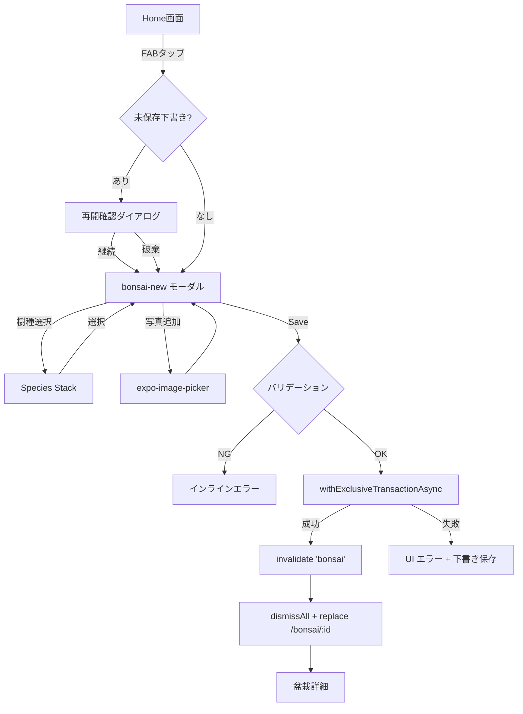

#### §6.3.2 必須項目とバリデーション

| 項目                        | 必須 | バリデーション                                                                               |
| --------------------------- | ---- | -------------------------------------------------------------------------------------------- |
| 名前 (name)                 | ✅   | 1〜100 文字、trim 後空文字禁止                                                               |
| 樹種 (species_id)           | ❌   | species テーブルに存在する ID または null                                                    |
| 購入日 (acquired_on)        | ❌   | ISO 8601 YYYY-MM-DD、未来日禁止                                                              |
| 樹形スタイル (style)        | ❌   | enum: chokkan/moyogi/shakan/kengai/han_kengai/bunjin/ishitsuki/sokan/kabudachi/yose_ue/other |
| 鉢情報 (pot_info_json)      | ❌   | 有効な JSON、サイズ 4KB 以内                                                                 |
| メモ (notes)                | ❌   | 10,000 文字以内                                                                              |
| カバー写真 (cover_photo_id) | ❌   | photos テーブルに存在する ID                                                                 |

#### §6.3.3 編集擬似コード

```typescript
// hooks/useUpdateBonsai.ts
export function useUpdateBonsai() {
  const db = useSQLiteContext();
  const qc = useQueryClient();

  return useMutation({
    mutationFn: async (input: UpdateBonsaiInput) => {
      await db.withExclusiveTransactionAsync(async (txn) => {
        await txn.runAsync(
          `UPDATE bonsai SET name = ?, species_id = ?, style = ?, notes = ?,
                             updated_at = strftime('%Y-%m-%dT%H:%M:%fZ','now')
           WHERE id = ?`,
          [input.name, input.speciesId, input.style, input.notes, input.id],
        );
      });
    },
    onSettled: (_, __, input) => {
      qc.invalidateQueries({ queryKey: ['bonsai', 'detail', input.id] });
      qc.invalidateQueries({ queryKey: ['bonsai', 'list'] });
    },
  });
}
```

#### §6.3.4 アーカイブ / 復元

- アーカイブは `archived_at` に現在時刻を書く（物理削除しない）
- Home 一覧は `WHERE archived_at IS NULL` でフィルタ
- アーカイブ画面（設定 → アーカイブ済み盆栽）から復元可能
- **完全削除**はアーカイブ済みの盆栽に対してのみ可能（タイプ入力「削除」）
- 完全削除時: CASCADE で `events`, `photos`, `reminders` も削除
- 完全削除時の写真ファイルは `FileSystem.deleteAsync` で物理削除

#### §6.3.5 並び替え

- 並び替え順は SQLite テーブル `bonsai_order`（`bonsai_id`, `position` INTEGER）で管理
- ドラッグ&ドロップで `position` を再計算
- デフォルトソート: 登録日降順（`created_at DESC`）

### §6.4 境界値テーブル

| 項目                | 境界     | 期待動作                                                |
| ------------------- | -------- | ------------------------------------------------------- |
| 名前長 0 文字       | 下限未満 | バリデーション NG、インラインエラー                     |
| 名前長 1 文字       | 下限     | OK                                                      |
| 名前長 100 文字     | 上限     | OK                                                      |
| 名前長 101 文字     | 上限超   | バリデーション NG、100 文字で自動 truncate は**しない** |
| 名前に改行          | 特殊     | `\n` は trim 対象外、保存可（表示は 1 行に）            |
| 盆栽数 0            | 境界     | Home 空状態「最初の盆栽を追加しよう」表示               |
| 盆栽数 1            | 境界     | FlashList 表示                                          |
| 盆栽数 1,000        | 高負荷   | FlashList で遅延なし                                    |
| 盆栽数 10,000       | 極端     | 動作するが UX 未保証（v1 対象外）                       |
| 購入日 = 今日       | 境界     | OK                                                      |
| 購入日 = 明日       | 未来日   | バリデーション NG                                       |
| 購入日 = 1900-01-01 | 極端     | OK（祖先樹木の価値）                                    |
| アーカイブ数 0      | 境界     | アーカイブ画面「なし」                                  |

### §6.5 エラーフロー

| エラー                     | 表示                                           | ユーザー操作                        |
| -------------------------- | ---------------------------------------------- | ----------------------------------- |
| SQLite 書き込み失敗        | エラートースト「保存できませんでした」         | 再試行ボタン、下書きは Zustand 保持 |
| 名前が空                   | インラインエラー「名前を入力してください」     | 修正                                |
| 購入日が未来               | インラインエラー「未来の日付は選べません」     | 修正                                |
| 樹種画像が 5MB 超過        | ダイアログ「画像が大きすぎます（最大 5MB）」   | 撮り直し / 選び直し                 |
| 名前重複（同名の盆栽存在） | **許容**（警告表示のみ、ユーザー判断に委ねる） | そのまま保存可                      |

### §6.6 受け入れ条件

- [ ] 名前空の盆栽は作成できない
- [ ] 新規作成後、自動で `(modals)/bonsai-new` → 詳細画面 `bonsai/[id]` へ遷移（戻るボタンで Home に戻る）
- [ ] アーカイブで Home から消え、アーカイブ画面に現れる
- [ ] 完全削除で CASCADE により events/photos/reminders も削除
- [ ] 並び替え後、再起動しても順序保持
- [ ] 盆栽 1,000 本登録時も Home スクロール 60fps 維持

### §6.7 対応テスト

- Jest: `__tests__/features/bonsai/create.test.ts`, `archive.test.ts`, `delete_cascade.test.ts`, `reorder.test.ts`
- Maestro: `maestro/flows/add_bonsai.yaml`

---

## §7. F-02 作業履歴記録

### §7.1 目的

1 本の盆栽に対する作業（水やり・剪定・針金・植替え等）をワンタップ記録する。

### §7.2 画面 / 入口

- 盆栽詳細（`bonsai/[id]`）内の「作業を記録」ボタン
- 作業種別選択シート（`(sheets)/work-type`、`formSheet` presentation）
- 作業記録確認画面（`(sheets)/work-confirm`、同上）

### §7.3 期待動作

#### §7.3.1 記録フロー

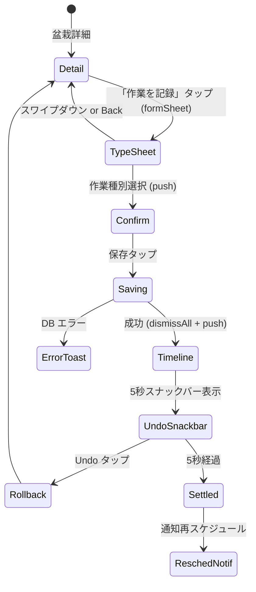

#### §7.3.2 作業種別 16 種

| type              | 名称           | icon | 既定値                                        |
| ----------------- | -------------- | ---- | --------------------------------------------- |
| watering          | 水やり         | 💧   | duration=null, amount=null                    |
| pruning           | 剪定           | ✂️   | duration=null                                 |
| wiring            | 針金がけ       | 〰️   | payload={wire_size_mm: 2, body_part: 'trunk'} |
| unwiring          | 針金外し       | ✂️〰️ | payload={linked_wiring_event_id: null}        |
| repotting         | 植替え         | 🪴   | payload={soil_type: null, pot_changed: true}  |
| fertilizing       | 施肥           | 🌱   | payload={fertilizer_type: 'solid'}            |
| pest_control      | 消毒           | 🦋   | payload={chemical: null}                      |
| disease_treatment | 病気治療       | 🩹   | 任意                                          |
| leaf_trimming     | 葉刈り         | 🍃   | 任意                                          |
| defoliation       | 全葉刈         | 🍂   | 任意                                          |
| deshoot           | 芽かき         | 🌿   | 任意                                          |
| candle_cut        | 芽切り（松類） | 🔥   | 樹種が松類時のみ表示                          |
| moss_care         | 苔手入れ       | 🌾   | 任意                                          |
| position_change   | 置き場変更     | 📍   | payload={new_location: null}                  |
| observation       | 観察メモ       | 👁   | 写真推奨                                      |
| other             | その他         | ❓   | 自由記述必須                                  |

**Candle cut（芽切り）は松類（species.scientific_name が `Pinus` 属）のみ選択肢表示**。

#### §7.3.3 記録擬似コード（optimistic update 付き）

```typescript
// hooks/useCreateEvent.ts
export function useCreateEvent() {
  const db = useSQLiteContext();
  const qc = useQueryClient();

  return useMutation({
    mutationFn: async (input: CreateEventInput) => {
      const id = uuidv4();
      await db.runAsync(
        `INSERT INTO events (id, bonsai_id, type, occurred_at, tz_offset_min,
                             duration_min, payload_json, note)
         VALUES (?, ?, ?, ?, ?, ?, ?, ?)`,
        [
          id,
          input.bonsaiId,
          input.type,
          input.occurredAt.toISOString(),
          -input.occurredAt.getTimezoneOffset(),
          input.durationMin ?? null,
          input.payload ? JSON.stringify(input.payload) : null,
          input.note ?? null,
        ],
      );
      return id;
    },
    onMutate: async (input) => {
      // 直近の水やりなら optimistic update
      if (input.type === 'watering') {
        await qc.cancelQueries({ queryKey: ['bonsai', 'detail', input.bonsaiId] });
        const previous = qc.getQueryData(['bonsai', 'detail', input.bonsaiId]);
        qc.setQueryData(['bonsai', 'detail', input.bonsaiId], (old: any) => ({
          ...old,
          last_watered_at: input.occurredAt.toISOString(),
        }));
        return { previous };
      }
    },
    onError: (_err, input, ctx) => {
      if (ctx?.previous) {
        qc.setQueryData(['bonsai', 'detail', input.bonsaiId], ctx.previous);
      }
    },
    onSettled: (_id, _err, input) => {
      qc.invalidateQueries({ queryKey: ['bonsai', 'detail', input.bonsaiId] });
      qc.invalidateQueries({ queryKey: ['bonsai', 'works', input.bonsaiId] });
      qc.invalidateQueries({ queryKey: ['bonsai', 'list'] });
      qc.invalidateQueries({ queryKey: ['reminders'] });
    },
  });
}
```

#### §7.3.4 Undo スナックバー

記録保存後 5 秒間「取り消し」ボタンが表示される。タップで `DELETE` 実行。5 秒経過で通知再スケジュール（F-05, F-16）発火。

```typescript
const handleSave = async (input: CreateEventInput) => {
  const eventId = await createEventMutation.mutateAsync(input);
  router.dismissAll();
  router.navigate(`/bonsai/${input.bonsaiId}?tab=timeline`);

  showSnackbar({
    label: t('event.saved', { type: t(`event.type.${input.type}`) }),
    action: t('common.undo'),
    duration: 5000,
    onPress: async () => {
      await db.runAsync('DELETE FROM events WHERE id = ?', [eventId]);
      qc.invalidateQueries({ queryKey: ['bonsai', 'detail', input.bonsaiId] });
    },
    onTimeout: async () => {
      await rescheduleBonsai(input.bonsaiId); // F-05, F-16
    },
  });
};
```

#### §7.3.5 写真添付

- 作業記録画面から複数枚添付可能（最大 10 枚/作業）
- 添付済み写真は `photos` テーブルに `event_id` を紐付けて保存
- F-08 の制約（Free 3 枚/盆栽）とは**別集計**（作業記録の写真は Free でも無制限、ただし盆栽単位では 3 枚）
- ※実装注意: Free ユーザーが作業記録経由で写真を大量添付し、結果的に盆栽単位の上限を迂回するケース → **作業記録写真も盆栽単位カウントに含める**（統一ルール）

#### §7.3.6 メモ

- 自由記述、最大 2,000 文字（UI 上は 280 文字でスクロール表示）
- FTS5 インデックス `events_fts` で検索対象（F-09）
- 改行 `\n` 保持

### §7.4 境界値テーブル

| 項目               | 境界   | 期待動作                           |
| ------------------ | ------ | ---------------------------------- |
| メモ 0 文字        | 下限   | OK                                 |
| メモ 2,000 文字    | 上限   | OK                                 |
| メモ 2,001 文字    | 上限超 | バリデーション NG、truncate しない |
| 添付写真 0 枚      | 境界   | OK                                 |
| 添付写真 10 枚     | 上限   | OK                                 |
| 添付写真 11 枚目   | 上限超 | ダイアログ「10 枚まで」            |
| 同一時刻に複数記録 | 境界   | 許可（例: 水やり後すぐ施肥）       |
| 未来日時           | 異常   | バリデーション NG                  |
| 10 年前            | 境界   | OK（遡及記録）                     |

### §7.5 エラーフロー

| エラー                      | 表示                       | 対応                     |
| --------------------------- | -------------------------- | ------------------------ |
| SQLite 書き込み失敗         | エラートースト             | 再試行ボタン、下書き保持 |
| 未来日時                    | インラインエラー           | 現在時刻にリセット       |
| Candle cut を松類以外で記録 | UI で選択肢非表示          | –                        |
| 写真添付中にメモリ不足      | トースト「画像処理に失敗」 | 写真を減らす             |

### §7.6 受け入れ条件

- [ ] 作業記録後、タイムラインに即時反映
- [ ] Undo スナックバー 5 秒間表示、タップで記録削除
- [ ] 5 秒経過後に通知再スケジュール発火
- [ ] 水やり記録時、盆栽詳細の「最後の水やりから X 日」が 0 日にリセット（optimistic update）
- [ ] DB 書き込み失敗時、optimistic update は元に戻る
- [ ] 松類以外で candle_cut が選択肢に出ない

### §7.7 対応テスト

- Jest: `__tests__/features/event/create.test.ts`, `timeline.test.ts`, `optimistic_rollback.test.ts`
- Maestro: `maestro/flows/log_watering.yaml`

---

## §8. （欠番）

> F-03 は v1.0 で実装しない。詳細経緯は ADR-0011 を参照。

---

## §9. F-04 水やり履歴の可視化

### §9.1 目的

水やり記録を**ヒートマップ**と「最後の水やりから X 日」で可視化する。盆栽健康問題の 98% が水やり由来（Bonsai Direct 公式）ゆえ、記録習慣がコア価値。Free / Pro 関係なく全機能利用可（ADR-0013）。

### §9.2 画面 / 入口 (ADR-0020 改訂)

- 盆栽詳細のサマリセクション（「最後の水やりから X 日」テキスト + 「水やり履歴を見る」リンク）
- **個別盆栽の水やり履歴画面 `app/(tabs)/bonsai/[id]/watering.tsx`** (ADR-0020 v1.x-6 整合):
  - 30 / 90 / 365 日切替セグメント (windowDays prop で動的サイズ: 5×7 / 13×7 / 53×7)
  - ヒートマップ (Skia)、4 サマリー (連続記録 / 過去 N 日記録日数 / 回数 / 2 回の日)
  - 注記: 「これは記録の表示です。水やりの判定はしません」(ADR-0011 哲学)
- **全盆栽サマリータブ (stats) は廃止** (ADR-0020 で削除、集約モード K2 達成率も廃止)

### §9.3 期待動作

#### §9.3.1 「最後の水やりから X 日」表示

```typescript
// components/DaysSinceWatering.tsx
export function DaysSinceWatering({ bonsaiId }: { bonsaiId: string }) {
  const { data: lastEvent } = useLiveQuery(
    db.select().from(events)
      .where(and(
        eq(events.bonsai_id, bonsaiId),
        eq(events.type, 'watering'),
        eq(events.status, 'logged'),
        isNull(events.deleted_at)
      ))
      .orderBy(desc(events.occurred_at_utc))
      .limit(1)
  );

  if (!lastEvent) return <Text size="$6">{t('water.never')}</Text>;

  const days = differenceInLocalDays(new Date(), lastEvent.occurred_at_utc, lastEvent.tz_offset_min);

  if (days === 0) return <Text size="$10" weight="bold">{t('water.today')}</Text>;
  if (days <= 30) return <Text size="$10" weight="bold">{t('water.days_ago', { count: days })}</Text>;
  if (days <= 365) return <Text size="$8" weight="regular" color="$color10">{t('water.days_ago', { count: days })}</Text>;
  return <Text size="$8" weight="regular" color="$color10">{t('water.over_year')}</Text>;
}
```

- フォントサイズ: 24-28pt Bold（0-30 日）/ 24pt Regular（31-365 日 + 1 年超）
- コントラスト: WCAG AAA 7:1 以上（`#1A1A1A` on `#FFFFFF`）
- 集約モード関連の記述は **ADR-0020 v1.x-7 で廃止済** (個別ヒートマップ詳細画面に統合)

#### §9.3.2 ヒートマップ仕様

- 描画: `@shopify/react-native-skia` の `<Atlas>` API で 365 セル一括 GPU 描画
- 形状: **年モード = 7 行 × 52 列**（GitHub Contribution Graph 風）/ **月モード = 7 行 × 5 列**
- 期間切替: セグメンテッドコントロール `[ 月 ] [ 年 ]`、年送り `[◀ 2025] [2026] [2027 ▶]` / 月送り併設
- 配色: ColorBrewer 2.0 Greens 4-class（color-blind safe）
  - L0 (空): `#F5F8F5` / L1: `#BAE4B3` / L2: `#74C476` / L3: `#238B45`
- 数字併記: 各セルに白文字オーバーレイ（"1" "2" "3+"）— WCAG 1.4.1 / Apple Differentiate Without Color 評価基準
- 今日のセル: 太枠 2dp `#238B45` でハイライト
- 未来日: 灰色 `#E0E0E0` で「未来」と区別
- 過去のみ表示（status='logged' のみ、未来予定 status='planned' は F-02 タイムラインタブで表示）
- **判定は行わない**（「少なすぎます」等の警告を出さない、constraints §5-2 禁止語）

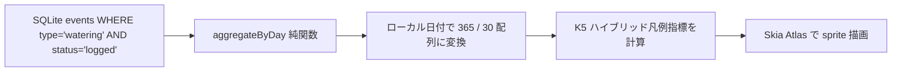

#### §9.3.3 凡例（K1 個別モードのみ、ADR-0020 v1.x-7 で集約 K2 廃止）

- **個別盆栽の水やり履歴画面 (`bonsai/[id]/watering.tsx`)**:
  ```
  凡例 (この盆栽への水やり回数):
  □ 0 回  ■ 1 回  ■ 2 回  ■ 3+ 回
  ```
- 集約モード (K2 達成率 %) は ADR-0020 で廃止、stats タブ削除に伴い削除済

#### §9.3.4 タップ詳細（Apple Health 風 BottomSheet）

- ライブラリ: `@gorhom/bottom-sheet`
- ヒートマップセルをタップ → 下から BottomSheet がせり上がる（画面遷移なし、シニア UX◎）
- シート内容:
  - 日付（"2026年4月15日 (水)"）
  - 水やり回数
  - その日の events リスト（時刻 + 盆栽名）
  - `[ + この日に水やり記録 ]` ボタン
- 閉じる操作: 下スワイプ / シート外タップ / 背景タップ / OS 戻るボタン

#### §9.3.5 フィルター — ADR-0020 v1.x-7 で削除

- 旧 stats タブの BonsaiFilterSheet (F1+F3 ハイブリッド) は ADR-0020 で廃止
- 個別ヒートマップは盆栽詳細画面に統合済 (盆栽選択不要、`bonsai/[id]/watering.tsx`)
- 検索は探すタブ (`/(tabs)/find`) で別途対応 (検索履歴 + chip + マッチハイライト)

#### §9.3.6 画面構成 UI

```
┌─────────────────────────────────────┐
│ ←  黒松「太郎」                  ⋮  │
├─────────────────────────────────────┤
│        最後の水やりから              │
│            3 日                      │  ← 28pt Bold
│    [ 💧 今日の水やりを記録 ]         │
├─────────────────────────────────────┤
│  📊 2026年の水やり実績               │
│  [ 月 ] [ 年 ]                       │  ← セグメンテッドコントロール
│  [◀ 2025] [2026] [2027 ▶]           │
│                                      │
│  月  ■■□■■■□■□■■■■■■■■□■■  │  ← Skia ヒートマップ 7×52
│  ...                                  │
│                                      │
│  凡例 (この盆栽への水やり回数):       │
│  □ 0回  ■ 1回  ■ 2回  ■ 3+回      │
│                                      │
│  記録日数: 87 / 365 日 (24%)         │  ← 提案 F: 年間サマリー数字
│  記録件数: 95 件                     │  ← 提案 H: データ件数
└─────────────────────────────────────┘
```

### §9.4 境界値テーブル

| 項目                        | 境界 | 期待動作                                                      |
| --------------------------- | ---- | ------------------------------------------------------------- |
| 水やり記録 0 件             | 下限 | 「まだ記録がありません」+ 記録ボタン                          |
| 水やり記録 1 件（今日）     | 境界 | 「今日、水やりしました」                                      |
| 水やり記録 1 件（昨日）     | 境界 | 「最後の水やりから 1 日」                                     |
| 水やり記録 1 件（1 年前）   | 境界 | 「最後の水やりから 365 日」（警告表示しない）                 |
| 水やり記録 1 件（1 年超）   | 境界 | 「最後の水やりから 1 年以上」                                 |
| 同日 2 回の水やり           | 境界 | ヒートマップセル内に "2" 数字オーバーレイ                     |
| 同日 4 回以上の水やり       | 境界 | ヒートマップセル内に "3+" 数字オーバーレイ                    |
| 未来日時の記録              | 異常 | バリデーション NG（F-02 で対処、ADR-0008）                    |
| TZ 境界（JST 23:55 水やり） | 境界 | ローカル日付で当日のセルにカウント                            |
| 全盆栽集約モード            | -    | **ADR-0020 v1.x-7 で廃止** (個別ヒートマップ詳細画面に統合済) |
| 100 本フィルター切替        | 性能 | 60 FPS でスムーズアニメ                                       |

### §9.5 エラーフロー

| エラー               | 表示                              | 対応                      |
| -------------------- | --------------------------------- | ------------------------- |
| ヒートマップ描画失敗 | 「データを読み込めませんでした」  | 再試行                    |
| events データ破損    | 「データを修復してください」      | 設定 → 整合性チェック機能 |
| Hermes Intl エラー   | フォールバックで `MM/DD` 形式表示 | @formatjs polyfill 追加   |

### §9.6 受け入れ条件

- [x] ヒートマップが windowDays に応じた構成で表示される (30:5×7 / 90:13×7 / 365:53×7、ADR-0020 v1.x-6)
- [x] ColorBrewer Greens 4 段階配色 (個別モード K1 のみ、ADR-0020 v1.x-7 で集約 K2 廃止)
- [x] 凡例が画面下部に常時表示 (個別モード固定)
- [x] 「最後から X 日」が画面上部に 28pt NotoSerifJP で表示 (ADR-0020 v1.x-6 SS 222921 整合)
- [x] セルタップ → BottomSheet で日別詳細表示
- [x] 30/90/365 切替セグメント (ADR-0020 v1.x-6)
- [x] 4 サマリー: 連続記録 / 過去 N 日記録日数 / 回数 / 2 回の日 (ADR-0020 v1.x-6)
- [x] 過去のみ表示（未来予定は非表示）
- [x] 「警告」「不足」「べき」等の判定語が UI に出ない（CI `pnpm i18n:forbidden`）
- [x] Free / Pro 関係なく全機能利用可
- [x] 19 言語ローカライズ
- [x] WCAG AA 4.5:1 (ADR-0020 Phase 10 で TEXT_MUTED #767066 補正)
- [ ] iOS Color Filters Grayscale モードで数字併記が機能（手動チェック）

### §9.7 対応テスト

- Jest: `__tests__/features/watering/wateringHeatmap.test.ts` (個別モード純関数、TZ 境界、空日)
- Jest: `__tests__/features/watering/heatmapA11y.test.ts` (a11y label / 凡例)
- Maestro: `maestro/flows/watering-heatmap.yml` (盆栽詳細 → 水やり履歴 → ヒートマップ → セルタップ)
- 廃止: `aggregateWatering.test.ts` / `bonsaiFilter.test.ts` (ADR-0020 v1.x-7 集約モード削除に伴い)

詳細は ADR-0013 (Amended by ADR-0020) + ADR-0020 を正とする。

---

## §10. F-05 「気遣い型」予定確認ポップアップ

### §10.1 目的

ユーザーが 1 日に 6 件目の予定を登録しようとした時に、「無理のない範囲で進めてくださいね」とソフトに声かけする（押し付けがましくないリマインド）。

### §10.2 画面 / 入口

- 任意の予定登録画面（盆栽詳細 → 作業を記録 → 予定として保存、または status='planned' で記録）

### §10.3 期待動作

#### §10.3.1 発火条件

- 同一日（occurred_at_utc の日付） に既に **5 件以上の予定 (status='planned' or 'logged')** が存在する状態で、6 件目を登録しようとした時
- ユーザーが「今後表示しない」を選択した後は発火しない

#### §10.3.2 ポップアップ仕様

```
┌─────────────────────────────────┐
│ お知らせ                          │
├─────────────────────────────────┤
│ この日は既に 5 件の予定があります。│
│ 無理のない範囲で進めてくださいね 🌱 │
├─────────────────────────────────┤
│ [ そのまま登録 ]  ← デフォルト    │
│ [ 一覧を見る ]                    │
│ [ 今後表示しない ]                │
└─────────────────────────────────┘
```

#### §10.3.3 設定

- デフォルト ON
- Settings → 通知設定 → 「予定が多い時の確認ポップアップ」トグルで OFF 可能（盆栽園プロ等の業務利用者向け抑制）

### §10.4 境界値

| 項目                     | 境界       | 期待動作                                     |
| ------------------------ | ---------- | -------------------------------------------- |
| 同一日 4 件              | 境界       | 発火しない                                   |
| 同一日 5 件 → 6 件目登録 | 発火       | ポップアップ表示                             |
| 同一日 100 件            | 既に発火済 | 「今後表示しない」が押されていれば発火しない |
| 「今後表示しない」選択後 | 抑制       | Settings で再有効化されるまで発火しない      |
| OFF 設定時               | 無効       | 発火しない                                   |

### §10.5 受け入れ条件

- [ ] 6 件目の予定登録時にポップアップ発火
- [ ] 文言が「この日は既に 5 件の予定があります。無理のない範囲で進めてくださいね」
- [ ] 「そのまま登録」がデフォルト操作（左寄り、目立つ）
- [ ] 「今後表示しない」を押すと以降発火しない
- [ ] Settings → 通知設定 で再有効化可能
- [ ] OFF 設定時はポップアップ発火しない

### §10.6 対応テスト

- Jest: `__tests__/features/reminders/popupTrigger.test.ts`
- Maestro: `maestro/flows/popup_5_events.yml`

---

## §11. （欠番）

> F-06 は v1.0 で実装しない。詳細経緯は ADR-0011 を参照。

---

## §12. F-07 針金がけ記録・外し時期通知

### §12.1 目的

針金がけ作業を記録した際に、ユーザーが**任意で「外す予定日時」を指定**できる。指定日時に通知を発火し、加えて装着期間経過の事実通知も対応する。Marcus 型ペルソナの「針金食い込みで永久傷」実害（🩹6）への回答。

> 「外しましょう」等の推奨/命令文言は禁止（事実通知のみ）。

### §12.2 画面 / 入口

- 盆栽詳細 → 作業記録 → wiring 選択
- 盆栽詳細 → 未外しの針金一覧
- 設定 → 全盆栽横断「未外しの針金」リスト

### §12.3 期待動作

#### §12.3.1 針金記録フロー

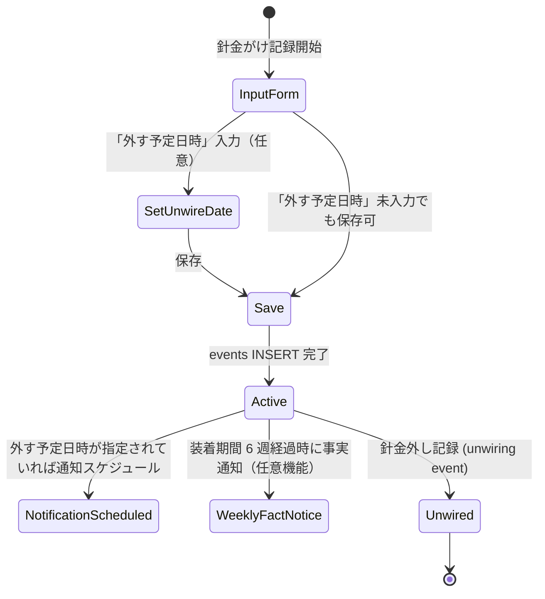

#### §12.3.2 針金 event のペイロード

```typescript
interface WiringPayload {
  wire_size_mm: number; // 0.5, 1, 1.5, 2, 2.5, 3, 4
  body_part: 'trunk' | 'branch_primary' | 'branch_secondary' | 'apex' | 'other';
  photo_ids: string[]; // 写真 ID
  scheduled_unwire_at: string | null; // ISO UTC、ユーザー指定の外し予定日時
  linked_unwiring_event_id: string | null; // 外し記録が付いたら埋める
}
```

#### §12.3.3 外し時期の扱い（ADR-0014 で個別通知 → F-02 統合 + アプリ内表示に変更）

**ユーザー指定外し日時**: F-02 status='planned' に統合 (ADR-0014 F1)

```typescript
// ユーザーが「外す予定日時」を 2026-06-15 と指定した場合
if (payload.scheduled_unwire_at) {
  // F-02 events に status='planned' で登録 (種別 'unwiring')
  // 個別通知は発火させず、F-16 当日まとめ通知に集約される
  await db.insert(events).values({
    id: ulid(),
    bonsai_id: bonsaiId,
    type: 'unwiring',
    status: 'planned',
    occurred_at_utc: new Date(payload.scheduled_unwire_at).toISOString(),
    tz_offset_min: getTzOffsetMin(),
    tz_iana: getTzIana(),
    payload_json: JSON.stringify({ linked_wiring_event_id: wiringEventId }),
  });
  // F-16 invalidator パターンで当日まとめ通知を再生成
  await invalidateBonsaiNotifications(bonsaiId);
}
```

**装着期間経過の表示**: 通知ではなくアプリ内事実表示 (ADR-0014 で確定)

- 盆栽詳細画面 → 針金一覧セクション
- 各針金 event に対して以下を表示:
  - 6 週未経過: 「装着期間: X 週 Y 日 (あと N 週)」
  - 6 週経過済: 「装着期間: X 週 Y 日 (経過済)」
  - 外し記録あり: 「装着期間: X 週 (完了)」
- 通知発火なし: ユーザーが自発的にアプリを開いて確認

**禁止文言（旧仕様で記載されていた通知文言は削除、ADR-0014 整合）**:

- ❌ 「針金を外しましょう」「外してください」「作業してください」（推奨/命令、禁止）
- ✅ 「装着期間: 6 週 3 日 (経過済)」（事実、アプリ内表示）

#### §12.3.4 外し記録の紐付け

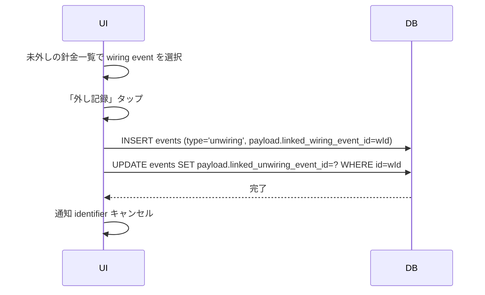

### §12.4 境界値テーブル

| 項目                           | 境界   | 期待動作                                   |
| ------------------------------ | ------ | ------------------------------------------ |
| wire_size_mm = 0.5             | 最細   | OK                                         |
| wire_size_mm = 4               | 最太   | OK                                         |
| wire_size_mm = 0               | 無効   | バリデーション NG                          |
| body_part = 不明値             | 無効   | enum にマップ、不一致は NG                 |
| scheduled_unwire_at = 過去日時 | 無効   | バリデーション NG                          |
| scheduled_unwire_at = null     | 任意   | 通知スケジュールなし、装着期間経過のみ通知 |
| 装着期間 6 週経過              | 境界   | 事実通知（任意機能、Settings で OFF 可能） |
| 外し前に針金 event 削除        | 整合性 | CASCADE 削除、関連通知キャンセル           |

### §12.5 エラーフロー

| エラー                         | 表示             | 対応                           |
| ------------------------------ | ---------------- | ------------------------------ |
| 通知スケジュール失敗           | ログのみ         | DB 正、起動時に再試行          |
| 外し記録の紐付け先が存在しない | インラインエラー | 適切な wiring event を選び直す |
| scheduled_unwire_at が過去     | インラインエラー | 修正                           |

### §12.6 受け入れ条件（ADR-0014 反映）

- [ ] 針金記録時に「外す予定日時」入力欄が表示される（任意入力）
- [ ] 「外す予定日時」入力時に F-02 status='planned' (種別 'unwiring') として登録
- [ ] 該当日の F-16 当日まとめ通知に「N 件の作業予定があります」として集約される
- [ ] 装着期間 6 週経過時に **通知発火しない** (ADR-0014 で削除)
- [ ] 盆栽詳細 → 針金一覧で「装着期間: X 週 Y 日 (経過済 / あと N 週 / 完了)」がアプリ内表示
- [ ] 「外しましょう」「作業してください」等の禁止語が UI / 通知文言に含まれない（CI で `pnpm i18n:forbidden` で検出）
- [ ] 外し記録 (unwiring event) で該当針金レコードが完了状態、F-02 planned event もキャンセル
- [ ] 針金 event 削除で CASCADE、関連 F-02 planned event 削除、F-16 通知再生成

### §12.7 対応テスト

- Jest: `__tests__/features/wiring/record.test.ts`, `scheduledPlanned.test.ts`, `weeksElapsedDisplay.test.ts`, `forbiddenWords.test.ts`
- Maestro: `maestro/flows/wiring_with_schedule.yml`（針金記録 → F-02 planned 確認 → 当日 F-16 通知に集約 → 外し記録）

---

## §13. F-08 写真管理（年次タイムライン）

### §13.1 目的

盆栽 1 本ごとに写真を時系列保存し、年次タイムライン画像を自動生成する。

### §13.2 画面 / 入口

- 盆栽詳細 → 写真タブ
- 作業記録画面（添付）
- 設定 → 年次タイムライン生成（Pro 限定）

### §13.3 期待動作

#### §13.3.1 写真追加フロー

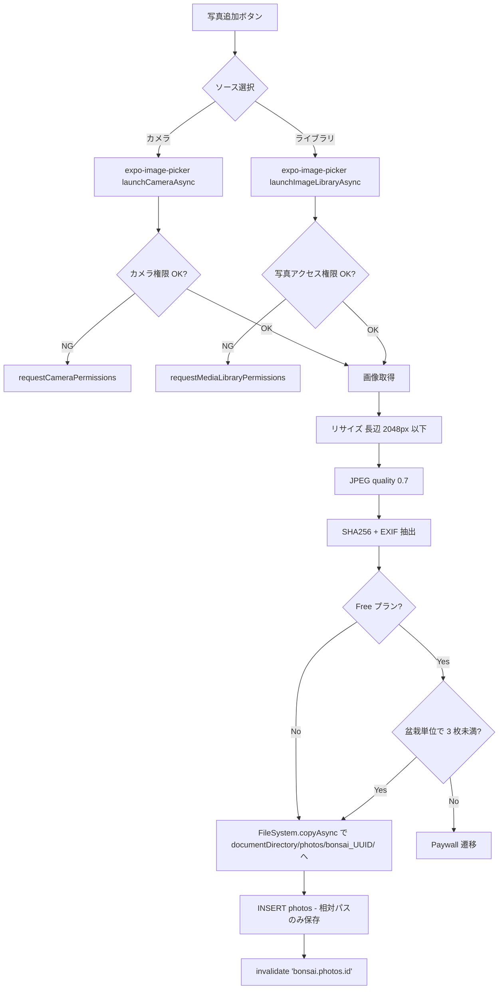

#### §13.3.2 相対パス保存（basic_spec.md §5.2 重要ルール）

```typescript
// db/filePathUtils.ts
const BASE = FileSystem.documentDirectory! + 'photos/';

export function toRelative(absUri: string): string {
  if (!absUri.startsWith(FileSystem.documentDirectory!)) {
    throw new Error('Photo must be under documentDirectory');
  }
  return absUri.substring(FileSystem.documentDirectory!.length);
}

export function toAbsolute(relPath: string): string {
  if (relPath.startsWith('/') || relPath.startsWith('file://')) {
    throw new Error('Photo path must be relative');
  }
  return FileSystem.documentDirectory + relPath;
}

// 使用例
const absUri = await copyPhotoToDocumentDir(sourceUri, bonsaiId);
const relPath = toRelative(absUri); // "photos/bonsai_abc-123/2026-04-23-uuid.jpg"
await db.runAsync('INSERT INTO photos (...) VALUES (..., ?)', [relPath]);
```

#### §13.3.3 リサイズ・圧縮

```typescript
import { manipulateAsync, SaveFormat } from 'expo-image-manipulator';

export async function optimizePhoto(sourceUri: string): Promise<string> {
  const result = await manipulateAsync(
    sourceUri,
    [{ resize: { width: 2048 } }], // 長辺 2048px（basic_spec.md §6.3 境界値）
    { compress: 0.7, format: SaveFormat.JPEG },
  );
  return result.uri;
}
```

#### §13.3.4 サムネイル生成

リスト用 300px、詳細用 800px の 2 サイズを `cacheDirectory` 配下に生成:

```typescript
const listThumb = await manipulateAsync(absUri, [{ resize: { width: 300 } }], {
  compress: 0.5,
  format: SaveFormat.JPEG,
});
```

`cacheDirectory` は OS が自動削除するので、表示時に不在なら再生成。

#### §13.3.5 年次タイムライン画像生成（Pro 限定）

```
┌────────────────────────┐
│   黒松「翁」 2026 年    │
│ ┌────┐┌────┐┌────┐    │
│ │1月 ││2月 ││3月 │    │
│ └────┘└────┘└────┘    │
│ ┌────┐┌────┐┌────┐    │
│ │4月 ││5月 ││6月 │    │
│ └────┘└────┘└────┘    │
│ …                       │
│ Generated by BonsaiLog │
└────────────────────────┘
     縦長 1080x1920px
```

各月: その月で最も撮影日が新しい写真を自動選択、ユーザー置換可能。

```typescript
// domain/photo/yearly_timeline.ts
export async function generateYearlyTimeline(bonsaiId: string, year: number): Promise<string> {
  const photos = await db.getAllAsync<Photo>(
    `SELECT * FROM photos WHERE bonsai_id = ?
     AND strftime('%Y', taken_at) = ? ORDER BY taken_at`,
    [bonsaiId, year.toString()],
  );
  const byMonth = groupByMonth(photos);
  return await renderTimelineImage(byMonth, bonsaiId, year);
}
```

Share Sheet で Instagram / Twitter / メール等に共有可。

### §13.4 境界値テーブル

| 項目                          | 境界             | 期待動作                                           |
| ----------------------------- | ---------------- | -------------------------------------------------- |
| 写真サイズ 0 バイト           | 無効             | バリデーション NG                                  |
| 写真サイズ 5MB（既定上限）    | 境界             | OK                                                 |
| 写真サイズ 6MB                | 上限超           | ダイアログ「画像が大きすぎます」、リサイズ後再試行 |
| 長辺 1080px                   | 境界             | リサイズなし                                       |
| 長辺 4096px                   | 上限超           | 2048 に縮小                                        |
| Free 盆栽あたり 3 枚          | 既定上限         | OK                                                 |
| Free 4 枚目                   | 上限超           | Paywall 遷移                                       |
| Pro 盆栽あたり 1,000 枚       | 上限なし（推奨） | OK                                                 |
| Pro 盆栽あたり 10,000 枚      | 極端             | 動作するが UX 劣化、警告表示                       |
| HEIC 入力                     | 特殊             | JPEG に自動変換（Samsung/Xiaomi 互換性）           |
| EXIF 欠損                     | 境界             | `taken_at = created_at` フォールバック             |
| 年次タイムライン: 月 0 枚     | 境界             | プレースホルダー（「写真なし」）                   |
| 年次タイムライン: 年全体 0 枚 | 境界             | 「生成できません」                                 |

### §13.5 エラーフロー

| エラー                   | 表示                                   | 対応                     |
| ------------------------ | -------------------------------------- | ------------------------ |
| カメラ権限拒否           | ダイアログ「設定から許可してください」 | `Linking.openSettings()` |
| 保存先ディスク不足       | トースト「ストレージ不足」             | 古い写真削除を提案       |
| コピー失敗               | トースト「写真を保存できませんでした」 | 再試行                   |
| DB INSERT 失敗           | ロールバック（ファイル削除）           | 再試行                   |
| 年次タイムライン生成失敗 | トースト「生成に失敗しました」         | 再試行                   |

### §13.6 受け入れ条件

- [ ] 写真 1 枚追加 → DB に相対パス保存確認
- [ ] アプリ再インストール後も写真表示可能（相対パス動作）
- [ ] Free で 4 枚目追加 → Paywall 表示
- [ ] Pro 購入後、Free 時代の 3 枚制限が即解除
- [ ] HEIC 入力 → JPEG で保存
- [ ] 長辺 4096px → 2048px にリサイズ
- [ ] 年次タイムライン生成 → Share Sheet 動作
- [ ] 盆栽削除 → 写真ファイルも物理削除（CASCADE + FileSystem）

### §13.7 対応テスト

- Jest: `__tests__/features/photo/add.test.ts`, `relative_path.test.ts`, `free_limit.test.ts`, `yearly_timeline.test.ts`
- Maestro: `maestro/flows/add_photo.yaml`

---

## §14. F-09 検索・タグ

### §14.1 目的

盆栽名・樹種・メモ・タグで検索する。BonsaiNut「Notion で自作」「Excel で全木 ID 管理」層の取り込み（🩹9）。

### §14.2 画面 / 入口

- Home 上部の検索バー
- 検索画面（`/search`）

### §14.3 期待動作

#### §14.3.1 検索アルゴリズム

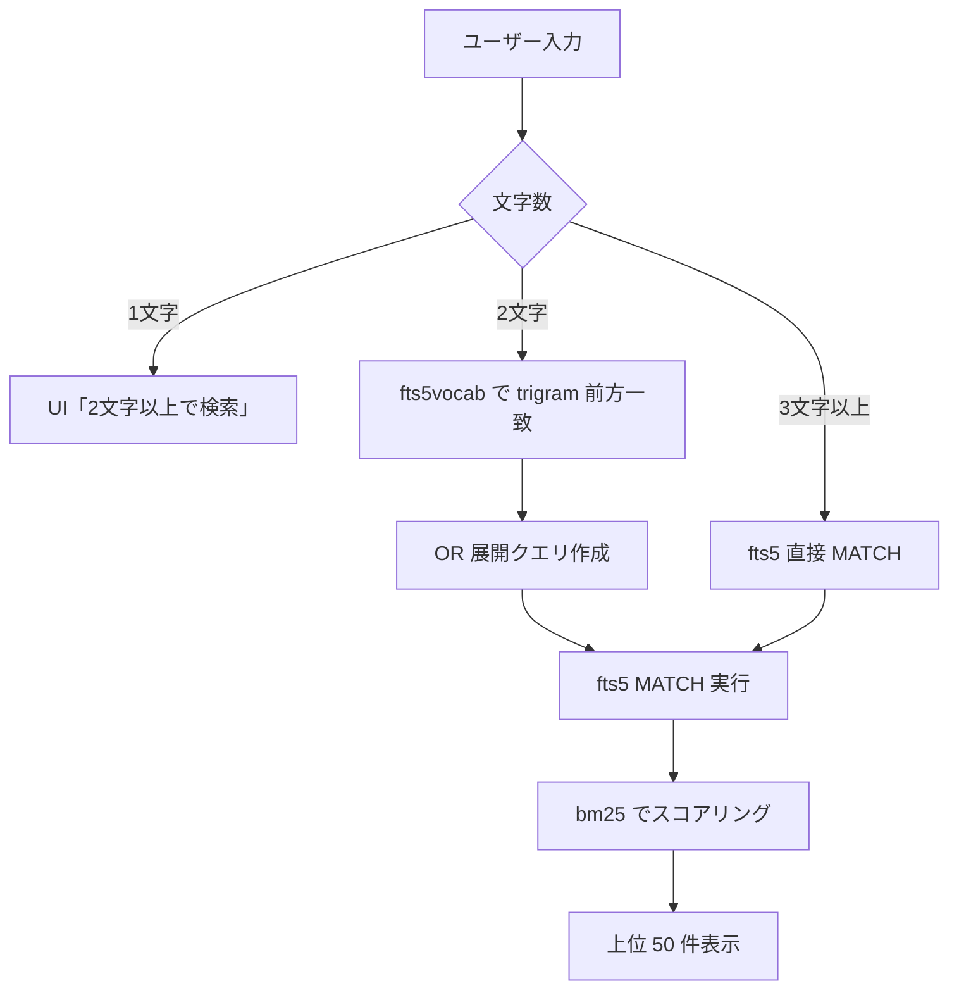

#### §14.3.2 検索カバー範囲（3 段組みグループ表示、ADR-0008 / リサーチ反映）

検索クエリは以下 **3 ターゲット**を並列検索し、**Things 3 / Apple Notes 風の 3 段組みグループ表示**で結果を返す:

| ターゲット                                           | 検索方式                                                       | 想定応答 (25 万行 events) |
| ---------------------------------------------------- | -------------------------------------------------------------- | ------------------------- |
| **盆栽名 (`bonsai.name`)**                           | LIKE 走査 (200 行レベル、index 不要)                           | ~1ms                      |
| **樹種名 (`species_names.common_name` 19 言語通称)** | LIKE 走査 (1,000 行レベル)                                     | ~5ms                      |
| **作業メモ (`events.note`)**                         | FTS5 trigram MATCH (2 文字 → vocab 展開、3 文字+ → 直接 MATCH) | ~50ms                     |

**結果表示**:

- 「盆栽 N 件 / 樹種 N 件 / メモ N 件」をセクション分け
- 0 件のセクションは非表示 (動的に表示数変化)
- 各セクション内 bm25 降順 → 同スコア時 `updated_at` 降順
- 上限 50 件 (各セクション合算)
- FTS5 `snippet(events_fts, 0, '<b>', '</b>', '...', 8)` でマッチ部分を `<b>` で強調

#### §14.3.2.1 検索カバー擬似コード

```typescript
// domain/search/multiSearch.ts
export interface SearchResult {
  bonsai: Bonsai[]; // セクション 1: 盆栽名一致
  species: SpeciesName[]; // セクション 2: 樹種名一致
  notes: NoteHit[]; // セクション 3: メモ一致 (snippet 含む)
}

export async function search(rawQuery: string): Promise<SearchResult> {
  const q = rawQuery.trim(); // Y4: 前後空白 trim
  if ([...q].length < 2) return { bonsai: [], species: [], notes: [] };

  // case-insensitive 統一: SQLite COLLATE NOCASE + LOWER() (Y5)
  const qLower = q.toLowerCase();

  // 盆栽名: LIKE (アーカイブ除外、Y1)
  const bonsai = await db.getAllAsync<Bonsai>(
    `SELECT * FROM bonsai WHERE archived_at IS NULL AND deleted_at IS NULL
     AND LOWER(name) LIKE ? ORDER BY updated_at DESC LIMIT 50`,
    [`%${qLower}%`],
  );

  // 樹種名: LIKE (19 言語通称、現在ロケール優先 + 全言語フォールバック)
  const species = await db.getAllAsync<SpeciesName>(
    `SELECT * FROM species_names WHERE LOWER(common_name) LIKE ?
     ORDER BY (locale = ?) DESC LIMIT 50`,
    [`%${qLower}%`, currentLocale],
  );

  // メモ: FTS5 (deleted_at NULL のみ = ゴミ箱除外、Y2 / payload 検索なし、Y3)
  const notes = await searchNotesFts(q);

  return { bonsai, species, notes };
}

async function searchNotesFts(q: string): Promise<NoteHit[]> {
  let matchExpr: string;
  if ([...q].length >= 3) {
    matchExpr = q; // 直接 MATCH
  } else {
    // 2 文字: vocab から trigram 前方一致を OR 展開
    const tokens = await db.getAllAsync<{ term: string }>(
      `SELECT term FROM events_fts_vocab WHERE term LIKE ? ESCAPE '\\' LIMIT 200`,
      [q.replace(/[%_\\]/g, '\\$&') + '%'],
    );
    if (tokens.length === 0) return [];
    matchExpr = tokens.map((t) => `"${t.term}"`).join(' OR ');
  }

  return db.getAllAsync<NoteHit>(
    `SELECT
       b.id AS bonsai_id, b.name, b.cover_photo_id,
       e.id AS event_id, e.type, e.occurred_at_utc,
       snippet(events_fts, 0, '<b>', '</b>', '...', 8) AS snippet
     FROM events_fts f
     JOIN events e ON e.rowid = f.rowid
     JOIN bonsai b ON b.id = e.bonsai_id
     WHERE events_fts MATCH ?
       AND e.deleted_at IS NULL          -- Y2 ゴミ箱除外
       AND b.archived_at IS NULL          -- Y1 アーカイブ除外
       AND b.deleted_at IS NULL
     ORDER BY bm25(events_fts), e.occurred_at_utc DESC
     LIMIT 50`,
    [matchExpr],
  );
}
```

#### §14.3.3 タグ機能（ADR-0008 / リサーチ反映）

**データモデル** (ADR-0008 §12-13):

- `tags`: `id ULID PK / name TEXT NOT NULL / name_normalized TEXT NOT NULL UNIQUE / color TEXT NULL (v1.0 未使用) / created_at / updated_at`
- `bonsai_tags`: `bonsai_id / tag_id / created_at`、PK = (bonsai_id, tag_id)、双方向 index

**重複防止**: `name_normalized = name.toLowerCase().normalize('NFC')` で UNIQUE 制約 (case-insensitive + NFC 正規化、Bear / Things 業界標準)

**タグ作成タイミング**: **G1 都度作成**（盆栽編集画面で「タグを追加」入力 → 既存マッチなら再利用、なければ新規作成）

- ❌ Settings → タグ管理画面で先に作成 (Notion 風) は採用しない (シニア UX 重視)

**最近使われた 3 タグ候補チップ** (盆栽編集画面、入力欄上部):

```sql
-- 直近 30 日で bonsai_tags への INSERT 上位 3 件
SELECT t.id, t.name, COUNT(*) AS cnt
FROM bonsai_tags bt
JOIN tags t ON t.id = bt.tag_id
WHERE bt.created_at > date('now', '-30 days')
GROUP BY t.id ORDER BY cnt DESC LIMIT 3;
```

- ライトユーザー (タグ 0 件) の場合は非表示
- チップタップで即追加、Bear / Things 業界標準

**Home 上部にタグチップ**:

- 複数選択で AND フィルタ (junction table COUNT(DISTINCT) = 選択数 SQL)
- 並び順: **使用頻度の多い順 (上位 10 個 + 「もっと見る」)** (TC1)
- タグは言語非依存（ユーザー入力）、翻訳キー経由しない

**色設定**: v1.0 で**実装しない (C1)**、灰色チップ統一 (v1.x で要望が来たら追加)

**タグ削除時 (R1+R3 ハイブリッド)**:

- 確認モーダル: 「このタグを N 本の盆栽から外します。よろしいですか?」(DM1) + [キャンセル] [外す]
- 確定 → `bonsai_tags` 該当行 CASCADE 削除 (盆栽自体は残る)

**タグ rename 機能 (Y9)**: Settings → タグ管理画面で誤入力修正可

**制約**:

- 1 盆栽あたり最大 **10 タグ** (TM1、Bear / Things 業界標準)
- アプリ全体タグ最大: **制限なし** (TG1)、ただし性能限界把握テスト用意 (`tagLimit.test.ts` で 1000/5000/10000 タグ性能計測)
- タグ名最大 **32 文字** (TL1、Bear / Notion 慣行)
- タグ名 0 文字: バリデーション NG

#### §14.3.4 検索履歴

- 端末内、最大 20 件（AsyncStorage に保存）
- 最古が落ちる FIFO
- 「履歴を削除」ボタン
- 検索画面表示時、クエリ 0 文字なら履歴 + 「最近の検索」見出し表示

#### §14.3.5 シニア UX 数値仕様（リサーチ発見、必須）

| 要素             | 値                                                                    | 根拠                                                |
| ---------------- | --------------------------------------------------------------------- | --------------------------------------------------- |
| 検索バー高       | **48 dp 以上**                                                        | WCAG 2.5.5 AAA / シニア対応                         |
| フォントサイズ   | **17 pt 以上**                                                        | Apple HIG body                                      |
| クリア × ボタン  | **48 × 48 dp タッチ領域**                                             | WCAG 2.5.5 AAA                                      |
| debounce         | **300 ms**                                                            | シニアタイプミス耐性 (Things 3 ms オーダーより緩め) |
| 結果リスト項目高 | **72 dp**                                                             | タイトル 18pt + サブ 14pt + 余白                    |
| サムネイル写真   | **56 × 56 dp** (Y8、F-08 cover_photo)                                 | 視認性                                              |
| placeholder 文言 | **「盆栽名・樹種・メモで検索」** (PH1)                                | 何が検索できるか明示、19 言語                       |
| 0 件時の文言     | **「該当する記録はありません。別のキーワードを試してください」** (N1) | 中立 + ヒント、constraints §5-2 整合                |

**検索バー配置** (P1):

- Home 上部に常時表示 (sticky)
- タップで検索画面 (`/search`) 全画面遷移
- 検索画面で結果タップ → 盆栽詳細遷移 → 戻る → **検索画面に戻る (クエリ + 結果保持、BK1)**

**event タップ時の挙動 (Y10)**:

- 盆栽詳細画面に遷移 + 該当 event をハイライト表示 (Apple Notes 標準動作)

**キーボード「検索」キー対応 (Y6)**:

- debounce + Enter 両対応 (Enter 即時実行、debounce 待たない)

**検索画面でテキスト + タグ AND フィルタ (Y7)**: 検索クエリとタグチップを同時適用可

### §14.4 境界値テーブル

| 項目                            | 境界     | 期待動作                                                             |
| ------------------------------- | -------- | -------------------------------------------------------------------- |
| クエリ 0 文字                   | 下限     | 検索履歴 + 「最近の検索」見出し表示                                  |
| クエリ 1 文字                   | 下限未満 | ガイド表示、検索不実行                                               |
| クエリ 2 文字                   | 下限     | vocab 展開で検索                                                     |
| クエリ 3 文字                   | 下限超   | 3 段組み (盆栽名 LIKE + 樹種名 LIKE + メモ FTS5 MATCH)               |
| クエリ 100 文字                 | 上限なし | 実行（結果は少数か 0）                                               |
| クエリ前後空白 (例「 黒松 」)   | 正規化   | trim して検索 (Y4)                                                   |
| クエリ大文字小文字混在          | 正規化   | LOWER() で case-insensitive (Y5)                                     |
| Enter キー (キーボード検索)     | 確定     | debounce 待たず即時実行 (Y6)                                         |
| 検索結果 0 件                   | 境界     | 「該当する記録はありません。別のキーワードを試してください」(N1)     |
| 検索結果セクション 0 件         | 境界     | 該当セクション非表示 (SE1、動的に表示数変化)                         |
| 検索結果 50 件                  | 上限     | 上位 50 件のみ表示 (3 段組み合算)                                    |
| タグ 0 個                       | 境界     | Home タグチップ非表示                                                |
| タグ全体 1000 / 5000 / 10000 個 | 性能     | tagLimit.test.ts で性能計測 (TG1 制限なし、テスト用意)               |
| 1 盆栽あたりタグ 11 個目        | 異常     | 「最大 10 タグまで」インラインエラー (TM1)                           |
| タグ名 33 文字目                | 異常     | 「最大 32 文字まで」インラインエラー (TL1)                           |
| タグ名 0 文字                   | 異常     | バリデーション NG                                                    |
| 同名タグ重複作成                | 異常     | name_normalized UNIQUE 制約で既存タグ再利用 (case-insensitive + NFC) |
| アーカイブ済盆栽                | 除外     | 検索結果に出ない (Y1、archived_at IS NOT NULL)                       |
| ゴミ箱内 events                 | 除外     | 検索結果に出ない (Y2、deleted_at IS NOT NULL)                        |
| events.payload_json 検索        | 除外     | 検索対象外 (Y3、note のみ)                                           |
| クエリに `"`/`*`/`(`/`)`        | 特殊     | エスケープして実行                                                   |

### §14.5 エラーフロー

| エラー                      | 表示               | 対応                      |
| --------------------------- | ------------------ | ------------------------- |
| FTS インデックス破損        | 「検索できません」 | 設定 → インデックス再構築 |
| 検索タイムアウト（10 秒超） | 「応答なし」       | 検索キャンセル            |

### §14.6 受け入れ条件

- [ ] 3 段組み表示「盆栽 N 件 / 樹種 N 件 / メモ N 件」、0 件セクションは非表示 (S1 / SE1)
- [ ] 「黒松」で検索 → 樹種「黒松」+ 盆栽名「黒松「太郎」」+ メモ内「黒松」が各セクションに表示
- [ ] 2 文字「水や」で検索 → vocab 展開で結果表示
- [ ] 1 文字 → 「2 文字以上で検索」ガイド (1 文字 NG、SQL 実行しない)
- [ ] 盆栽 1,000 本 + 作業 25 万件で検索 P95 < 150ms (リサーチ実測根拠、Andrew Mara ベンチ)
- [ ] タグ複数選択で AND フィルタ動作 (junction COUNT(DISTINCT) = 選択数)
- [ ] 検索履歴 20 件超で FIFO
- [ ] 検索バー高 48dp、フォント 17pt、debounce 300ms (シニア UX)
- [ ] FTS5 snippet 関数でマッチ部分 `<b>` 強調表示
- [ ] アーカイブ盆栽・ゴミ箱 events・payload_json は検索結果に出ない (Y1/Y2/Y3)
- [ ] クエリ前後空白 trim、case-insensitive、Enter 即時実行 (Y4/Y5/Y6)
- [ ] テキスト + タグ AND フィルタ動作 (Y7)
- [ ] 検索結果に盆栽サムネイル写真 (cover_photo) 表示 (Y8、F-08 連動)
- [ ] event タップ → 盆栽詳細 + 該当 event ハイライト (Y10)
- [ ] 検索結果から盆栽詳細遷移 → 戻るで検索画面復帰 (BK1、クエリ + 結果保持)
- [ ] 盆栽編集画面で「タグを追加」入力欄上部に最近使われた 3 タグ候補チップ表示 (G1)
- [ ] 1 盆栽 11 タグ目で「最大 10 タグまで」インラインエラー (TM1)
- [ ] タグ名 33 文字目で「最大 32 文字まで」インラインエラー (TL1)
- [ ] 同名タグ作成 (case-insensitive + NFC) で既存タグ再利用 (name_normalized UNIQUE)
- [ ] タグ削除時に確認モーダル「このタグを N 本の盆栽から外します。よろしいですか?」(DM1)
- [ ] Settings → タグ管理画面でタグ rename 可 (Y9)
- [ ] 19 言語ローカライズ (placeholder + 0 件文言 + 確認モーダル)
- [ ] ストア審査禁止語が UI に出ない (CI `pnpm i18n:forbidden`)

### §14.7 対応テスト

- Jest: `__tests__/features/search/bonsai_name.test.ts`, `fts5_memo.test.ts`, `fts5_two_char.test.ts`, `tag_filter.test.ts`

---

## §15. F-10 エクスポート（CSV / PDF）

### §15.1 目的

全データを CSV・PDF 形式でエクスポートする。展示会出品記録・青色申告・データポータビリティ対応。**Pro 限定** (ADR-0009 / ADR-0011 / ADR-0016)。Repolog 既存実装 (`/home/doooo/04_app-factory/apps/Repolog/src/features/pdf/`) の堅牢性 (3 段階フォールバック + タイムアウト + ストレージチェック) を流用。

### §15.2 画面 / 入口 (7 画面構成)

1. **Settings → エクスポート (Hub)**: 5 種類 (CSV×3 / PDF×2) を CSV/PDF セクション分け表示、キャッチ「あなたの記録を、あなたの手元へ。」
2. **Options Sheet (BottomSheet)**: エクスポート種類タップで開く、盆栽選択 (全件 vs 個別、Y4) + 種類別オプション
3. **Generating Overlay**: 進捗バー + 「キャンセル」ボタン (Y2)
4. **Share Sheet**: iOS / Android 標準共有 UI (OS 委譲)
5. **CSV Preview**: Excel 風スプレッドシート + 生テキスト両表示 (生成前確認)
6. **PDF Bonsai Preview** (個別): A4 比縮小表示で 1 本ずつのレポート構成確認
7. **PDF List Preview** (全盆栽): A4 比縮小表示で表紙 + リスト + 統計確認

### §15.3 期待動作

#### §15.3.1 エクスポート種類 (5 種類、ADR-0016)

| key           | フォーマット | タイトル         | 列数/構成                                                                                                             | サイズ目安   | 用途                        |
| ------------- | ------------ | ---------------- | --------------------------------------------------------------------------------------------------------------------- | ------------ | --------------------------- |
| `bonsai_csv`  | CSV          | 盆栽一覧         | 9 列 (id/name/species_scientific/species_common/acquired_on/style/archived_at/created_at/updated_at)                  | ~3KB/100本   | データポータビリティ        |
| `events_csv`  | CSV          | 作業履歴         | 11 列 (盆栽ID/名前/作業/日時/部位/量/メモ/created_at/updated_at/status/occurred_at_utc)、**写真件数列なし (Q17 PC2)** | ~12KB/1000件 | 青色申告 / 経年比較         |
| `species_csv` | CSV          | 樹種別サマリ     | 8 列 (樹種学名/通称/保有数/最終水やり/最終剪定/最終植替え/最終施肥/最古取得日)                                        | ~1KB         | コレクション俯瞰            |
| `bonsai_pdf`  | PDF          | 個別盆栽レポート | A4 縦、1 ページ/盆栽 (カバー写真+基本情報+作業履歴サマリ+メモ)                                                        | ~480KB/5本   | 展示会出品票 / 譲渡継承書類 |
| `list_pdf`    | PDF          | 全盆栽リスト     | A4 縦、表紙+サムネイル付きリスト+統計                                                                                 | ~210KB/5本   | 保有資産一覧 / 棚整理       |

#### §15.3.2 CSV 仕様 (RFC 4180 準拠)

- **UTF-8 BOM 付き** (`` プレフィクス、Excel 日本語版文字化け対策)
- **改行コード CRLF (`\r\n`)** (Q18 LB1: RFC 4180 準拠)
- **Quote escape**: `,` / `"` / `\r` / `\n` を含むフィールドは `"..."` で囲む、内部 `"` は `""` 2 連
- **ヘッダ行**: エクスポート時の言語で出力 (Q19 H1: 19 言語 i18n キー経由)
- **数値フォーマット**: 機械可読 (小数点 `.`、桁区切りなし、例 `1234.56`、Q20 NF1)
- **日時フォーマット**: ISO 8601 UTC (例 `2026-04-30T07:00:00Z`)
- **写真関連列を一切含めない (Q8 PH4)**: 写真は F-11 ZIP バックアップで完全分離

```csv
"id","name","species_scientific","species_common","acquired_on","style","archived_at","created_at","updated_at"
"01HXXXXXX","翁","Pinus thunbergii","黒松","2020-03-15","chokkan","","2026-04-23T10:30:00Z","2026-04-23T10:30:00Z"
```

```typescript
// src/features/export/csvWriter.ts (自前 30 行、ライブラリ追加なし)
const BOM = '';
const CRLF = '\r\n';

function escapeField(v: string | number | null | undefined): string {
  if (v == null) return '';
  const s = String(v);
  if (/[",\r\n]/.test(s)) return `"${s.replace(/"/g, '""')}"`;
  return s;
}

export function rowsToCsv(headers: string[], rows: Array<Array<string | number | null>>): string {
  const head = headers.map(escapeField).join(',');
  const body = rows.map((r) => r.map(escapeField).join(',')).join(CRLF);
  return BOM + head + CRLF + body + CRLF;
}
```

#### §15.3.3 PDF 仕様 (Repolog 流用 + iOS WKWebView 互換)

- **expo-print `printToFileAsync({ html, width, height })` 使用** (新規ライブラリ追加なし)
- **A4 縦固定** (PG1): width 595px、height 842px (210mm × 297mm @ 72dpi)
- **HTML `<!DOCTYPE html>` 必須** (Q4): Issue #7435 余分な空ページ問題回避
- **写真 base64 data URI inline** (Q1 W1): iOS WKWebView の `file://` パス読み込み不可制約 (Issue #1308)
  - `expo-image-manipulator` で 800×800 px / JPEG quality 75 にリサイズ
  - 100 枚 PDF で 5-8MB に収まる
- **page-break: WebKit プレフィクス併記** (Q2):
  ```css
  .bonsai-page {
    page-break-after: always;
    -webkit-page-break-after: always;
  }
  .bonsai-page:last-child {
    page-break-after: auto;
  }
  ```
- **CJK フォント明示指定** (Q3、フォント埋込なし、Repolog Issue #292 教訓):
  ```css
  font-family:
    -apple-system, 'Hiragino Sans', 'Hiragino Kaku Gothic ProN', 'Noto Sans CJK JP', 'Noto Sans JP',
    'PingFang SC', 'Apple SD Gothic Neo', system-ui, sans-serif;
  ```
- **絵文字対応** (Q21 EM1): system フォント任せ (iOS Apple Color Emoji / Android Noto Color Emoji 自動利用)
- **CSS `@page`** (Repolog 流用): `@page { size: A4 portrait; margin: 15mm 12mm 18mm 12mm; }`
- **ページ番号** (Q10 PN1): flow フッター方式 (各 `.bonsai-page` 末尾に `<div class="page-footer">{{i}} / {{total}}</div>`、`position: fixed` 不使用、iOS WebKit 制約回避)

#### §15.3.4 3 段階フォールバック (Q11 FB1: Repolog 流用)

```typescript
// src/features/export/pdfService.ts (Repolog pdfService.ts 流用)
const attempts = [
  { label: 'full quality', options: { ...input, skipFontEmbedding: true } },
  {
    label: 'reduced images',
    options: { ...input, skipFontEmbedding: true, imagePreset: 'reduced' },
  },
  { label: 'tiny images', options: { ...input, skipFontEmbedding: true, imagePreset: 'tiny' } },
];

for (let index = 0; index < attempts.length; index += 1) {
  const timeoutMs = calculatePrintTimeoutMs(input.photos.length, index);
  try {
    const html = await buildPdfHtml(attempts[index].options);
    return await printHtml(html, input.paperSize, timeoutMs);
  } catch (error) {
    if (!isRecoverablePdfError(error) || index === attempts.length - 1) throw error;
    await sleep(300); // fallback cooldown
  }
}
```

- **OOM / BlankPdfError / PdfHangError 検出時に自動次 attempt へ**
- **3 attempt 全て失敗で最終エラー throw**
- **fallback cooldown 300ms** (native heap 解放待ち)

#### §15.3.5 タイムアウト戦略 (Q12 TO1: Repolog 流用)

- **動的計算**: `30 秒 + 写真数 × 1 秒`
- **attempt 1 のみ 10 秒キャップ** (Issue #298 hang バグ対策、正常時は 1 秒以内に完了)
- **`Promise.race` でタイムアウト強制** (printToFileAsync は hang したら resolve も reject も来ない)

#### §15.3.6 ストレージ事前チェック (Q13 ST1: Repolog 流用)

- **`getFreeDiskStorageAsync()` で 100MB 必須**: 不足なら `PdfStorageLowError` で即時エラー (フォールバック不可)
- **`getFreeDiskStorageAsync` 自体が失敗時はチェックスキップ** (古い端末や権限問題対応)

#### §15.3.7 カスタムエラー (Repolog 流用)

```typescript
class BlankPdfError extends Error {
  /* 1024 byte 未満 */
}
class PdfHangError extends Error {
  /* Promise.race timeout */
}
class PdfStorageLowError extends Error {
  /* 100MB 不足 */
}
```

`assertPdfLooksValid()`: 生成された PDF サイズが 1024 byte 未満なら blank と判定 → `BlankPdfError` で再試行。

#### §15.3.8 ファイル名規則 (Q14 NM3)

- **形式**: `bonsailog-{kind}-{YYYYMMDD-HHMM}.{csv|pdf}`
  - 例: `bonsailog-bonsai-list-20260430-1730.csv`
  - 例: `bonsailog-bonsai-pdf-20260430-1730.pdf`
- **ASCII 文字のみ** (Windows 予約文字回避)
- **タイムスタンプは端末ローカル時刻** (`expo-localization.getCalendars()[0]?.timeZone`)
- **Repolog の Forbidden chars 置換ロジック流用**:
  - 禁止文字 `[\/\\:*?"<>|]` を `_` に置換
  - 連続 `_` を 1 つに圧縮
  - 端の `_` を除去

#### §15.3.9 共有 / 保存 (Q15 SAF1: Repolog 流用)

- **iOS**: `Sharing.shareAsync(uri, { UTI, mimeType })` で Share Sheet
  - PDF: `UTI: 'com.adobe.pdf'`、`mimeType: 'application/pdf'`
  - CSV: `UTI: 'public.comma-separated-values-text'`、`mimeType: 'text/csv'`
- **Android**: `LegacyFileSystem.StorageAccessFramework.requestDirectoryPermissionsAsync()` で保存場所選択 → `createFileAsync()` + `writeAsStringAsync({ encoding: Base64 })` で書込
- **共有後の後始末** (Q7): `file.delete()` で必ず cacheDirectory から削除 (ADR-0007 と同思想)

#### §15.3.10 Pro ガート (Q5: Repolog 流用)

```typescript
import RevenueCatUI, { PAYWALL_RESULT } from 'react-native-purchases-ui';
import Purchases from 'react-native-purchases';

export async function exportFlow(kind: string) {
  // Pro チェック
  const customerInfo = await Purchases.getCustomerInfo();
  const isPro = customerInfo.entitlements.active['pro'] != null;
  if (!isPro) {
    const result = await RevenueCatUI.presentPaywallIfNeeded({
      requiredEntitlementIdentifier: 'pro',
    });
    if (result !== PAYWALL_RESULT.PURCHASED && result !== PAYWALL_RESULT.RESTORED) {
      return; // 無音終了 (押し付けがましさ排除)
    }
  }
  // エクスポート実行...
}
```

### §15.4 境界値テーブル

| 項目                       | 境界 | 期待動作                                                |
| -------------------------- | ---- | ------------------------------------------------------- |
| 盆栽 0 本                  | 境界 | 「エクスポートするデータがありません」                  |
| 盆栽 1,000 本              | 中量 | 3 秒以内に CSV 生成、PDF は 30s+1s/枚                   |
| 盆栽 10,000 本             | 極端 | プログレスバー表示、3 段階フォールバック                |
| PDF 100 ページ             | 極端 | 3 段階フォールバックで生成可、メモリ不足時 reduced/tiny |
| Free プラン                | 境界 | Paywall 遷移 (Pro 限定維持、Q16 PR2)                    |
| Pro 加入直後               | 境界 | 即時エクスポート開始 (Marcus UX)                        |
| ストレージ 100MB 未満      | 異常 | `PdfStorageLowError` + 「100MB 以上空けてください」     |
| iOS 16 (SIGTRAP)           | 異常 | 3 段階フォールバックで attempt 1 失敗 → attempt 2 へ    |
| Android base64 フォント    | 異常 | フォント埋込なし、blank PDF 回避 (Repolog Issue #292)   |
| iOS hang (Issue #298)      | 異常 | attempt 1 は 10 秒タイムアウトキャップで早期失敗        |
| 生成失敗 3 attempt 全滅    | 異常 | 「PDF を作成できませんでした」(Q22 EN1)                 |
| Share Sheet キャンセル     | 境界 | 無音終了                                                |
| ファイル名 Forbidden chars | 異常 | `_` に自動置換 (Repolog 流用)                           |
| Android SAF 拒否           | 境界 | 保存中止、無音 (ユーザー選択尊重)                       |
| 個別選択 0 本              | 境界 | 「盆栽を選択してください」                              |

### §15.5 エラーフロー

| エラー                    | 表示                                                                      | 対応                   |
| ------------------------- | ------------------------------------------------------------------------- | ---------------------- |
| 生成失敗 (3 attempt 全滅) | 「PDF を作成できませんでした。盆栽の数を減らしてお試しください」(Q22 EN1) | 盆栽数を減らして再実行 |
| ストレージ不足            | 「ストレージ容量が不足しています。100MB 以上空けてください」(Q22 ES1)     | OS 設定で空き容量確保  |
| Share Sheet キャンセル    | 無音                                                                      | –                      |
| Pro 未加入                | Paywall 遷移                                                              | 加入 or キャンセル無音 |

### §15.6 受け入れ条件

- [ ] Pro 限定維持 (Free でタップ → Paywall、ADR-0009 整合、Q16 PR2)
- [ ] 5 種類エクスポート (bonsai_csv / events_csv / species_csv / bonsai_pdf / list_pdf)
- [ ] CSV: UTF-8 BOM + CRLF + RFC 4180 quote escape + ロケール対応ヘッダ
- [ ] CSV に写真関連列を含めない (Q8 PH4 + Q17 PC2)
- [ ] PDF: A4 縦 + DOCTYPE + base64 写真 + WebKit page-break + CJK フォント明示 (フォント埋込なし)
- [ ] 3 段階フォールバック (full → reduced → tiny) 動作 (Q11 FB1)
- [ ] タイムアウト動的計算 (30s + 1s/枚、attempt1=10s、Q12 TO1)
- [ ] ストレージ事前チェック 100MB (Q13 ST1)
- [ ] BlankPdfError / PdfHangError / PdfStorageLowError 動作
- [ ] ファイル名 `bonsailog-{kind}-{YYYYMMDD-HHMM}.{csv|pdf}` (Q14 NM3)
- [ ] iOS Share Sheet (UTI / mimeType 両指定) + Android SAF (Q15 SAF1)
- [ ] cacheDirectory 後始末 (file.delete() Q7)
- [ ] 7 画面構成 (Hub / Options / Progress / Share / CSV Preview / PDF Bonsai / PDF List)
- [ ] 個別選択機能 (Y4、全件 vs 個別ラジオ + 複数選択チェックボックス)
- [ ] エクスポート履歴保持しない (Y1)
- [ ] 進捗画面キャンセルボタン (Y2)
- [ ] エクスポート完了通知なし (Y3、F-16 連動なし)
- [ ] エラー文言「PDF を作成できませんでした」「ストレージ容量が不足」(Q22 EN1+ES1)
- [ ] 数値フォーマット機械可読 1234.56 (Q20 NF1)
- [ ] 絵文字 system フォント任せ (Q21 EM1)
- [ ] 19 言語ローカライズ (CSV ヘッダ + UI 文言、`pnpm i18n:check` 0 missing)
- [ ] 禁止語検出 (`pnpm i18n:forbidden` 緑)
- [ ] F-15 連動 (UI 画面のみテーマ追従、PDF レイアウトは light 固定)
- [ ] F-11 連動 (機能分離、CSV に写真関連列なし)
- [ ] Excel 日本語版で文字化けなし (UTF-8 BOM 効果確認、手動 PoC)
- [ ] 100 本盆栽の bonsai_pdf 生成で 60 FPS (実機 Pixel 7 / iPhone 13)

### §15.7 対応テスト

- Jest: `__tests__/features/export/csvWriter.test.ts` (BOM / CRLF / quote escape)
- Jest: `__tests__/features/export/csvBonsai.test.ts` (9 列、写真関連列なし PH4)
- Jest: `__tests__/features/export/csvEvents.test.ts` (11 列、写真件数列なし PC2)
- Jest: `__tests__/features/export/csvSpecies.test.ts` (8 列)
- Jest: `__tests__/features/export/pdfBonsai.test.ts` (DOCTYPE + base64 + page-break)
- Jest: `__tests__/features/export/pdfFallback.test.ts` (3 段階フォールバック + cooldown)
- Jest: `__tests__/features/export/pdfTimeout.test.ts` (TO1 + attempt1 10s)
- Jest: `__tests__/features/export/pdfStorage.test.ts` (ST1 100MB)
- Jest: `__tests__/features/export/proGate.test.ts` (Q5 + Pro 限定 PR2)
- Jest: `__tests__/features/export/fileNameRule.test.ts` (NM3 + Forbidden chars)
- Jest: `__tests__/features/export/i18nForbiddenWords.test.ts`
- Maestro: `maestro/flows/export_csv_flow.yml` (Hub → CSV → Pro → 生成 → Share)
- Maestro: `maestro/flows/export_pdf_flow.yml` (Hub → PDF → 個別選択 → 生成 → Share)
- Maestro: `maestro/flows/export_paywall_flow.yml` (Free → Paywall → キャンセル → 無音)
- Maestro: `maestro/flows/export_progress_cancel.yml` (生成中キャンセル → 中断)
- 詳細は ADR-0016 を正とする。

---

## §16. F-11 お引っ越し機能（デバイス移行）

> ⚠️ **設計変更履歴**: 当初仕様（QR コード + WebRTC P2P + AES-256-GCM + ECDH P-256 + HKDF-SHA256 + DTLS の 4 層暗号化）は **ADR-0007 で却下** された。実装コスト過大・テスト容易性極低・シニアペルソナ UX 厳しい・ADR-0005 (iOS 暗号化フラグ) との整合判断が必要、という理由。本仕様は Repolog アプリで実証済みの「ZIP + Share Sheet」方式に変更したもの。

### §16.1 目的

旧端末から新端末へ全データ（盆栽 + 樹種 + 作業履歴 + 写真 + リマインダー + タグ + 設定）を移行する。標準 OS の Share Sheet を使い、ユーザーが任意の保存先（iCloud Drive / Google Drive / メール / LINE 等）を選択できる。クラウドサービス非依存（Local-first）。

高橋さん 62 歳の「スマホ買い替え不安」（🩹10）への回答。

### §16.2 画面 / 入口

- **エクスポート**: 設定 → 「バックアップを作成」（S-05）
- **インポート**: 設定 → 「バックアップから復元」（S-05）
- 両画面とも `fullScreenModal` 不要、通常のスタック遷移

### §16.3 期待動作

#### §16.3.1 エクスポートフロー

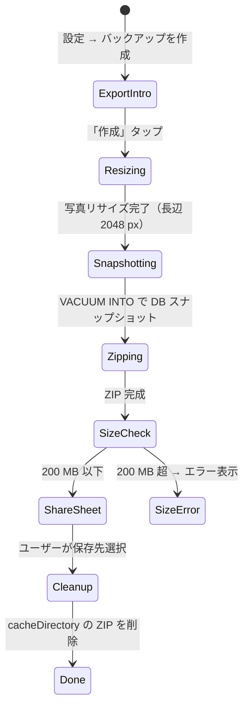

#### §16.3.2 インポートフロー

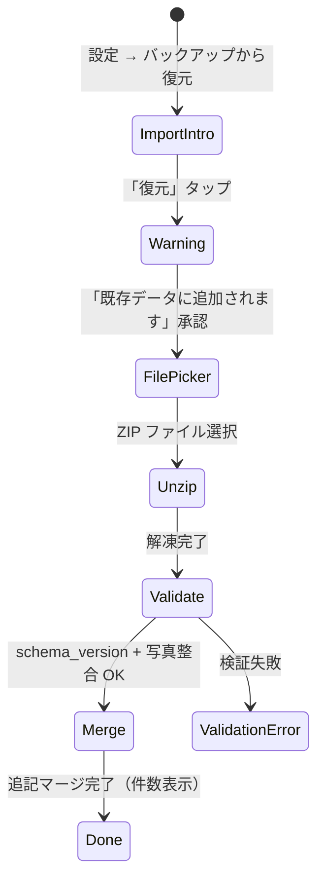

#### §16.3.3 ZIP 構造

```
backup-<ISO8601>.zip
├── manifest.json         # メタデータ
├── bonsai.db             # SQLite VACUUM INTO スナップショット
└── photos/
    ├── <photoId1>.jpg    # 長辺 2048 px にリサイズ済み
    ├── <photoId2>.jpg
    └── ...
```

#### §16.3.4 manifest.json スキーマ

```json
{
  "schema_version": 1,
  "exported_at": "2026-04-29T10:00:00.000Z",
  "app_version": "1.0.0",
  "db_sha256": "<sha256 hex>",
  "stats": {
    "bonsai_count": 5,
    "event_count": 120,
    "photo_count": 15
  }
}
```

### §16.4 暗号化方針

- **暗号化なし**（生 JSON + 生 JPEG + 生 SQLite）
- 位置情報を**一切保持しない**（緯度経度を取得しない、constraints §1-3）→ PII リスクなし
- UI で「バックアップは暗号化されません。クラウドに保存する場合はパスワードで保護されたフォルダにご保管ください」を明示（19 言語で）
- iOS の `usesNonExemptEncryption: false`（ADR-0005）を維持

> v1.1 以降でパスワード付 ZIP（AES-256）追加検討。`react-native-zip-archive` の `zipWithPassword` / `unzipWithPassword` で対応可能。

### §16.5 ライブラリ

- `expo-file-system`（SDK 55 同梱、新 API: `Paths.document`, `Paths.cache`, `File`, `Directory`, `File.pickFileAsync`）
- `expo-sharing`（SDK 55 同梱、Share Sheet）
- `expo-image-manipulator`（SDK 55 同梱、写真リサイズ）
- `react-native-zip-archive@7.0.2`（**固定ピン**、`pnpm.overrides` で transitive 経由のアップグレード禁止）

### §16.6 マージポリシー

- v1.0 は **追記のみ（Append）**。ID 重複の盆栽・写真・作業はスキップ
- 完全置換モードは **v1.0 では実装しない**（v1.1 以降で UX フィードバック次第）
- `schema_version !== 1` の ZIP は `BackupError('schema')` で拒否（マイグレータ API は予約のみ）

### §16.7 上限・制約

- バックアップサイズ **200 MB ハード制限**（react-native-zip-archive 公式ガイド準拠）
- 写真リサイズ **長辺 2048 px**（`expo-image-manipulator`）
- 1 端末で同時に作成できるバックアップ ZIP は 1 つ（cacheDirectory 内）

### §16.8 エラー処理

| エラー                 | UI 文言（i18n キー）                       | エラーコード |
| ---------------------- | ------------------------------------------ | ------------ |
| `schema_version !== 1` | 「このバックアップは別バージョン用です」   | BL-006       |
| 写真ファイル欠損       | 「バックアップが壊れています」             | BL-007       |
| 200 MB 超過            | 「写真を削減してから再度作成してください」 | BL-008       |
| ファイル選択キャンセル | （無音）                                   | -            |
| Share Sheet キャンセル | （無音、ZIP は削除）                       | -            |

### §16.9 受け入れ条件

- [ ] 旧端末で盆栽 5 樹 + 各 3 枚写真を登録 → エクスポート → Share Sheet 起動
- [ ] iCloud Drive / Google Drive / メール / LINE 等の保存先が選択可能
- [ ] 旧端末（iOS）で作成した ZIP を新端末（Android）でインポート → 復元成功
- [ ] 旧端末（Android）で作成した ZIP を新端末（iOS）でインポート → 復元成功
- [ ] 200 MB 超のバックアップは作成前にエラー表示
- [ ] `schema_version !== 1` の ZIP は `BL-006` エラー
- [ ] 写真ファイル欠損 ZIP は `BL-007` エラー
- [ ] エクスポート / インポート後、cacheDirectory に ZIP 残骸が残らない
- [ ] 「暗号化されません」警告文が 19 言語で表示される
- [ ] iOS の `usesNonExemptEncryption: false` を維持

### §16.10 対応テスト

- **Jest（純粋関数）**: `__tests__/features/backup/backupImportPlanner.test.ts`（マージプラン構築・schema_version 検証・写真欠損検知）
- **Maestro（E2E）**: `maestro/flows/backup-screen-reach.yml`（画面到達 + Share Sheet 起動の手前まで、CI 実行可）
- **手動 E2E（必須）**: 2 端末 + クロス OS 転送（iOS↔Android）。`docs/reference/constraints.md` §9 の方針に従い、Issue / PR で「手動 E2E 必須」を明示

### §16.11 関連

- **ADR-0007**（F-11 設計方針: ZIP + Share Sheet 採用、暗号化排除）
- **ADR-0005**（iOS 暗号化エクスポートコンプライアンス、本機能で `false` 維持）
- **既存実装参照**: Repolog `/src/features/backup/`（移植元、ただし legacy API → 新 API 変換が必要）

---

## §17. F-12 多言語対応

### §17.1 目的

19 言語で UI・樹種名・作業名を提供する。Claude Code による翻訳生成 + 予算ゼロ。

### §17.2 画面 / 入口

- 初回起動の言語選択
- 設定 → 言語（即時反映、再起動不要）

### §17.3 期待動作

#### §17.3.1 言語検出と切替フロー

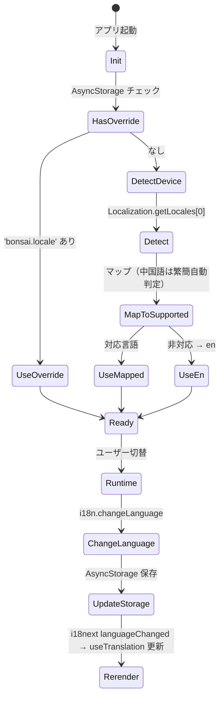

#### §17.3.2 init 擬似コード

```typescript
// core/i18n/index.ts
import i18n from 'i18next';
import { initReactI18next } from 'react-i18next';
import { getLocales } from 'expo-localization';
import AsyncStorage from '@react-native-async-storage/async-storage';
import '@formatjs/intl-pluralrules/polyfill-force';

const SUPPORTED = [
  'en',
  'ja',
  'fr',
  'es',
  'de',
  'it',
  'pt',
  'ru',
  'zh-Hans',
  'zh-Hant',
  'ko',
  'hi',
  'id',
  'th',
  'vi',
  'tr',
  'nl',
  'pl',
  'sv',
] as const;

function pickLocale(tag: string, code: string) {
  if (code === 'zh') {
    if (/Hant/i.test(tag) || /(TW|HK|MO)/i.test(tag)) return 'zh-Hant';
    return 'zh-Hans';
  }
  return SUPPORTED.includes(code as any) ? code : 'en';
}

export async function initI18n() {
  const override = await AsyncStorage.getItem('bonsai.locale');
  const device = getLocales()[0];
  const lng = override ?? pickLocale(device?.languageTag ?? 'en', device?.languageCode ?? 'en');

  await i18n.use(initReactI18next).init({
    lng,
    fallbackLng: { 'zh-Hant': ['zh-Hans', 'en'], default: ['en'] },
    supportedLngs: SUPPORTED,
    compatibilityJSON: 'v4', // ru/pl の 4 形 plural 対応
    interpolation: { escapeValue: false },
    resources, // 19 言語の翻訳
  });
}

export async function switchLanguage(lng: string) {
  await i18n.changeLanguage(lng);
  await AsyncStorage.setItem('bonsai.locale', lng);
}
```

#### §17.3.3 plural 境界値（ICU / CLDR）

**ja/zh-Hans/zh-Hant/ko/vi/th/id**: 1 形（`other` のみ）

```json
{ "events_other": "{{count}} 件のイベント" }
```

**en/de/it/nl/es/tr/sv**: 2 形（`one` / `other`）

```json
{ "events_one": "{{count}} event", "events_other": "{{count}} events" }
```

**hi**: 2 形（`one` は 0, 1 を含む）

```json
{ "events_one": "{{count}} घटना", "events_other": "{{count}} घटनाएँ" }
```

**fr**: 3 形（`one` 0,1 / `many` 10^6,10^9... / `other`）

```json
{
  "events_one": "{{count}} événement",
  "events_many": "{{count}} événement",
  "events_other": "{{count}} événements"
}
```

**ru**: 4 形

```json
{
  "events_one": "{{count}} событие", // 1, 21, 31 (n%10=1, n%100≠11)
  "events_few": "{{count}} события", // 2-4, 22-24 (n%10=2-4, n%100∉12-14)
  "events_many": "{{count}} событий", // 0, 5-20, 25-30
  "events_other": "{{count}} события" // 小数
}
```

**pl**: 4 形

```json
{
  "events_one": "{{count}} wydarzenie", // n=1
  "events_few": "{{count}} wydarzenia", // 2-4, 22-24 (n%10=2-4, n%100∉12-14)
  "events_many": "{{count}} wydarzeń", // 0, 5-21, 25-31
  "events_other": "{{count}} wydarzenia" // 小数
}
```

**ar（v1.3 で追加）**: 6 形

```json
{
  "events_zero": "لا توجد أحداث",
  "events_one": "حدث واحد",
  "events_two": "حدثان",
  "events_few": "{{count}} أحداث",
  "events_many": "{{count}} حدثًا",
  "events_other": "{{count}} حدث"
}
```

#### §17.3.4 日付・数値フォーマット

```typescript
// utils/format.ts
export function formatDate(date: Date, locale: string): string {
  return new Intl.DateTimeFormat(locale, {
    year: 'numeric',
    month: 'long',
    day: 'numeric',
  }).format(date);
}

export function formatRelativeDays(days: number, locale: string): string {
  return new Intl.RelativeTimeFormat(locale, { numeric: 'auto' }).format(-days, 'day');
}
```

### §17.4 境界値テーブル

| 項目                  | 境界        | 期待動作                                |
| --------------------- | ----------- | --------------------------------------- |
| 端末 locale = `ja-JP` | 代表        | ja 選択                                 |
| 端末 locale = `ko-KR` | 対応        | ko 選択                                 |
| 端末 locale = `zh-CN` | 中国語      | zh-Hans                                 |
| 端末 locale = `zh-TW` | 繁体        | zh-Hant                                 |
| 端末 locale = `zh-HK` | 特殊        | zh-Hant（香港）                         |
| 端末 locale = `ar-SA` | v1.3 未対応 | en フォールバック                       |
| 端末 locale = `uk-UA` | 未対応      | en フォールバック                       |
| override = 未対応言語 | 異常        | en フォールバック                       |
| plural: ru で n=21    | 境界        | one（「21 событие」）                   |
| plural: ru で n=22    | 境界        | few（「22 события」）                   |
| plural: ru で n=11    | 境界        | many（「11 событий」、n%100=11 は特殊） |
| plural: pl で n=22    | 境界        | few                                     |
| 言語切替ボタンタップ  | UX          | 0.5 秒以内に全画面再レンダ              |

### §17.5 エラーフロー

| エラー               | 表示           | 対応               |
| -------------------- | -------------- | ------------------ |
| 翻訳ファイル欠損     | キー文字列表示 | en フォールバック  |
| AsyncStorage 失敗    | 無音           | 端末 locale で継続 |
| 言語切替中クラッシュ | 前言語で継続   | –                  |

### §17.6 受け入れ条件

- [ ] 端末を `pl` で起動 → 全画面ポーランド語
- [ ] 「3 件の盆栽」が ja/en/pl/ru すべて正しい plural 形
- [ ] 設定画面で言語切替 → 0.5 秒以内に全 UI 反映
- [ ] `pnpm i18n:check` で 19 言語キー 100% 一致
- [ ] ハードコード文字列ゼロ（`pnpm i18n:audit` 通過）

### §17.7 対応テスト

- Jest: `__tests__/i18n/locale_detection.test.ts`, `plural_ru.test.ts`, `plural_pl.test.ts`, `change_language.test.ts`
- CI: `pnpm i18n:check`, `pnpm i18n:audit`

---

## §18. F-13 課金（サブスク＋買切）

### §18.1 目的

月額・年額サブスク + Lifetime 買切で Pro 機能を解放する。Lifetime 所持時はサブスク表示を抑止する **Champion 方式** (Pocket Casts) を採用し、Pro→Free 戻り時の既存データ保持には **Notion 方式データ保護** を採用 (詳細は ADR-0009、glossary.md 参照)。

### §18.2 画面 / 入口

- Paywall（`(modals)/paywall`、`fullScreenModal` presentation、`gestureEnabled: false`）
- 設定 → アカウント → プラン確認
- Free 機能タップ時の誘導（例: タイミング計算、写真 4 枚目、エクスポート）

### §18.3 期待動作

#### §18.3.1 購入フロー

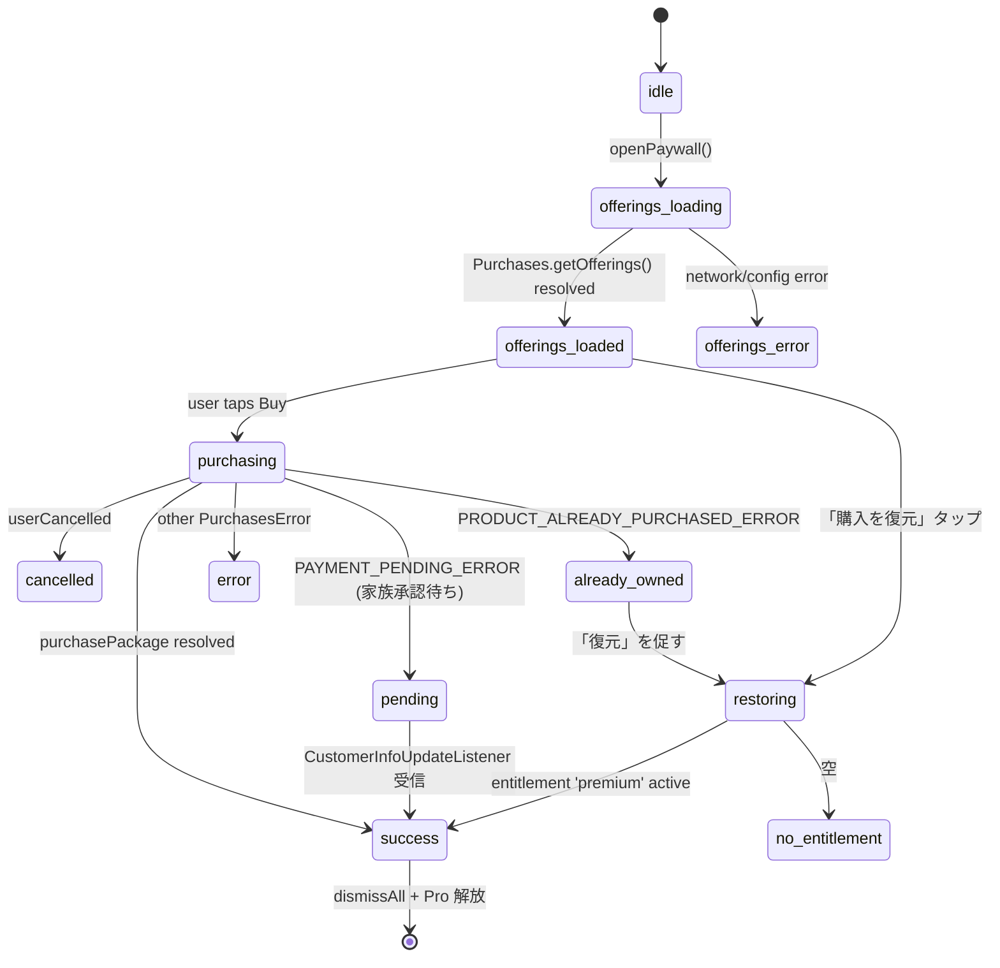

#### §18.3.2 設定（Entitlement / Offering / Packages）

```typescript
const ENTITLEMENT_ID = 'premium'; // 1 つのみ
const OFFERING_ID = 'default'; // 1 つのみ

// Packages:
// $rc_monthly  → bonsailog_pro_monthly  （Auto-Renewable Subscription）
// $rc_annual   → bonsailog_pro_yearly   （Auto-Renewable Subscription）
// $rc_lifetime → bonsailog_pro_lifetime （Non-Consumable IAP / One-time Product）
```

#### §18.3.3 購入擬似コード

```typescript
// features/paywall/buy.ts
type PurchaseOutcome =
  | { kind: 'success'; info: CustomerInfo }
  | { kind: 'cancelled' }
  | { kind: 'pending' }
  | { kind: 'already_owned' }
  | { kind: 'error'; code: string; readable: string; message: string };

export async function buy(pkg: PurchasesPackage): Promise<PurchaseOutcome> {
  try {
    const { customerInfo } = await Purchases.purchasePackage(pkg);
    return { kind: 'success', info: customerInfo };
  } catch (e: any) {
    if (e.userCancelled || e.code === PURCHASES_ERROR_CODE.PURCHASE_CANCELLED_ERROR)
      return { kind: 'cancelled' };
    if (e.code === PURCHASES_ERROR_CODE.PAYMENT_PENDING_ERROR) return { kind: 'pending' };
    if (e.code === PURCHASES_ERROR_CODE.PRODUCT_ALREADY_PURCHASED_ERROR)
      return { kind: 'already_owned' };
    return {
      kind: 'error',
      code: String(e.code),
      readable: e.readableErrorCode,
      message: e.message,
    };
  }
}
```

#### §18.3.4 状態管理（proStore + proService）

実装は `src/services/proService.ts` (RC SDK ラッパー) + `src/stores/proStore.ts` (zustand) に分離。`isPro` / `planType` / `expirationDate` を購読側で参照する。

```typescript
// src/stores/proStore.ts (抜粋)
export const useProStore = create<ProStore>((set, get) => ({
  isPro: false,
  planType: null, // 'monthly' | 'yearly' | 'lifetime' | null
  expirationDate: null,
  init: async () => {
    const local = await proService.loadLocalState();
    if (local) set({ ...local });
  },
  refresh: async () => {
    const state = await proService.refreshCustomerInfo();
    if (state) set({ ...state });
  },
  purchase: async (plan) => proService.purchase(plan),
  restore: async () => proService.restore(),
}));

// 利用側 (例: PaywallScreen, Settings, app/(tabs)/bonsai/[id].tsx)
const isPro = useProStore((s) => s.isPro);
const planType = useProStore((s) => s.planType);
```

`app/_layout.tsx` で `Purchases.addCustomerInfoUpdateListener` を 1 回だけ登録し、proStore に反映する (Apple Review 3.1.1 / 5.0 準拠)。

#### §18.3.5 Restore フロー

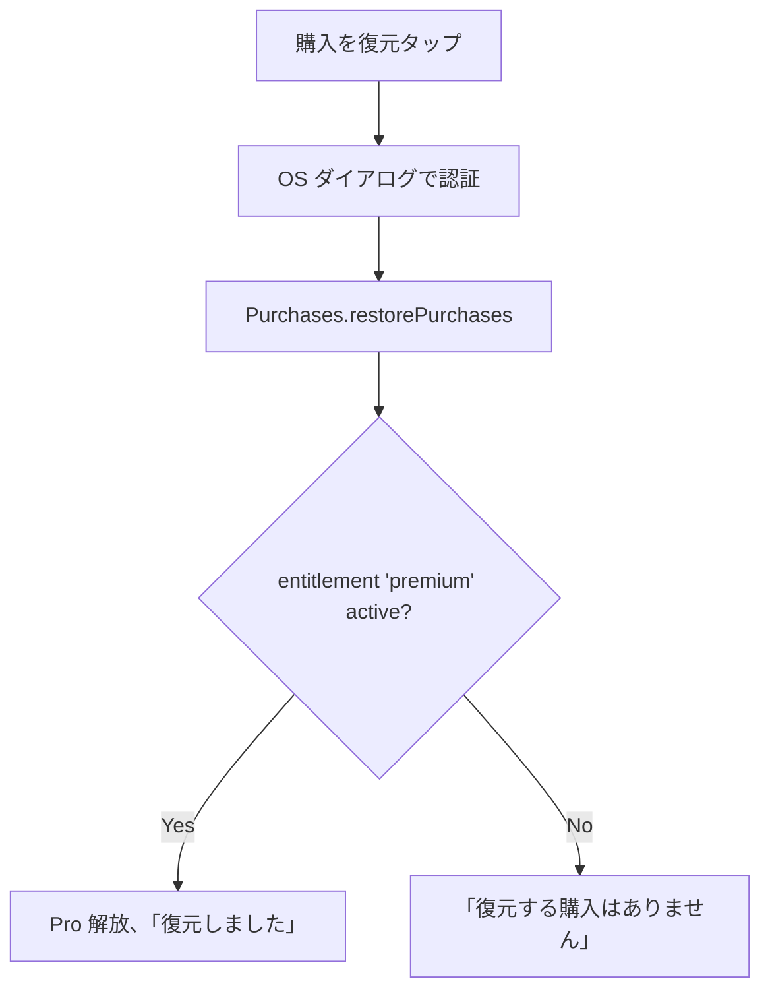

#### §18.3.6 Paywall UI

```
┌─────────────────────────────┐
│  🌱 BonsaiLog Pro          │
├─────────────────────────────┤
│  status / Champion バナー   │ ← Lifetime 所持時は👑+「Pro メンバー (買切)」固定バナー
├─────────────────────────────┤
│  ・写真 3 枚/本の制限撤廃    │
│  ・CSV / PDF エクスポート    │
│  ・年次タイムライン画像      │
│  ・広告非表示                │
├─────────────────────────────┤
│  [ 年額 ¥3,980 ]  ← 推奨   │ Lifetime 所持時は非表示
│   月換算 ¥331/月             │
│  [ 月額 ¥500 ]               │ Lifetime 所持時は非表示
│  [ 買切 ¥9,800 ]            │ Lifetime 所持時は disabled
├─────────────────────────────┤
│  [    購読する    ]          │
│  購入を復元 | 利用規約 | プライバシー │
└─────────────────────────────┘
```

**Apple Review Guideline 3.1.1 準拠**: 「購入を復元」は **Paywall と Settings 両方** に配置 (Lifetime 所持時も常時表示)。

**Apple Review Guideline 5.0 透明性**: 既存サブスク中ユーザーが Lifetime 購入時、購入前ダイアログで「サブスクは自動キャンセルされません。App Store の設定から手動で解約してください」と明示。

**Champion 方式の判定 (純関数)**: `src/features/pro/championMode.ts` の `shouldHideSubscriptions(planType)` が `planType === 'lifetime'` を返すと Paywall が月額/年額カードを描画しない。

**Settings の 3 状態表示**: `planType === 'lifetime'` → 「Pro メンバー (買切)」、`isPro && planType !== 'lifetime'` → 「Pro メンバー」、それ以外 → 「無料プラン」(`settingsAccountProLifetimeTitle` / `settingsAccountProActive` / `proTitle` の i18n キー)。

#### §18.3.7 オフライン挙動

- SDK キャッシュから `getCustomerInfo` 即返却
- `entitlements.active['premium']` が true ならオフラインでも Pro として扱う
- 最大 3 日間グレースピリオド
- **Lifetime（Non-Consumable）は Offline Entitlements 対象外**（RC 仕様）。RC サーバダウン時に Lifetime 購入は失敗する可能性

### §18.4 境界値テーブル

| 項目                          | 境界        | 期待動作                                                              |
| ----------------------------- | ----------- | --------------------------------------------------------------------- |
| 初回起動                      | 境界        | Free プラン、entitlement 空                                           |
| 月額購入成功                  | 正常        | `premium` active                                                      |
| 年額購入成功                  | 正常        | `premium` active                                                      |
| 買切購入成功                  | 正常        | `premium` active、expirationDate なし                                 |
| 購入キャンセル                | ユーザー    | 無音で Paywall に戻る                                                 |
| 承認待ち（Family）            | pending     | 「承認待ち」画面、listener で完了検知                                 |
| 既購入（同一 Apple ID）       | 重複        | 「復元」誘導                                                          |
| ネットワークエラー            | 異常        | 「後で再試行」、購入未確定                                            |
| 月額 → 年額アップグレード     | OS 管理     | OS のアップグレード UI                                                |
| 年額 → 月額ダウングレード     | OS 管理     | 次回更新時に反映                                                      |
| 期限切れ                      | 正常遷移    | entitlement inactive、Free に戻る                                     |
| 3 日グレースピリオド経過      | オフライン  | entitlement inactive 扱い                                             |
| Lifetime 所持時の Paywall     | Champion    | 月額/年額カード非描画、Lifetime のみ disabled、上部に Champion バナー |
| Pro→Free 戻り (写真 4 枚以上) | Notion 方式 | 既存写真は閲覧可能、新規追加のみ 3 枚制限                             |

### §18.5 エラーフロー

| コード                      | 表示                                         | 対応                      |
| --------------------------- | -------------------------------------------- | ------------------------- |
| 1 PURCHASE_CANCELLED        | 無音                                         | Paywall 維持              |
| 2 STORE_PROBLEM             | 「ストアに問題があります」                   | 再試行                    |
| 3 PURCHASE_NOT_ALLOWED      | 「購入が許可されていません」                 | 端末設定確認              |
| 6 PRODUCT_ALREADY_PURCHASED | 「既に購入済み」                             | 復元誘導                  |
| 10 NETWORK                  | 「接続を確認してください」                   | 再試行                    |
| 20 PAYMENT_PENDING          | 「承認待ちです」                             | 待機、listener で自動反映 |
| 22 CONFIGURATION            | 「アプリ設定に問題があります」（開発エラー） | 開発者に連絡              |

### §18.6 受け入れ条件

- [ ] Free ユーザーが Pro 機能タップ → Paywall 表示
- [ ] 年額購入成功 → `isPro = true` 即時反映
- [ ] Restore → 過去購入があれば Pro 復元 (Lifetime 所持時も Restore ボタン常時表示)
- [ ] Restore → 過去購入がなければ「復元する購入はありません」
- [ ] オフラインでも Pro 判定が SDK キャッシュから可能 (Lifetime は Offline Entitlements 対象外)
- [ ] 購入キャンセルで無音、Paywall 維持
- [ ] 「購入を復元」ボタンが Paywall と Settings 両方に存在
- [ ] Lifetime 購入が Non-Consumable として RC Dashboard に登録（事前確認）
- [ ] **Champion 方式**: Lifetime 所持時、Paywall に月額/年額カード非描画 + 上部 Champion バナー表示 + Settings/ホームで「Pro メンバー (買切)」表示
- [ ] **Notion 方式**: Pro で写真 10 枚 → Free 戻り → 既存 10 枚閲覧可能、新規追加のみ 3 枚制限
- [ ] **Apple Review 5.0**: 既存サブスク中ユーザーが Lifetime 購入時、購入前ダイアログで自動キャンセル無しの旨を明示

### §18.7 対応テスト

- Jest:
  - `__tests__/services/proService.test.ts` (toProState / derivePlanType / findPackage、Repolog 移植)
  - `__tests__/services/proPurchaseError.test.ts` (mapPurchaseErrorCode、AC8 7 種分類)
  - `__tests__/features/pro/championMode.test.ts` (shouldHideSubscriptions、Lifetime/Yearly/Monthly/null の 4 ケース)
  - `__tests__/features/photos/photoLimit.test.ts` (Free 写真 3 枚制限、`isPro` 切替で動作)
- Maestro: `maestro/flows/paywall_to_purchase.yaml`（RevenueCat sandbox、未実装）

### §18.8 SDK バージョン (期限付き)

- パッケージ: `react-native-purchases` **^10.x**
- 経緯: 9.6.6 (Billing Library 7) → 10.x (Billing Library 8) 昇格 (2026/8/31 廃止対応)
- Breaking Change: one-time product restore 動作変更 → Sandbox 全フロー検証必須
- 関連: ADR-0009 §80-87

---

## §19. F-14 Home 下部バナー広告

### §19.1 目的

Free プランで Home 画面下部にバナー広告を表示する。ATT/UMP 規約準拠。

### §19.2 画面 / 入口

- Home 画面最下部のみ
- Pro では完全非表示

### §19.3 期待動作

#### §19.3.1 ATT → UMP → AdMob 初期化 7 ステップ

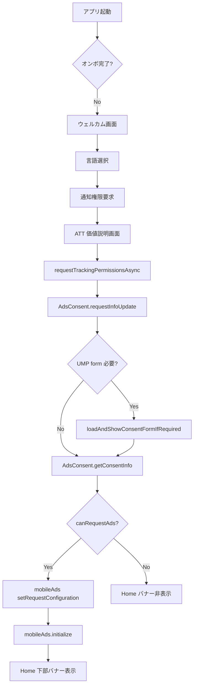

#### §19.3.2 BannerAd コンポーネント

```tsx
// components/HomeBannerAd.tsx
export function HomeBannerAd() {
  const isPro = useSubscriptionStore((s) => s.isPro);
  const canRequestAds = useAdsStore((s) => s.canRequestAds);
  const insets = useSafeAreaInsets();
  const bannerRef = useRef<BannerAd>(null);
  const lastLoadedAt = useRef(0);
  const [failed, setFailed] = useState(false);

  if (isPro) return null; // Pro 即非表示
  if (!canRequestAds) return null;

  // iOS バックグラウンド復帰時の 60 秒制限対応
  useForeground(
    useCallback(() => {
      if (Platform.OS !== 'ios') return;
      const now = Date.now();
      if (now - lastLoadedAt.current < 60_000) return;
      bannerRef.current?.load();
      lastLoadedAt.current = now;
    }, []),
  );

  if (failed) return <View style={[styles.placeholder, { paddingBottom: insets.bottom }]} />;

  return (
    <View style={[styles.container, { paddingBottom: insets.bottom + 16 }]}>
      <Text size="$1" color="$gray10" style={styles.label}>
        {t('ads.label')}
      </Text>
      <BannerAd
        ref={bannerRef}
        unitId={
          __DEV__
            ? TestIds.ADAPTIVE_BANNER
            : Platform.select({
                ios: PROD_IOS_UNIT_ID,
                android: PROD_ANDROID_UNIT_ID,
              })!
        }
        size={BannerAdSize.ANCHORED_ADAPTIVE_BANNER}
        onAdLoaded={() => {
          lastLoadedAt.current = Date.now();
          setFailed(false);
        }}
        onAdFailedToLoad={() => setFailed(true)}
      />
    </View>
  );
}
```

#### §19.3.3 設定値（固定）

```typescript
await mobileAds().setRequestConfiguration({
  maxAdContentRating: MaxAdContentRating.PG, // 家族向け
  tagForChildDirectedTreatment: false, // General Audience
  tagForUnderAgeOfConsent: false,
});
```

#### §19.3.4 UI 配置ルール（基本仕様 §9.4 再掲）

- **位置**: Home 画面 tabBar の**上**（タブ外配置で切替 unmount 回避）
- **サイズ**: Anchored Adaptive Banner（高さ 50-60dp）
- **表示タイミング**: アプリ起動後 **3 秒以上経過後**
- **X ボタン**: **48dp 以上**、右上
- **セーフエリア**: 広告周囲 **16dp 以上の余白**
- **「広告」ラベル**: 常時表示（小さくグレー）
- **Pro 版**: **完全非表示**（即時反映）

#### §19.3.5 タブ外配置

```tsx
<Stack.Screen name="Main">
  {() => (
    <View style={{ flex: 1 }}>
      <Tab.Navigator>{/* Home, Plants, Care, Settings */}</Tab.Navigator>
      <HomeBannerAd /> {/* タブ切替でも unmount されない */}
    </View>
  )}
</Stack.Screen>
```

### §19.4 境界値テーブル

| 項目                               | 境界         | 期待動作                             |
| ---------------------------------- | ------------ | ------------------------------------ |
| Free + canRequestAds=true          | 正常         | バナー表示                           |
| Free + canRequestAds=false         | UMP 拒否     | バナー非表示（課金プロンプトは残す） |
| Pro                                | 課金済       | バナー完全非表示、即時反映           |
| ATT notDetermined                  | 初回         | プロンプト                           |
| ATT denied                         | 拒否         | パーソナライズなし広告配信           |
| UMP REQUIRED                       | GDPR         | フォーム表示                         |
| UMP NOT_REQUIRED                   | 非GDPR       | フォームスキップ                     |
| UMP OBTAINED                       | 再起動       | フォームスキップ                     |
| 広告ロード失敗                     | ネットワーク | プレースホルダ                       |
| 起動後 3 秒未満                    | 境界         | 表示しない                           |
| iOS バックグラウンド復帰 60 秒以内 | 境界         | 再ロードしない                       |
| Pro 購入 → バナー消失              | 即時         | 購入完了時に即 unmount               |

### §19.5 エラーフロー

| エラー                     | 表示           | 対応                       |
| -------------------------- | -------------- | -------------------------- |
| UMP ネットワーク失敗       | 無音           | 前回 consent status で継続 |
| AdMob 初期化失敗           | バナー非表示   | 次回起動で再試行           |
| 広告ロード失敗             | プレースホルダ | onAdLoaded を待つ          |
| 誤タップでリンク先が怪しい | –              | カテゴリフィルタで事前防止 |

### §19.6 受け入れ条件

- [ ] 初回起動 → ATT → UMP → Home にバナー表示
- [ ] Pro 購入 → バナー即消失
- [ ] 詳細画面・設定画面では非表示
- [ ] 設定 → プライバシー設定 → UMP フォーム再表示可能
- [ ] カテゴリフィルタで ギャンブル・アルコール・出会い系 全拒否
- [ ] Google Play Policy / Apple Guideline 違反なし（事前レビュー済み）

### §19.7 対応テスト

- Jest: `__tests__/features/ads/visibility.test.ts`, `placement.test.ts`, `ump_consent.test.ts`, `att_order.test.ts`
- Maestro: `maestro/flows/first_launch_consent.yaml`

---

## §20. F-15 ダークモード / 屋外モード

### §20.1 目的

4 mode (Auto / Light / Dark / Outdoor) でテーマを切り替える。Material 3 baseline + 屋外モード緑単色 + 全画面ヘッダー右上太陽アイコン (ADR-0015、Free / Pro 全機能利用可)。

### §20.2 画面 / 入口

- Settings → 外観 → テーマ（セグメンテッドコントロール: システム / ライト / ダーク）+ 屋外モード（独立トグル）
- **全画面のヘッダー右上 太陽アイコン**（ワンタップで屋外モード ON/OFF、48×48dp タッチ領域）
- チュートリアル中は太陽アイコン非表示 + Settings 遷移不可（常に light 固定、TT2）

### §20.3 期待動作

#### §20.3.1 テーマ切替フロー（4 mode、ADR-0015）

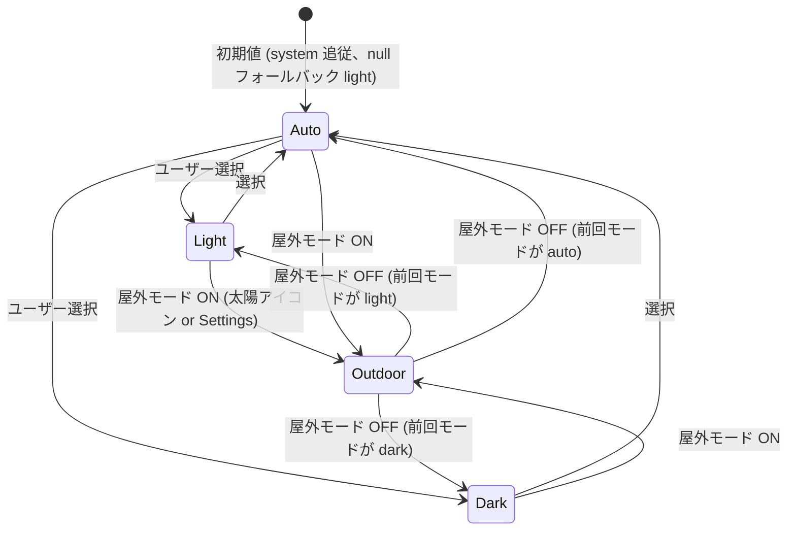

**前回モードは `previousMode` として AsyncStorage に保存** (BR1)。

#### §20.3.2 Tamagui テーマ統合

```tsx
// app/_layout.tsx
import { Appearance, useColorScheme } from 'react-native';
import { useReducedMotion } from 'react-native-reanimated';

export default function RootLayout() {
  const themeMode = useThemeStore((s) => s.themeMode); // 'auto' | 'light' | 'dark' | 'outdoor'
  const systemScheme = useColorScheme(); // 'light' | 'dark' | null

  const resolved = useMemo(() => resolveTheme(themeMode, systemScheme), [themeMode, systemScheme]);

  return (
    <TamaguiProvider config={config} defaultTheme={resolved}>
      <Slot />
    </TamaguiProvider>
  );
}

// src/core/theme/resolveTheme.ts (純関数)
export function resolveTheme(
  mode: 'auto' | 'light' | 'dark' | 'outdoor',
  systemColorScheme: 'light' | 'dark' | null,
): 'light' | 'dark' | 'outdoor' {
  if (mode === 'outdoor') return 'outdoor';
  if (mode === 'auto') return systemColorScheme === 'dark' ? 'dark' : 'light'; // null → light (IM1-A)
  return mode;
}
```

#### §20.3.3 色トークン（ADR-0015、WCAG AAA 7:1 必達）

| トークン              | light                      | dark (Material 3)               | outdoor (純白+純黒+緑単色)  |
| --------------------- | -------------------------- | ------------------------------- | --------------------------- |
| `background`          | #FFFFFF                    | **#121212** (M3 baseline)       | #FFFFFF                     |
| `surface`             | #FAFAFA                    | #1E1E1E                         | #FFFFFF (装飾排除、影 OFF)  |
| `surface2`            | #F5F5F5                    | #242424                         | #FFFFFF                     |
| `color`               | #1A1A1A (16:1 AAA)         | #E1E1E1 (14.5:1 AAA)            | **#000000 (21:1 理論上限)** |
| `muted`               | #4A4A4A (8.6:1 AAA)        | #A0A0A0 (8.5:1 AAA)             | #000000 (純黒)              |
| `borderColor`         | #E0E0E0                    | #2C2C2C                         | #000000 (純黒、線幅 2dp+)   |
| `accent`              | #2E7D32 (Mat green、7.4:1) | **#7BC97D** (M3 tone 80、8.5:1) | **#1B5E20** (緑単色、9.7:1) |
| `bonsai_heatmap_l0`   | #F5F8F5 (ADR-0013 継続)    | #1E1E1E                         | #FFFFFF                     |
| `bonsai_heatmap_l1`   | #BAE4B3                    | #2D4A2E                         | #A8D5A8                     |
| `bonsai_heatmap_l2`   | #74C476                    | #4A8A4D                         | #4A8A4D                     |
| `bonsai_heatmap_l3`   | #238B45 (4.7:1 + 数字併記) | #7BC97D (8.5:1 AAA)             | #1B5E20 (9.7:1 AAA)         |
| `bonsai_today_border` | #238B45 太枠 2dp           | #7BC97D 太枠 2dp                | #000000 太枠 2dp            |

**屋外モード追加要件**:

- フォントウェイト強制 600+ (細字を屋外で読ませない)
- 線幅最小 2dp
- 影 (shadow) 完全 OFF
- アイコンサイズ + 4dp 拡大

#### §20.3.4 Reduced Motion 対応 (A1)

```tsx
const reduceMotion = useReducedMotion(); // react-native-reanimated
const duration = reduceMotion ? 0 : 200; // F-15: 200ms 標準 (Tamagui quick)
```

#### §20.3.5 全画面ヘッダー太陽アイコン (OA1)

```tsx
// src/components/HeaderSunIcon.tsx
import { Sun, SunDim } from '@tamagui/lucide-icons';
import { useThemeStore } from '@/core/theme/themeStore';
import { useTheme } from 'tamagui';

export function HeaderSunIcon() {
  const { themeMode, setThemeMode, previousMode } = useThemeStore();
  const theme = useTheme();
  const isOutdoor = themeMode === 'outdoor';
  const Icon = isOutdoor ? SunDim : Sun;

  return (
    <Pressable
      onPress={() => {
        if (isOutdoor) {
          setThemeMode(previousMode); // BR1: 前回モード復帰
        } else {
          setThemeMode('outdoor'); // 前回モードを保存してから outdoor に
        }
      }}
      hitSlop={{ top: 12, bottom: 12, left: 12, right: 12 }} // 48×48dp タッチ領域
      accessibilityLabel="屋外モードを切り替える"
      accessibilityRole="button"
    >
      <Icon size={24} color={theme.color.val} />
    </Pressable>
  );
}
```

#### §20.3.6 スプラッシュ + ステータスバー (SP1 + SB1)

```ts
// app.config.ts
export default {
  expo: {
    userInterfaceStyle: 'automatic', // SP1: OS dark mode 追従
    // ...
  },
};

// app/_layout.tsx
import { StatusBar } from 'expo-status-bar';

const statusBarStyle = resolved === 'dark' ? 'light' : 'dark'; // SB1
return (
  <>
    <StatusBar style={statusBarStyle} />
    <Slot />
  </>
);
```

### §20.4 境界値テーブル

| 項目                                  | 境界     | 期待動作                                                 |
| ------------------------------------- | -------- | -------------------------------------------------------- |
| 初回起動 (mode=auto + system=null)    | 境界     | light フォールバック (IM1-A)                             |
| 初回起動 (mode=auto + system=dark)    | 境界     | dark 適用                                                |
| 手動 light 選択 + system=dark         | 強制     | light 適用 (Appearance.setColorScheme)                   |
| 屋外モード ON + 前回モード=dark       | 境界     | outdoor 適用、previousMode='dark' 保存                   |
| 屋外モード OFF (前回 dark)            | 境界     | dark に復帰 (BR1)                                        |
| reduced motion ON                     | 境界     | アニメーション 0ms (A1)                                  |
| AAA 7:1 (light color #1A1A1A on #FFF) | 達成     | 16:1 (楽勝)                                              |
| AAA 7:1 (outdoor color)               | 達成     | 21:1 (理論上限)                                          |
| ヒートマップ L0 vs L1 (outdoor)       | 1.4.11   | 1.6:1、数字「1」併記 + 枠線 1dp 黒で識別補完             |
| AsyncStorage 保存失敗                 | 異常     | 無音 + Sentry ログ、セッション内反映、再起動で戻る (PE1) |
| OS dark mode 切替時 (auto モード)     | 境界     | 即時アプリ再描画、ヒートマップも 1 フレーム以内 (RD1)    |
| TZ 変更                               | 影響なし | F-15 はテーマのみ、F-04/F-16 は ADR-0014 で対応          |

### §20.5 エラーフロー

| エラー                 | 表示                                   | 対応                             |
| ---------------------- | -------------------------------------- | -------------------------------- |
| AsyncStorage 保存失敗  | 無音 (Sentry ログのみ)                 | セッション内反映、再起動で前回値 |
| Tamagui theme 解決失敗 | light フォールバック                   | Sentry ログ、ユーザー無通知      |
| 直 hex 違反 (CI 検出)  | ESLint エラー (`no-direct-hex-in-jsx`) | コード修正必須、CI block         |

### §20.6 受け入れ条件

- [ ] tamagui.config.ts に light / dark / outdoor の 3 themes (neonPink/cyberBlue 削除確認)
- [ ] 全 themes で 11 トークン (background / surface / surface2 / color / muted / borderColor / accent / bonsai_heatmap_l0..l3 / bonsai_today_border) 保持
- [ ] light: AAA 16:1 (color on background)
- [ ] dark: Material 3 #121212 + AAA 14.5:1
- [ ] outdoor: 21:1 (理論上限) + 緑単色 #1B5E20 (9.7:1)
- [ ] 4 mode 切替 (Auto / Light / Dark / Outdoor) 動作
- [ ] Auto モード = OS dark mode 即時追従
- [ ] null フォールバック light (IM1-A)
- [ ] 屋外モード ON で前モード保存、OFF で前モード復帰 (BR1)
- [ ] アニメ 200ms、Reduced Motion ON で 0ms (A1)
- [ ] スプラッシュが OS dark mode 追従 (SP1、`userInterfaceStyle: 'automatic'`)
- [ ] ステータスバーがモード別自動切替 (SB1)
- [ ] AsyncStorage 永続化失敗時無音 (PE1)
- [ ] Settings UI セグメント (3 つ) + 屋外トグル (UI1)
- [ ] 全画面ヘッダー右上太陽アイコン (OA1)、48×48dp タッチ
- [ ] F-04 ヒートマップが 3 mode で即時再描画 (RD1、Skia Atlas worklet 内 1 フレーム)
- [ ] F-08 写真自体は変更なし、UI 枠のみテーマ追従 (PH1)
- [ ] BottomSheet が屋外モード時 純白/純黒 (BS1)
- [ ] Lucide アイコン全 theme.color 参照 (IC1)
- [ ] チュートリアル中は light 固定、太陽アイコン非表示 (TT2 + Y5)
- [ ] AdMob 広告は色変えない (Y4 確定)
- [ ] テーマプリセット (春/秋/和風) v1.0 不採用 (Y2)
- [ ] Home トグル提供しない、Settings + ヘッダー太陽のみ (Y1)
- [ ] F-11 引継ぎで AsyncStorage `theme.mode` 移行 (Y10)
- [ ] ESLint `no-direct-hex-in-jsx` で直 hex 検出 (EL1)
- [ ] トークン命名規約: 標準キー + bonsai\_\* プレフィクス (TN1)
- [ ] Maestro snapshot で各モード主要画面確認 (Y11)

### §20.7 対応テスト

- Jest: `__tests__/features/theme/system_mode.test.ts`, `outdoor_mode.test.ts`, `contrast_aaa.test.ts`

---

## §21. F-16 ローカル通知

### §21.1 目的

作業の通知をローカル配信する（サーバ非依存、Local-first）。当日まとめ通知 + 水やり繰り返し通知の **2 系統**で構成、Free / Pro 全機能利用可。詳細は ADR-0014 を正とする。

### §21.2 画面 / 入口

- 設定 → 通知 → マスタートグル + 水やり通知サブセクション + 当日まとめ通知時刻
- 通知タップ → **作業予定カレンダー (S-08)** の当日選択状態
- オンボーディング Step 5 (ADR-0011 改訂) で初回設定

### §21.3 期待動作

#### §21.3.1 権限要求フロー

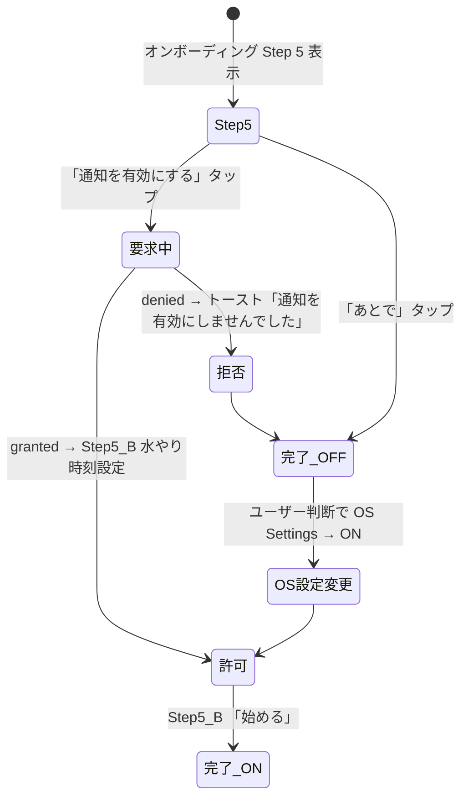

通知拒否後の挙動: **何もしない (C3)**。アプリ内に「設定を開く」誘導なし、ユーザーが OS Settings から自発的に ON。

#### §21.3.2 通知チャネル（Android 13+、2 種に削減）

```typescript
// notifications/channels.ts
export const CHANNELS = {
  WATERING: 'bonsai_watering', // 水やり繰り返し通知
  DAILY_SUMMARY: 'bonsai_daily_summary', // 当日まとめ通知
} as const;

export async function initNotificationChannels() {
  if (Platform.OS !== 'android') return;
  // ⚠️ 権限要求より前に必ず実行
  await Notifications.setNotificationChannelAsync(CHANNELS.WATERING, {
    name: '水やり通知',
    importance: Notifications.AndroidImportance.DEFAULT,
  });
  await Notifications.setNotificationChannelAsync(CHANNELS.DAILY_SUMMARY, {
    name: '当日まとめ通知',
    importance: Notifications.AndroidImportance.DEFAULT,
  });
}
```

#### §21.3.3 スケジューリング擬似コード（7 日ローリング、enforceIosLimit 不要）

```typescript
// notifications/scheduleSummary.ts
const ROLLING_DAYS = 7; // 当日 + 6 日先まで予約

export async function rescheduleSummaryNotifications() {
  // アプリ起動時のみ実行 (R2、シンプル原則)
  const tzIana = getTzIana(); // ADR-0008 datetime ラッパー
  const today = startOfLocalDay(now(), tzIana);

  // 既存の当日まとめ通知を全キャンセル (prefix マッチ)
  const existing = await Notifications.getAllScheduledNotificationsAsync();
  const summaries = existing.filter((n) => n.identifier.startsWith('daily_summary_'));
  await Promise.all(
    summaries.map((n) => Notifications.cancelScheduledNotificationAsync(n.identifier)),
  );

  // events.status='planned' から 7 日先まで集計、N 件以上の日のみ通知予約
  const horizon = addDays(today, ROLLING_DAYS - 1);
  const plannedEvents =
    await db.query(/* status='planned' AND occurred_at_utc BETWEEN today AND horizon */);
  const byDate = aggregateByLocalDay(plannedEvents, tzIana); // 純関数化

  const summaryHour = await getSummaryNotificationTime(); // Settings 値、デフォルト 07:00

  for (const [dateKey, events] of Object.entries(byDate)) {
    if (events.length === 0) continue;
    const fireDate = setHourMinute(parseLocalDate(dateKey, tzIana), summaryHour);
    await Notifications.scheduleNotificationAsync({
      identifier: `daily_summary_${dateKey}`,
      content: {
        title: 'BonsaiLog',
        body: t('notification.summary.body', { count: events.length }),
        // 例: 「3 件の作業予定があります」
        data: { type: 'daily_summary', date: dateKey },
      },
      trigger: {
        type: Notifications.SchedulableTriggerInputTypes.DATE,
        date: fireDate,
        channelId: CHANNELS.DAILY_SUMMARY,
      },
    });
  }
}

// notifications/scheduleWatering.ts
export async function rescheduleWateringNotifications(
  times: Array<{ hour: number; minute: number }>,
) {
  // 既存の水やり通知を全キャンセル
  const existing = await Notifications.getAllScheduledNotificationsAsync();
  const watering = existing.filter((n) => n.identifier.startsWith('daily_watering_'));
  await Promise.all(
    watering.map((n) => Notifications.cancelScheduledNotificationAsync(n.identifier)),
  );

  // 各時刻で DAILY trigger 登録 (最大 5 件)
  for (const { hour, minute } of times.slice(0, 5)) {
    await Notifications.scheduleNotificationAsync({
      identifier: `daily_watering_${hour}_${minute}`,
      content: {
        title: 'BonsaiLog',
        body: t('notification.watering.body'), // 「水やりの時間です」
        data: { type: 'watering' },
      },
      trigger: {
        type: Notifications.SchedulableTriggerInputTypes.DAILY,
        hour,
        minute,
        channelId: CHANNELS.WATERING,
      },
    });
  }
}
```

**最大通知数**: 水やり 5 件 + 当日まとめ 7 件 = **最大 12 件**（iOS 64 件上限の 1/5、enforceIosLimit ロジック不要）。

#### §21.3.4 通知タップ → Deep Link（作業予定カレンダー S-08）

```typescript
// app/_layout.tsx
useEffect(() => {
  const redirect = (notif: Notifications.Notification) => {
    const data = notif.request.content.data as { type?: string; date?: string };
    // 通知タップ → 直接「作業予定カレンダー」(S-08) に遷移、当日選択状態
    // 戻るボタンでホームタブ復帰のため、画面スタックにホームを事前 push
    const targetDate = data.date ?? formatLocalDate(now(), getTzIana());
    router.push(`/(tabs)`); // ホームを画面スタックの下に
    router.push(`/calendar?date=${targetDate}`); // S-08 作業予定カレンダーへ
  };

  // 完全停止からの復帰: listener 登録前に発火するため必須
  const last = Notifications.getLastNotificationResponse();
  if (last?.notification) {
    redirect(last.notification);
    Notifications.clearLastNotificationResponseAsync();
  }

  const sub = Notifications.addNotificationResponseReceivedListener((resp) => {
    redirect(resp.notification);
  });
  return () => sub.remove();
}, []);
```

#### §21.3.5 通知設定の既定値（ADR-0014 確定）

- **通知マスタートグル**: チュートリアル「通知を有効にする」選択時に ON、「あとで」/スキップ時は OFF (K1)
- **水やり通知**: チュートリアル Step 5-B でユーザー入力（デフォルト 1 回 / 朝 07:00）、Settings で 1〜5 回・各時刻変更可
- **当日まとめ通知時刻**: デフォルト朝 07:00、Settings で 24 時間どこでも変更可 (H6)
- **通知音 / 振動**: OS デフォルト固定 (S1)
- **設定状態保持**: AsyncStorage キー `notification.master`, `notification.watering.times`, `notification.summary.time` で永続化、OFF→ON で前回設定復元

### §21.4 境界値テーブル

| 項目                               | 境界   | 期待動作                                           |
| ---------------------------------- | ------ | -------------------------------------------------- |
| 通知 0 件                          | 下限   | OK                                                 |
| iOS pending 12 件 (最大想定)       | 余裕   | OK (上限 64 の 1/5)                                |
| 水やり通知 6 件目登録              | 上限超 | 「最大 5 回」インラインエラー                      |
| 当日 planned events 0 件           | 境界   | 当日まとめ通知をキャンセル                         |
| 当日 planned events 100 件         | 上限   | 「100 件の作業予定があります」                     |
| 通知時刻 = 過去                    | 異常   | バリデーション NG                                  |
| タイムゾーン変更後                 | 境界   | AppState=active で現地時刻に再スケジュール (B1)    |
| 端末バッテリー最適化 ON（Android） | 境界   | Inexact alarm で最大 15 分遅延 (許容)              |
| 通知許可 granted                   | 境界   | 通知表示                                           |
| 通知許可 denied                    | 境界   | scheduleNotificationAsync 成功、ただし配信されない |
| 通知 OFF → ON 切替                 | 境界   | AsyncStorage から水やり時刻設定復元                |
| 7 日連続アプリ未起動               | 境界   | 通知停止 → アプリ起動瞬間に再予約で復活            |
| 海外 TZ 切替（日本 → ハワイ）      | 境界   | 起動時に現地時刻 07:00 に再予約                    |
| F-11 引継ぎ後初回起動              | 境界   | 自動 OS 通知許可リクエスト (D2)                    |
| 予定削除                           | 境界   | 該当日の通知再生成 (E1)                            |
| 盆栽削除                           | 境界   | 関連 planned events 削除 → 通知再生成              |

### §21.5 エラーフロー

| エラー                          | 表示                                          | 対応                               |
| ------------------------------- | --------------------------------------------- | ---------------------------------- |
| 権限拒否                        | 何もしない (C3)                               | ユーザーが OS Settings → ON で復活 |
| スケジュール失敗                | ログのみ (Sentry `NotificationScheduleError`) | 次回起動時に再試行                 |
| チャネル作成失敗                | ログのみ                                      | DEFAULT チャネルにフォールバック   |
| 通知タップ → 該当日 events 0 件 | 作業予定カレンダー当日選択で空表示            | 「予定はありません」表示           |
| Hermes Intl 月名 RangeError     | フォールバックで `MM/DD` 表示                 | @formatjs polyfill 追加判断        |

### §21.6 受け入れ条件

- [ ] 通知 ON で水やり時刻 1〜5 件設定可
- [ ] 水やり通知が指定時刻に発火、本文「水やりの時間です」
- [ ] 当日まとめ通知が朝 7:00 (デフォルト) に発火、本文「N 件の作業予定があります」
- [ ] 通知タップで作業予定カレンダー (S-08) が当日選択状態で開く
- [ ] 戻るボタンでホームタブ復帰 (G1)
- [ ] 通知マスター OFF→ON で水やり時刻設定が保持される
- [ ] 海外 TZ 変更時に現地時刻で通知発火 (B1)
- [ ] 予定削除/盆栽削除時に通知が自動再生成 (E1)
- [ ] F-11 引継ぎ後に OS 通知許可リクエスト発火 (D2)
- [ ] 装着期間経過通知が発火しない (アプリ内表示のみ、ADR-0014)
- [ ] 「水やりが必要」等の判定語が UI に出ない (CI `pnpm i18n:forbidden`)
- [ ] 19 言語ローカライズ (`pnpm i18n:check` 0 missing)
- [ ] iOS pending 通知が 12 件以下
- [ ] チュートリアル Step 5「通知を有効にする」/「あとで」/OS 拒否の 3 パターン動作

### §21.7 対応テスト

- Jest: `__tests__/features/notification/scheduleSummary.test.ts`, `scheduleWatering.test.ts`, `persistSettings.test.ts`, `deepLink.test.ts`, `i18nForbiddenWords.test.ts`
- Maestro: `maestro/flows/notification_permission.yaml`, `notification_summary_tap.yaml`, `watering_settings.yaml`, `notification_off_on.yaml`, `onboarding_notification.yaml`

---

## §22. 画面遷移マップ（5 主要フロー）

### §22.1 オンボーディング

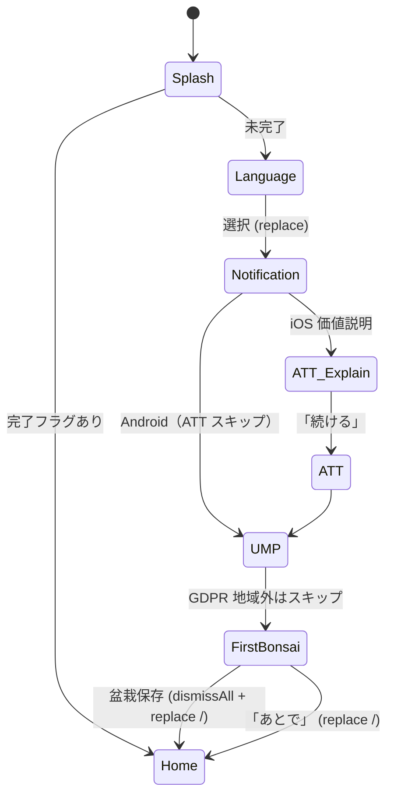

**presentation**: 各ステップは `fullScreenModal` + `router.replace`（戻る禁止）、完了時 `router.dismissAll(); router.replace('/(tabs)')`。

### §22.2 盆栽追加

```mermaid
flowchart TD
  A[Home /(tabs)/index] -->|FAB tap| B{未保存下書き?}
  B -- あり --> C[再開確認]
  B -- なし --> D[/(modals)/bonsai-new/]
  C -->|破棄| D
  D -->|樹種選択| E[ネスト Stack push /species]
  E -->|選択| D
  D -->|写真追加| F[expo-image-picker]
  F --> D
  D -->|Save| G{バリデーション}
  G -- NG --> D1[インラインエラー]
  G -- OK --> H[withExclusiveTransactionAsync]
  H -->|成功| I[dismissAll + replace /bonsai/:id]
  H -->|失敗| D2[エラー + 下書き保持]
  D -->|Close ×| J{dirty?}
  J -- あり --> K[破棄確認シート]
  K -->|破棄| A
```

### §22.3 作業記録（§7.3.1 と同じ、再掲略）

### §22.4 課金

```mermaid
flowchart TD
  A[Free 機能タップ] --> B{isPro?}
  B -- Yes --> Z[機能実行]
  B -- No --> P[/(modals)/paywall fullScreenModal, gestureEnabled:false/]
  P -->|Close ×| A
  P -->|Package タップ| S[StoreKit / BillingClient]
  S -->|キャンセル| P
  S -->|成功| V[RevenueCat 検証 + Listener]
  S -->|失敗| E[エラーダイアログ]
  V -->|entitlement 'premium' active| U[isPro=true → dismissAll → Z]
  V -->|検証失敗| E
```

### §22.5 お引っ越し（§16.3.1 と同じ、再掲略）

---

## §23. Deep Link 仕様

### §23.1 URL スキーム

- **Custom Scheme**: `bonsailog://`
- **Universal Link / App Links**: `https://bonsailog.app/` (v2+)

### §23.2 URL パターン

| URL                                      | 画面                    | Stack 構築                                                          |
| ---------------------------------------- | ----------------------- | ------------------------------------------------------------------- |
| `bonsailog://`                           | Home                    | `(tabs)/index`                                                      |
| `bonsailog://bonsai/[id]`                | 盆栽詳細                | `(tabs)/index` → `bonsai/[id]`                                      |
| `bonsailog://bonsai/[id]?event=watering` | 盆栽詳細 + 作業選択済   | → 作業シート表示                                                    |
| `bonsailog://event/[id]`                 | 作業詳細                | → `bonsai/[bonsaiId]` → `event/[id]`                                |
| `bonsailog://settings`                   | 設定                    | `(tabs)/settings`                                                   |
| `bonsailog://settings/theme`             | テーマ設定              | → `settings/theme`                                                  |
| `bonsailog://settings/language`          | 言語設定                | → `settings/language`                                               |
| `bonsailog://paywall`                    | Paywall                 | + `(modals)/paywall`                                                |
| `bonsailog://migration`                  | お引っ越し              | `(tabs)/settings` → `(modals)/migration`                            |
| `bonsailog://calendar?date=YYYY-MM-DD`   | 作業予定カレンダー S-08 | `(tabs)/index` → `calendar?date=YYYY-MM-DD` (ADR-0014 通知タップ用) |

### §23.3 失敗時の挙動

| エラー                  | 挙動                             |
| ----------------------- | -------------------------------- |
| 盆栽 ID が存在しない    | Home にフォールバック + トースト |
| 未対応パス              | Home にフォールバック            |
| 認証が必要な画面（v2+） | Login へ誘導                     |

---

## §24. エラーコード一覧

### §24.1 RevenueCat エラーコード（§18.5 再掲）

| コード | 名称                      | UI 対応    |
| ------ | ------------------------- | ---------- |
| 1      | PURCHASE_CANCELLED        | 無音       |
| 2      | STORE_PROBLEM             | 再試行     |
| 3      | PURCHASE_NOT_ALLOWED      | 設定確認   |
| 6      | PRODUCT_ALREADY_PURCHASED | 復元誘導   |
| 10     | NETWORK                   | 再試行     |
| 20     | PAYMENT_PENDING           | 待機       |
| 22     | CONFIGURATION             | 開発エラー |

### §24.2 BonsaiLog 内部エラー（アプリ固有）

| コード | 名称                    | 発生場所 | UI 対応                                    |
| ------ | ----------------------- | -------- | ------------------------------------------ |
| BL-001 | DB_LOCKED               | SQLite   | リトライ（busy_timeout 5秒）               |
| BL-002 | DB_MIGRATION_FAILED     | 起動時   | 「データベースの更新に失敗」、アプリ再起動 |
| BL-003 | PHOTO_COPY_FAILED       | F-08     | 「写真を保存できませんでした」             |
| BL-004 | PHOTO_SIZE_EXCEEDED     | F-08     | 「画像が大きすぎます（最大 5MB）」         |
| BL-005 | FREE_LIMIT_REACHED      | F-08     | Paywall 遷移                               |
| BL-006 | MIGRATION_HASH_MISMATCH | F-11     | 「データが破損しています」                 |
| BL-007 | MIGRATION_SCHEMA_FUTURE | F-11     | 「アプリを更新してください」               |
| BL-008 | NOTIFICATION_LIMIT      | F-16     | 自動削減 + ログ                            |
| BL-010 | TRANSLATION_MISSING     | F-12     | キー文字列表示 + ログ                      |

### §24.3 Expo / RN 既知エラー

| エラー                                      | 発生条件                      | 回避策                                                 |
| ------------------------------------------- | ----------------------------- | ------------------------------------------------------ |
| `SQLITE_BUSY`                               | 並行書き込み競合              | `busy_timeout = 5000`、`withExclusiveTransactionAsync` |
| `FileSystem UUID changed`                   | iOS 再インストール/TestFlight | 相対パス保存（basic_spec §5.2）                        |
| `Maximum update depth exceeded`             | Zustand v5 セレクタ           | `useShallow` 使用                                      |
| `CALENDAR trigger not supported on Android` | F-16                          | DATE trigger にフォールバック                          |

---

## 付録A：小中学生向け用語辞典（本書固有語のみ）

- **optimistic update**（オプティミスティック・アップデート）: ボタンを押した瞬間に「成功した」という前提で画面を更新する方法。失敗したらあとで元に戻す。速く見せるため。
- **ロールバック**: 失敗したら変更を「なかったこと」にする操作。
- **query key**（クエリキー）: データの住所のようなもの。`['bonsai', 'list']` = 「盆栽リストの住所」。
- **invalidate**（インバリデート）: 「そのデータは古いよ、もう一度取ってきて」というマーク。
- **ZIP**: 複数のファイルを 1 つにまとめて圧縮するファイル形式。盆栽の写真と DB をひとまとめにして送る箱。
- **Share Sheet**: スマホで「他のアプリに送る」を選ぶときに出てくる標準のメニュー。「メールで送る」「Drive に保存」など。
- **VACUUM INTO**: SQLite で「DB の中身を綺麗な状態でファイルに書き出す」コマンド。バックアップ用のスナップショットを作るときに使う。
- **manifest.json**: バックアップ ZIP の中に入っている「メモ書き」。「いつ作ったか」「中身は何件か」が書いてある。
- **FTS5**: SQLite の検索機能。文章の中の言葉を早く探せる。
- **trigram tokenizer**: 3 文字ずつ区切って検索する方法。日本語でも英語でも使える。
- **fts5vocab**: FTS5 が持っている「使われている単語の一覧」。ここから前方一致で単語を拾える。
- **bm25**: 検索結果の「どれが一番関連性が高いか」を数値化する計算方法。
- **Mermaid**: 状態遷移図やフローチャートを文字だけで書く記法。GitHub でも表示できる。
- **状態遷移図**: 「こういう時はこう動く」を矢印で書いた図。プログラムの動きを整理できる。
- **擬似コード**: 「こんなコードになる」を正確じゃなくていいから書いたもの。実装の指針。
- **境界値**: データの最小・最大や、動きが変わるギリギリの値。ここを間違えるとバグが出やすい。

## 付録B：実装前チェックリスト

実装に入る前に確認:

- [ ] 本書の該当 F 章を最後まで読んだ
- [ ] basic_spec.md の該当 F 章と整合している
- [ ] 必要な状態遷移図を理解した
- [ ] 境界値テーブルをテストケースに転記した
- [ ] エラーフローを網羅したエラーハンドリングを設計した
- [ ] 横断仕様（§5）に従っている（特に TXN 選択、invalidate タイミング）
- [ ] テストファイル配置を決めた（`__tests__/...`）
- [ ] Maestro flow が必要なら `.maestro/` に配置を決めた
- [ ] PRAGMA 初期化が必要な処理か確認した（§5.12）

## 付録C：既知の仕様曖昧点（未決定リスト）

以下は現時点で「決めていない」または「調査中」の項目。実装時に迷ったら ADR を起こすこと:

1. **作業記録の写真は盆栽写真と別カウント？**
   - 現状: §7.3.5 で「盆栽単位カウントに含める」と決定。ただし UX 実装で迂回の抜け道がないか要確認。
2. **お引っ越しの iOS↔Android クロス**
   - 現状: §16.4 で「v1.0 未対応」と明記。実装上の障壁は低いが、DB ファイルが同一 SQLite 形式であることを保証すれば可能。v1.1 検討。
3. **365 セルヒートマップ + 100 本同時の Skia 描画性能**
   - 現状: §9 で `@shopify/react-native-skia` の `<Atlas>` API 採用（ADR-0013）。1825 件 events + 100 本対応の 60 FPS は Phase 0 PoC で実機（Pixel 7 / iPhone 13）検証必須。
4. **言語切替中のメモ欄入力中ドラフト**
   - 現状: §17 では触れていない。切替時に入力中テキストが消える可能性 → 要検証。
5. **Lifetime 購入のオフライン挙動**
   - 現状: §18.3.7 で「Offline Entitlements 対象外」と明記。RC サーバダウン時に Lifetime 購入が失敗するケースの UX 要設計。
6. **通知許可の二度拒否後の再プロンプト UX**
   - 現状: §21.3.1 で「設定誘導」と決定。ただし Android 13+ で `canAskAgain=false` の閾値が Android バージョンで異なる挙動 → 実機検証要。

## 付録D：本書を生かし続けるためのチェック（最短版）

- 機能追加・挙動変更したら、必ず「該当 F-XX の章」を更新する
- テスト（Jest / Maestro）と「受け入れ条件」をセットで更新する
- 状態遷移図・境界値テーブルが影響を受けるなら更新する
- docs 変更は CODEOWNERS レビュー必須にする
- 付録 C「未決定リスト」に新規曖昧点が生じたら追記する
